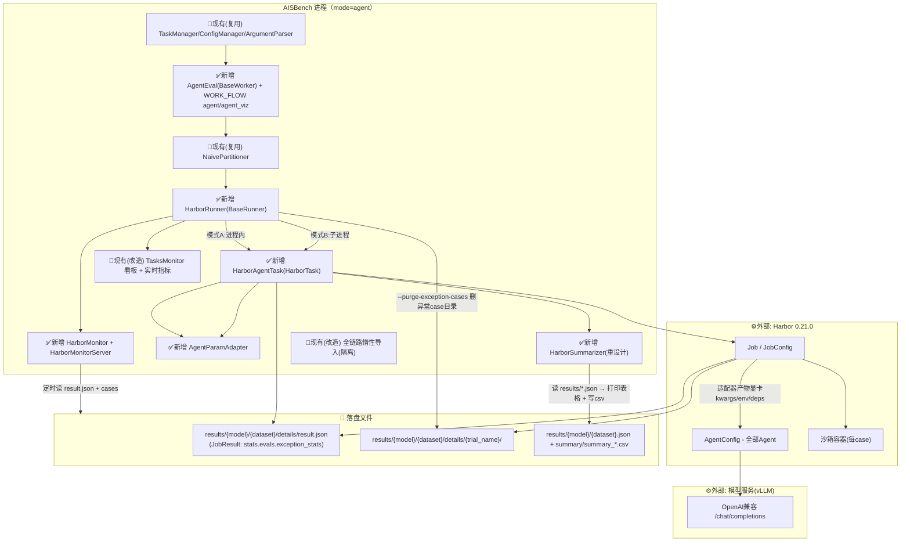
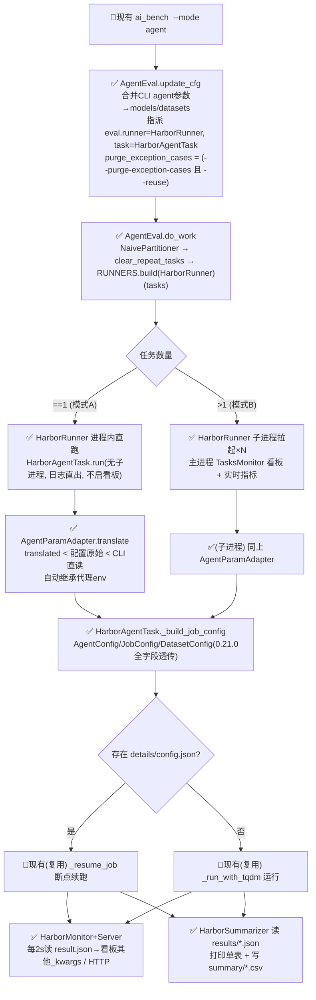
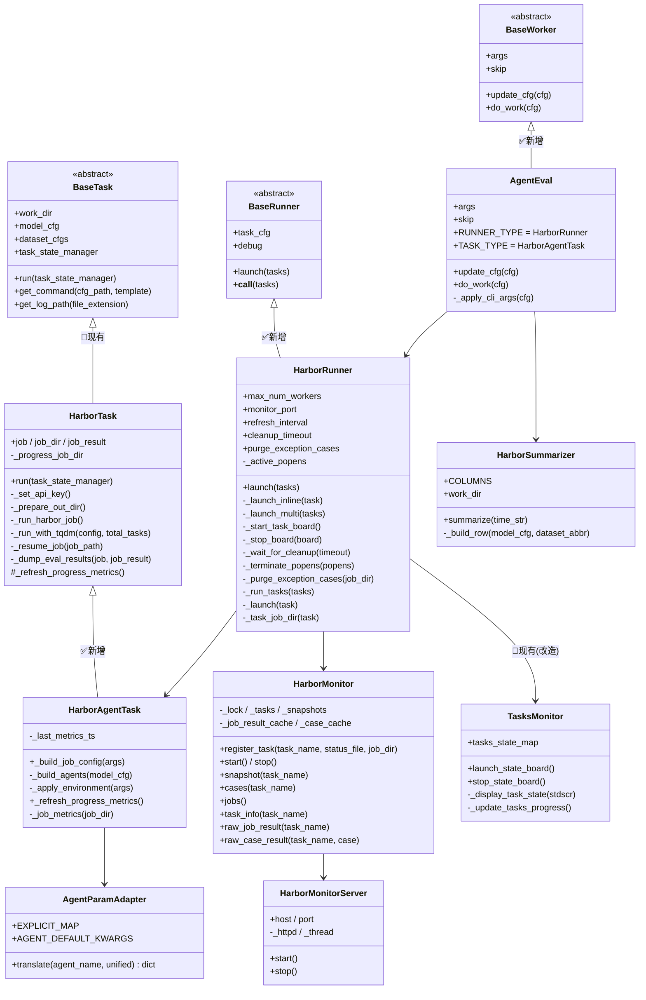
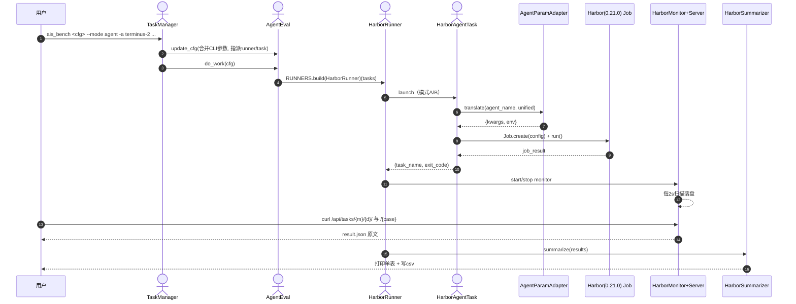

# AISBench 接入 Harbor Agent 测评实现设计说明书

> 目标读者：开发、测试、评审。本文说明「在 AISBench 中新增/改造了哪些东西」以实现基于 Harbor 的 Agent 通用测评，所有图统一约定：**蓝色节点 / 「✅新增」标记 = 本 Story 新增**，**白色节点 / 「🧩现有」标记 = 既有组件（仅被复用或为隔离做惰性化改造）**。

图例：
- `✅新增`：本次新写的模块 / 新加的功能点
- `🧩现有(改造)`：既有组件，为支持依赖隔离或承接函数做了惰性导入 / 小改动
- `🧩现有(复用)`：既有组件，直接复用不改
- `⚙️外部组件`：Harbor / 模型服务（vLLM）等外部依赖

---

## 1. Story概述（必要）

AISBench 原生只支持「开放式推理（infer）→ 评估（eval）→ 汇总（viz）」的标准化评测链路，其必装依赖 `requirements/runtime.txt` 非常庞大（torch / transformers / datasets / opencv 等）。而 Harbor 是一个独立的 Agent 评测框架，其 Job（每 case 在独立沙箱容器中运行 Agent → 验证）与 AISBench 的 inference/eval 模型完全不同，二者集成存在两类矛盾：

1. **依赖冲突**：把 Harbor 接入 AISBench 原生运行时，会引入 Harbor 依赖（pydantic/fastapi/litellm/typer 等）与 AISBench 原生庞大依赖相互拉扯，且 AISBench 无 torch 环境无法 import；
2. **语义鸿沟**：Harbor 中不同 Agent（terminus-2、claude-code、mini-swe-agent…）对同一含义参数（模型服务 base url / api key / model_info / 模型调用方式）的传入方式不同（有的走 kwargs、有的走环境变量），用户难以用一套统一参数接入；
3. **执行形态差异**：AISBench 的 Runner 以「GPU 池 + 子进程」拉任务，而 Harbor Job 自带沙箱/验证器/代理并发调度，AISBench 需要专属 Runner 承接，并能实时感知每个 Harbor case 的执行状态。

本 Story 在 AISBench 中新增一套**完全独立的 Agent 测评链路**（`--mode agent`）：新建专属 Worker、专属 Runner、专属 Monitor（含 HTTP 实时服务）、兼容全部 Harbor Agent 的 Task、统一参数适配器、独立精简依赖集，使「安装 agent.txt → 一行命令拉起 Harbor 评测 → 实时查看每 case 状态 → 输出单表 + csv」成为可能，且不破坏 AISBench 任何既有功能。

**对外承诺的四个最终能力**：
1. 一条 workflow：`ais_bench <config> --mode agent` 直接执行 Harbor job；
2. 实时监控：`HarborMonitorServer` 暴露任务总览（= result.json 原文）与每 case 原始结果；
3. 统一参数：`AgentParamAdapter` 把统一语义参数自动转换为各 Agent 私有参数；
4. 依赖隔离：仅安装 `requirements/agent.txt` 即可运行，原生 `runtime.txt` 与既有功能零影响。

---

## 2. Story上下文（必要）

下图展示 AISBench（本 Story 新增组件 vs 既有组件）与 Harbor、模型服务（vLLM）及落盘文件系统之间的整体交互关系。



---

## 3. 功能点分解（必要）

| 序号 | 功能点名称 | 功能点描述 |
|--|--|--|
| 1 | 新增 Agent workflow | `WORK_FLOW` 增加 `agent=[AgentEval, AccViz]` 与 `agent_viz=[AccViz]`；`--mode` 可选值增加 `agent` / `agent_viz`；新增专属 worker `AgentEval`（update_cfg 合并 CLI 参数、指派 HarborRunner/HarborAgentTask/NaivePartitioner；do_work 复用 partitioner→clear_repeat_tasks→runner 骨架）。 |
| 2 | Agent CLI 参数组 | `_agent_parser()` 新增 `agent_args` 组：`-a/--agent`、`--agent-import-path`、`--model`、`--api-base`、`--api-key`、`--ak/--agent-kwarg`、`--ae/--agent-env`、`--agent-deps`、`-p/--path`、`-d/--dataset`、`-n/--n-concurrent`、`-k/--n-attempts`、`-e/--environment`、`--timeout-multiplier`、`--max-retries`、`--include/exclude-task-name`、`--n-tasks`、`--disable-verification`、`--force-build/--no-force-build`、`--host-network`、`--delete/--no-delete`、`--purge-exception-cases`、`-q/--quiet`、`-y/--yes`、`--env-file`、`--monitor-port`。 |
| 3 | Harbor 专属 Runner | `HarborRunner(BaseRunner)`：按任务数分流——单任务进程内直跑（日志直出）、多任务子进程拉起 + 主进程看板；维护监控服务与看板生命周期；`--purge-exception-cases` 执行前清理异常 case 目录。 |
| 4 | 实时监控（Monitor + HTTP 服务） | `HarborMonitor`（两级快照：任务级 + 每 case 级，mtime 增量缓存）+ `HarborMonitorServer`（标准库 http.server）：`/api/tasks/{模型}/{数据集}/` 返回 **result.json 原文**、`/api/tasks/{模型}/{数据集}/{case}` 返回 **case 原始 result.json**，另保留派生快照端点。 |
| 5 | 兼容全部 Agent 的 Task | `HarborAgentTask(HarborTask)`：名称/import_path 传原始字符串，完整透传 0.21.0 的 `AgentConfig/JobConfig/DatasetConfig/EnvironmentType` 字段；支持本地路径/registry/package 数据集来源；复用旧 HarborTask 结果落盘与断点续跑。 |
| 6 | 参数适配器 | `AgentParamAdapter`：统一参数（api_base/api_key/llm_kwargs/model_info）→ 各 Agent 私有 kwargs/env（显式映射 + 描述符动态发现 + 兜底约定 + 按 Agent 注入默认 kwargs + 向后兼容直通）。 |
| 7 | 单表 + 单 csv 汇总 | 重设计 `HarborSummarizer`（不再继承 DefaultSummarizer）：仅打印一张表格、仅落一个 csv，列为 `agent/model_name/dataset/avg_score/correct/wrong/exception`，`COLUMNS` 数据驱动可自由拓展。 |
| 8 | 独立依赖集 | 新增 `requirements/agent.txt`（harbor + 核心 CLI 依赖，无 torch/transformers/datasets/opencv）；`setup.py` 增加 `extras_require["agent"]`；既有 `runtime.txt` 与默认安装不动。 |
| 9 | CLI 导入链惰性化（隔离改造） | `tasks/__init__.py`、`summarizers/__init__.py`、`datasets/__init__.py`、`utils/file/__init__.py` 改为 PEP 562 惰性再导出；`local.py`、`load_tokenizer.py`、`icl_base_local_inferencer.py`、`utils/config/run.py` 中 torch/transformers 函数内导入；`config_manager.py` custom dataset 惰性导入。 |
| 10 | 看板实时指标 | `HarborAgentTask._refresh_progress_metrics()` 每 2s 读 `result.json` 汇总正确/错误/异常/平均分写入任务状态 `other_kwargs`，`TasksMonitor` 看板 "Extend Parameters" 列实时展示。 |
| 11 | Ctrl+C 优雅回收 | 看板立即停止、心跳等待 Harbor 子进程回收容器、超时 SIGTERM/SIGKILL 兜底、`SystemExit(130)`；子进程 `except BaseException` 保证状态线程退出。 |
| 12 | 异常用例自动重试 | `--purge-exception-cases`（仅 `--reuse` 时生效）：执行前从各任务 `result.json` 的 `exception_stats` 获取异常 case 名，删除同目录下对应 case 目录，使 Harbor 重建 job 时自动重跑。 |

---

## 4. 实现设计（必要）

### 4.1 功能实现思路

**核心思路：在既有 registry 体系（PARTITIONERS / RUNNERS / TASKS / SUMMARIZERS）上"旁挂"一条独立的 Harbor 链路，而不是改造原生 infer/eval 链路。**

- **Workflow 层**：沿用 `WORK_FLOW` 机制，新增 `agent`（AgentEval 拉任务 + AccViz 汇总）与 `agent_viz`（仅汇总）。`AgentEval` 与既有 `Eval` 结构同构（update_cfg + do_work），保证与其他 mode 行为一致。
- **Runner 层**：`HarborRunner` 不依赖 GPU 池，按任务数分流。单任务（Mode A）在进程内直跑 `HarborAgentTask`，日志直接打印；多任务（Mode B）每个 task 子进程拉起（复用 `task.get_command` + 临时 param file + out 日志重定向），主进程启动 `TasksMonitor` 看板。
- **Task 层**：`HarborAgentTask` 继承旧 `HarborTask`，**重写** `JobConfig` 构建（严格对齐 harbor 0.21.0，不受旧 0.6.1 实现误导），**复用** `_dump_eval_results / _resume_job / _run_with_tqdm`，从而满足「结果落盘格式与旧版一致、断点续跑行为一致」的兼容性要求。
- **参数适配**：`AgentParamAdapter.translate()` 输入统一语义 dict，输出 `{kwargs, env}`，在 `_build_agents` 里按优先级合并（translated < 配置原始 < CLI 直读），并自动继承宿主代理环境变量。
- **监控**：`HarborMonitor` 以 harbor 落盘文件为唯一信息源，监控线程定时扫描；`HarborMonitorServer` 用标准库 `http.server` 暴露只读 JSON 端点，直接透出原始 result.json。
- **依赖隔离**：将 CLI 导入链上所有重型第三方依赖（torch/transformers/huggingface datasets/plotly）惰性化（PEP 562 `__getattr__` 或函数内 import），使 `from ais_bench.benchmark.cli.workers import WORK_FLOW` 在无 torch 环境可用；新增独立 `requirements/agent.txt`。

**对既有功能的影响**：
- 不改原生 infer/eval/perf 数据流；`runtime.txt`、默认安装、`all/infer/eval/perf` 等既有 workflow 完全不动；
- 惰性化改造仅改变导入时机，不改行为（完整环境下所有类仍照常可导、命名空间一致）；
- `datasets`/`tasks`/`summarizers`/`utils.file` 的惰性再导出对既有注册表加载（按点号路径直接加载子模块）无副作用；
- `runners/base.py`、`tasks/custom_tasks/harbor_task.py` 仅做非破坏性增强（新增钩子 / 抛出 BaseException）。

### 4.2 功能实现设计

#### 4.2.1 流程图



#### 4.2.2 流程说明

| 步骤 | 功能 | 输入/输出 | 异常处理 |
|---|---|---|---|
| AgentEval.update_cfg | 把 CLI agent 参数合并进 cfg、指派 runner/task；计算 purge 开关 | 输入 cfg；输出含 eval.runner 的 cfg | 无 |
| AgentEval.do_work | 建 partitioner 划分 model×dataset、去重任务、build runner 执行 | 输入 cfg；输出 `[(task_name, exit_code)]` | runner 异常向上抛 |
| HarborRunner.launch | purge 后按任务数分流 | 输入 tasks list | 无 |
| 模式A（单任务） | 进程内直跑 HarborAgentTask，日志直出；启 Monitor+Server，不启看板 | 输出 `(name, exit_code)` | except → return (name,1) |
| 模式B（多任务） | 每 task 子进程拉起（Popen.wait 不 SIGKILL）；主进程看板+指标 | 输出 status list | Ctrl+C → 停看板/心跳/超时兜底 → SystemExit(130) |
| _build_job_config | 构建 0.21.0 JobConfig | 输入 dataset args + model cfg | 数据集路径/枚举非法报清晰错误 |
| 断点续跑 | 检测 `details/config.json` 存在则 `_resume_job` | 输出 (job, job_result) | config 缺失抛 ValueError |
| Monitor/Server | 定时扫描落盘 + HTTP 只读响应 | 输出 JSON（result.json 原文 / case 原文 / 派生快照） | 文件缺失返回 404 / None |
| Summarizer | 汇总单表 + 单 csv | 输入 results/*.json；输出打印 + summary csv | 无结果则 warning 返回 |

#### 4.2.3 类图



#### 4.2.4 类图说明

**✅新增**
- `AgentEval(BaseWorker)`：`update_cfg` 合并 CLI 参数并指派 `eval.runner.type=HarborRunner`、`eval.runner.task.type=HarborAgentTask`、`partitioner=NaivePartitioner`、注入 `work_dir/results/` 及 monitor/cleanup/purge 等 runner 参数；`do_work` 复用 partitioner→runner 骨架。
- `HarborRunner(BaseRunner)`：核心编排。属性含 `monitor_port / jobs_dir / keep_tmp_file / debug / cleanup_timeout / purge_exception_cases / _active_popens`。模式 A 进程内直跑；模式 B 子进程并发 + 看板；含 `_purge_exception_cases`、`_wait_for_cleanup`、`_terminate_popens`、`_stop_board`。
- `HarborAgentTask(HarborTask)`：重写 `_build_job_config`/`_build_agents`（0.21.0 严格对齐），新增 `_refresh_progress_metrics`/`_job_metrics`（看板实时指标）与代理环境继承；复用父类落盘/续跑/tqdm。
- `AgentParamAdapter`：`translate(agent_name, unified) -> {"kwargs":..., "env":...}`；`parse_env_strings/parse_kwarg_strings` 解析 CLI 列表。
- `HarborMonitor` / `HarborMonitorServer`：监控快照 + 标准库 HTTP 服务，透出 result.json 原文与 case 原文。
- `HarborSummarizer`：独立汇总器（单表 + 单 csv）。

**🧩现有**
- `HarborTask`（改造）：新增 `_refresh_progress_metrics` 无操作钩子；`__main__` 的 `except Exception→BaseException`。作为 `HarborAgentTask` 的父类复用。
- `TasksMonitor`（改造）：新增 `stop_state_board()` 停止标志。
- `BaseWorker/BaseRunner/BaseTask`（复用）：继承与被 build_from_cfg 实例化的基类。
- `Partitioner/RUNNERS/TASKS/SUMMARIZERS` registry（复用）：`PARTITIONERS.build / RUNNERS.build / TASKS.build / build_from_cfg`。

#### 4.2.5 时序图



#### 4.2.6 时序图说明

1. 用户以命令行覆盖常用参数启动 `agent` mode；`TaskManager` 构建 `AgentEval` 并 load_config（config 读入方式与 AISBench 原有一致：`ais_bench <cfg> --mode agent`）。
2. `AgentEval.update_cfg` 将 CLI 参数写入 `models[0]`/`datasets[*].args`，并配置 runner/task/partitioner。
3. `do_work` 用 partitioner 划分 tasks 后交由 `HarborRunner` 执行。
4. `HarborRunner.launch` 按任务数分流；单任务进程内直跑，多任务子进程 + 看板。
5. `HarborAgentTask` 构建 JobConfig 前调用 `AgentParamAdapter` 把统一参数转为各 Agent 私有 kwargs/env。
6. 构建 0.21.0 `JobConfig` 后 `Job.create(config).run()` 执行；每 case 在沙箱容器中跑 Agent → 验证，并持续写落盘文件。
7. job 完成后返回 `job_result`；`_dump_eval_results` 落盘 summary json。
8. Runner 生命周期内启动/停止 Monitor；Monitor 每 2s 扫描落盘，Server 对外提供只读 HTTP。
9. 用户可随时 `curl` 获取任务总览（result.json 原文）或某 case 原始结果。
10. 全部任务结束 → `HarborSummarizer` 读取各 `results/{model}/{dataset}.json`，打印单表并落 csv。

### 4.3 数据库及文件持久化设计（可选）

本方案无数据库操作；涉及文件落盘如下：

**新增落盘**
- `work_dir/results/{model}/{dataset}/details/<harbor job 目录>`：由 Harbor 0.21.0 写入，含 `result.json`（`JobResult`，其中 `stats.evals[*].exception_stats` 是异常 case 名来源）、`config.json`（供断点续跑检测）、以及每个 case 目录（`details/{trial_name}/`，含该 case 的 `result.json/exception.txt/verifier/agent` 等）。
- `work_dir/results/{model}/{dataset}.json`：`_dump_eval_results` 落盘的汇总字段（`total_count/n_errors/avg_score/reward_distribution/exception_distribution/n_total_trials/pass_at_k`），与旧 HarborTask 完全一致。
- `work_dir/summary/summary_{time_str}.csv`：`HarborSummarizer` 落盘的单 csv。
- `requirements/agent.txt`、`configs/agent_example/harbor_agent_task.py`：本体资源。

**隔离改造（不破坏既有文件逻辑）**
- `data/__init__.py`、`tasks/__init__.py`、`utils/file/__init__.py` 等改为惰性再导出；完整环境下类照常可导，命名空间一致；注册表按点号路径加载子模块不受影响。

### 4.4 接口描述（必要）

**内部新增接口**
- `BaseWorker.AgentEval.update_cfg(cfg)->ConfigDict`、`.do_work(cfg)`、`._apply_cli_args(cfg)`。
- `HarborRunner.launch(tasks)->list[(name, exit_code)]`；`_purge_exception_cases(job_dir)`；`_wait_for_cleanup(timeout)`。
- `HarborAgentTask._build_job_config(args)->JobConfig`、`._build_agents(model_cfg)->list[AgentConfig]`、`._job_metrics(job_dir)->dict`、`._refresh_progress_metrics()`。
- `AgentParamAdapter.translate(agent_name, unified)->{"kwargs":..., "env":...}`；`parse_env_strings(list)`、`parse_kwarg_strings(list)`。
- `HarborMonitor.register_task(task_name, status_file, job_dir)`、`.snapshot()`、`.cases()`、`.raw_job_result()`、`.raw_case_result()`；`HarborMonitorServer.start()/stop()`。
- `HarborSummarizer.summarize(time_str=None)`（接口与既有 Summarizer 一致，`config=cfg` 构造）。

**对外 HTTP 接口（标准库只读服务，零新增依赖）**
| 端点 | 方法 | 说明 |
|---|---|---|
| `/api/health` | GET | 存活探测 |
| `/api/tasks` | GET | 全部任务级快照列表 |
| `/api/tasks/{模型}/{数据集}/` | GET | **任务总览 = job_dir/result.json 原文**（尾斜杠触发） |
| `/api/tasks/{模型}/{数据集}/{case}` | GET | **case 原始 result.json**（case 可为 `trial_00000` / 序号 `0` / harbor 任务名 `astropy__...`） |
| `/api/tasks/{模型}/{数据集}/cases` | GET | 该 task 每 case 派生状态/成败原因明细 |
| `/api/tasks/{模型}/{数据集}` | GET | 该 task 任务级派生快照（向后兼容） |
| `/api/jobs` | GET | 各 job 进度（聚合计数 + case 状态统计） |

端口由 `--monitor-port` 指定（默认 0 = 关闭）。case 结果未落盘时返回 404。

**第三方 / 服务接口**
- Harbor 0.21.0：`JobConfig` / `AgentConfig` / `DatasetConfig` / `EnvironmentType` / `AgentName` / `harbor.job.Job` / `harbor.cli.utils.run_async`。严格对齐当前 `harbor` 源码参数定义，不沿用 `harbor==0.6.1` 旧定义。
- 模型服务：OpenAI 兼容 `{api_base}/chat/completions`（经各 Agent 私有方式调用，由适配器转换）。

### 4.5 GUI界面（可选）

无 GUI。终端呈现两处：
- `TasksMonitor` 看板（模式 B，curses 交互屏，后台退化为 tqdm 进度条），"Extend Parameters" 列实时显示 `other_kwargs`（含 correct/wrong/exception/avg_score）。
- `HarborSummarizer` 运行结束时打印的单张 `tabulate` 表格。

### 4.6 代码设计（必要）

新增文件（**✅ 全部为本次新增**）与改造文件（**🧩 为惰性化/增强改造**）：

```
benchmark/
├─ requirements/
│  ├─ runtime.txt                     # 🧩 不动（既有原生依赖）
│  └─ agent.txt                       # ✅ 新增：独立Agent依赖集（harbor + 核心CLI）
├─ setup.py                           # 🧩 新增 extras_require["agent"]；parse_line 兼容 -e 无 #egg=
├─ ais_bench/benchmark/
│  ├─ cli/
│  │  ├─ argument_parser.py           # ✅ 新增 _agent_parser() + mode choices + --purge-exception-cases
│  │  ├─ workers.py                   # ✅ 新增 AgentEval + WORK_FLOW agent/agent_viz
│  │  └─ config_manager.py            # 🧩 custom dataset 惰性导入
│  ├─ runners/
│  │  ├─ harbor_runner.py             # ✅ 新增 HarborRunner
│  │  ├─ harbor_monitor.py            # ✅ 新增 HarborMonitor + HarborMonitorServer
│  │  ├─ base.py                      # 🧩 TasksMonitor.stop_state_board + 停止标志
│  │  ├─ local.py                     # 🧩 torch/npu 函数内导入
│  │  └─ __init__.py                  # 🧩 导出 HarborRunner
│  ├─ tasks/
│  │  ├─ __init__.py                  # 🧩 PEP 562 惰性再导出
│  │  └─ custom_tasks/
│  │     ├─ harbor_task.py            # 🧩 新增进度钩子 + except BaseException（父类复用）
│  │     └─ harbor_agent_task.py      # ✅ 新增 HarborAgentTask
│  ├─ utils/
│  │  ├─ agent_params.py              # ✅ 新增 AgentParamAdapter
│  │  ├─ config/run.py                # 🧩 惰性导入 partitioner/runner/task/openicl；跳过agent数据集dummy填充
│  │  └─ file/__init__.py + load_tokenizer.py  # 🧩 PEP562 惰性再导出 + transformers函数内导入
│  ├─ datasets/__init__.py            # 🧩 逐模块 try/except 守卫惰性导出
│  ├─ summarizers/
│  │  ├─ __init__.py                  # 🧩 PEP 562 惰性再导出
│  │  └─ harbor.py                    # ✅ 重设计 HarborSummarizer（单表+单csv）
│  └─ openicl/icl_inferencer/icl_base_local_inferencer.py  # 🧩 DataLoader 惰性导入
└─ ais_bench/configs/agent_example/
   └─ harbor_agent_task.py            # ✅ 新增示例配置（models/datasets 划分）
```

---

## 5 DFX设计（可选）

### 5.1 性能设计（可选）

- Monitor 增量缓存：按「已解析 trial 目录 + 文件 mtime」缓存，仅 mtime 变化才重读 `result.json`/`ctrf.json`；stdout/stderr 只取尾部固定行数；新 case 首次全量解析一次，避免大 job 高频全量扫描。
- 看板实时指标 `_refresh_progress_metrics` 限频 2s/次，读 `result.json` 聚合，不做全量遍历。
- HTTP 服务为标准库 `ThreadingHTTPServer`，单请求开销低；只读响应。
- `--purge-exception-cases` 仅在 `--reuse` 下、执行前一次性删除，不影响运行期性能。

### 5.2 兼容性设计（可选）

- **结果格式兼容**：`HarborAgentTask` 复用 `_dump_eval_results`，落盘字段与旧 `harbor_task.py` 一致。
- **配置格式兼容**：沿用 `models`（agent+模型服务）与 `datasets`（测评任务）划分；原 `agent_kwargs.api_base` 写法继续可用（适配器直通），新增统一字段为可选增强。
- **依赖互不影响**：`runtime.txt` 与默认安装不动；惰性化改造仅改导入时机，不改行为；`all/infer/eval/perf` 等既有 workflow 完全不动。
- **断点续跑**：沿用 harbor job 目录 `config.json` 检测 → `_resume_job`，行为与旧实现一致。
- **插件/注册表兼容**：`RUNNERS/TASKS/SUMMARIZERS` 按 registry 注册，新增组件不影响既有构建。

### 5.3 日志上报（可选）

- 统一走 `AISLogger`；关键节点（启动 job、env keys、monitor server 端口、summary csv 路径、purge 的 case 目录、Ctrl+C 清理心跳/超时终止）记录 INFO/WARNING。
- Monitor/Server 与落日读异常用 debug/exception 记录，不影响主流程。
- 子进程日志重定向到 `get_log_path('out')`；task 状态写入 `status_tmp`。

---

## 6 测试设计（必要）

### 6.1 单元测试（UT）

- `AgentParamAdapter.translate`：terminus-2→kwargs、claude-code/mini-swe-agent→env、兜底约定、`AGENT_DEFAULT_KWARGS` 注入、优先级（显式覆盖翻译值与默认）。
- `HarborAgentTask._build_job_config`：Agent/Job/Dataset/Environment 字段映射正确；单 task 目录→`config.tasks`、数据集目录→`config.datasets`；断点续跑检测。
- `HarborMonitor.raw_job_result / raw_case_result`：三种 case 匹配方式（trial 目录/序号/task 名）及 404 返回。
- `HarborSummarizer._build_row`：正确/错误/异常计数与 avg_score 读取。
- `_purge_exception_cases`：从 result.json 的 `exception_stats` 提取并删除 case 目录。
- `_job_metrics`：correct/wrong/exception/avg_score 聚合。

### 6.2 接口测试

- 按 4.4 接口描述校验：`/api/tasks/{模型}/{数据集}/` 返回 result.json 原文；`/api/tasks/{模型}/{数据集}/{case}` 返回 case 原文；`cases`/s 增点返回派生快照；不存在的任务/case 返回 404 与明确错误。
- CLI 参数组：`ais_bench --help` 出现 agent_args 组；`--mode` 可选值含 agent/agent_viz；`--ae/--ak` 解析到 `agent_env/agent_kwarg`（dest 正确）。

### 6.3 业务场景测试

- 单个 Harbor 任务（`-a oracle`/`-a nop`）：验证模式 A 日志直出 + 结果 json 字段与旧版一致 + summarizer 单表/单 csv。
- 多个 Harbor 任务：验证看板进度与 Extend Parameters 实时指标、`/api/tasks` 与 `/api/jobs` 聚合。
- `--purge-exception-cases`（结合 `--reuse`）：异常 case 目录被删除、重跑后已重试；不指定 `--reuse` 时不生效。
- `agent_viz`：仅汇总已有结果，不拉起 Harbor job。

### 6.4 异常场景测试

- 断链/超时：Harbor 服务不可达、单 case Agent 超时（`timeout_multiplier`/各类 timeout 覆盖项）。
- Ctrl+C 优雅回收：立即停看板、心跳打印、容器回收后 `SystemExit(130)`；极端下 `cleanup_timeout` 超时 SIGTERM/SIGKILL 兜底；子进程容器已回收但被状态线程卡住时经 `except BaseException` 正常退出。
- 全部/部分失败：部分 case 异常（correct/wrong/exception 计数正确）、全部异常（summarizer 仍输出、avg_score 无酬金显示 `-`）。
- 依赖隔离：仅安装 `agent.txt` 环境执行 `python -c "from ais_bench.benchmark.cli.workers import WORK_FLOW"` 通过（无 torch/transformers/datasets 报错）。