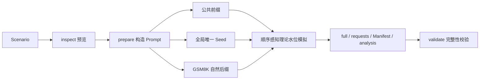

# Prefix Cache 数据生成、压测与命中率分析

## 概述

AISBench Prefix Cache 插件用于构造具有可控公共前缀的数据集，先计算理论 Prefix Cache 命中率，再通过 AISBench 和 vLLM 采集实际命中率。它适用于验证不同输入长度、公共前缀比例、Prefix Group、请求顺序以及单入口多 DP 对缓存命中率的影响。

当前插件提供五个命令：

- `inspect`：预览场景、可达范围和长度分布；
- `prepare`：生成正式请求、Manifest 和理论分析；
- `validate`：校验已有产物是否被修改、截断或换序；
- `run`：探活、reset、按组逐 DP 预热并运行 AISBench 正式压测；
- `analyze`：使用两份 Prometheus 快照离线复算实际命中率。

`inspect`、`prepare`、`validate` 完全离线；只有 `run` 连接 vLLM。当前支持一个 HTTP 入口及其内部单 DP 或多 DP，不支持多个独立推理服务实例。

---

## 前置条件

1. **Python 3.10 或更高版本**。
2. **可正常使用的 AISBench 仓库及依赖**。
3. **与目标 vLLM 服务一致的 tokenizer**。tokenizer 不一致会造成 token 长度、Block 边界和理论命中率偏差。
4. **GSM8K JSONL 语料**。每个非空行必须是 JSON 对象，并包含 Scenario 中 `corpus.field` 指定的文本字段，默认是 `question`。
5. **正确的 Prefix Cache Block 大小**。`tokenizer.block_size` 必须与目标服务实际值一致。
6. **在线 run 所需服务能力**：`/v1/completions`、`/metrics`、可选 `/reset_prefix_cache`，多 DP 时还需支持 `X-data-parallel-rank` 和分 DP `engine` 指标标签。

---

## 安装

以下命令假设当前目录是 AISBench 仓库根目录：

```shell
python -m venv .venv
source .venv/bin/activate
python -m pip install -e .
python -m pip install -e ./plugins/prefix_cache
ais-bench-prefix-cache --help
```

`-e` 表示 editable 安装，修改当前仓库源码后通常不需要重新安装。

---

## 快速使用

复制示例 Scenario：

```shell
cp ./plugins/prefix_cache/config_examples/scenario.example.json ./scenario.json
```

至少检查 `tokenizer.path`、`tokenizer.block_size` 和 `corpus.path`。需要模拟 cold 多 DP 路由或生成 warmup 计划时，还应让 `service.dp_size` 与目标服务一致。
执行在线压测前还要核对 `service` 下的 URL、`model` 以及 `aisbench.config`。

一个最小示例：

```json
{
  "schema_version": "1.0",
  "run": {
    "run_id": "gsm8k-prefix-cache-60",
    "random_seed": 42,
    "output_dir": "./outputs/gsm8k-prefix-cache-60"
  },
  "tokenizer": {
    "path": "/path/to/tokenizer",
    "block_size": 16
  },
  "corpus": {
    "path": "./GSM8K.jsonl",
    "field": "question",
    "selection": {"mode": "random"}
  },
  "requests": {
    "count": 100,
    "input_length": {"mode": "fixed", "value": 1024},
    "output_length": {"mode": "fixed", "value": 32}
  },
  "prefix_cache": {
    "mode": "warmup",
    "target_hit_rate": 0.6,
    "seed_blocks": 1,
    "groups": {"count": 1, "assignment": {"mode": "uniform"}},
    "order": {"strategy": "interleave"}
  },
  "service": {"dp_size": 2}
}
```

依次执行：

```shell
ais-bench-prefix-cache inspect --scenario ./scenario.json
ais-bench-prefix-cache prepare --scenario ./scenario.json
ais-bench-prefix-cache validate --manifest \
  ./outputs/gsm8k-prefix-cache-60_<时间戳>/result/gsm8k-prefix-cache-60_<时间戳>.manifest.json
ais-bench-prefix-cache run --scenario ./scenario.json
```

`run` 的正式 AISBench 请求固定使用 vLLM SSE 流式响应，按请求开始、首个响应 chunk 和后续 chunk 的时间点生成 TTFT、TPOT、ITL、E2EL 与吞吐量指标。探活和 warmup 使用 baseline 前的独立非流式请求，不进入正式性能统计。

已有 Prometheus 快照时，可在不连接 vLLM 的情况下复算：

```shell
ais-bench-prefix-cache analyze \
  --manifest <manifest路径> \
  --baseline ./baseline.prom \
  --after ./after.prom
```

---

## 工作原理



每条正式请求由三部分构成：

```text
公共前缀 + 全局唯一 seed + GSM8K 自然后缀
```

- 公共前缀按 `block_size` 对齐，是理论命中的主要来源；
- seed 长度为 `seed_blocks × block_size`，每条请求全局唯一，防止公共前缀之后继续误共享；
- 自然后缀从 GSM8K 问题中选择、拼接并截断，使非共享区保持自然语言形态。

插件根据目标全局命中率反求每条请求的公共前缀长度，并按照最终请求顺序模拟缓存水位。最终命中 token 总量优先精确匹配最近可达目标；在终值相同的方案中，warmup 均衡分配前缀，cold 按 Prefix Group/DP lane 水位优先选择累计率低超调、少回落并逐步贴近目标的方案。后置 lane 首次 miss 或容量不足时严格单调可能不可行，但不会再默认采用“前段明显冲高、尾部短前缀回调”的顺序填满方式。

---

## Scenario 核心配置

完整逐字段参考位于仓库中的：

```text
plugins/prefix_cache/config_examples/scenario.example.md
```

### 完整字段索引

| 配置路径 | 允许字段 |
|---|---|
| 顶层 | `schema_version`、`run`、`tokenizer`、`corpus`、`requests`、`prefix_cache`、`service`、`validation`、`aisbench` |
| `run` | `run_id`、`random_seed`、`output_dir`、`overwrite` |
| `tokenizer` | `path`、`block_size`、`revision`、`trust_remote_code` |
| `corpus` | `path`、`field`、`selection` |
| `corpus.selection` | `mode`、`values`、`indices`、`question_sha256` |
| `requests` | `count`、`input_length`、`output_length` |
| `requests.input_length` | `mode`、`value`、`values`、`ranges`、`min`、`max`、`mean`、`std`、`path`；range 项只允许 `min`、`max`、`count` |
| `requests.output_length` | `mode`、`value`、`min`、`max`、`mean`、`std`、`path` |
| `prefix_cache` | `mode`、`target_hit_rate`、`seed_blocks`、`minimum_non_shared_length`、`groups`、`order` |
| `prefix_cache.groups` | `count`、`assignment`、`overrides` |
| `prefix_cache.groups.assignment` | `mode`、`exponent`、`weights` |
| `groups.overrides.group-N` | `input_length`、`output_length`、`corpus_selection` |
| `prefix_cache.order` | `strategy` |
| `service` | `inference_url`、`metrics_url`、`reset_url`、`model`、`dp_size`、`assume_empty_cache`、`engine_label_map`、`timeout_seconds`、`api_key` |
| `validation` | `target_warning_pp`、`actual_warning_pp` |
| `aisbench` | `config`、`work_dir`、`extra_args`；`run` 消费，离线命令不消费 |

Scenario 会拒绝白名单之外的字段。离线计算使用 `service.dp_size`；`run` 使用服务 URL、model、reset/空缓存策略、指标映射、超时、API key 以及整个 `aisbench` 段。

### 输入和输出长度

`requests.input_length` 支持：

- `fixed`：固定长度；
- `explicit`：显式长度列表；
- `range`：一个或多个闭区间采样；
- `truncated_normal`：截断正态分布；
- `csv`：从 CSV 的 `input_prompt_tokens`、`content_tokens` 或 `input_tokens` 列读取。

`requests.output_length` 支持：

- `fixed`；
- `uniform`；
- `truncated_normal`；
- `csv`，列名必须为 `output_tokens`。

所有长度必须为正整数。全局显式列表、range 计数和 CSV 行数必须等于 `requests.count`；组级覆盖时必须等于该组实际请求数。

### GSM8K 样本选择

`corpus.selection.mode` 支持：

- `random`：根据 `run.random_seed` 确定性打乱；
- `indices`：按 GSM8K 零基行号选择；
- `question_sha256`：按规范化 question 的 SHA-256 选择；
- `mixed`：先加入 `indices`，再加入 `question_sha256`。

指定样本不足时会按已选顺序循环复用。mixed 模式的两个列表不能同时为空。

### Prefix Group

`prefix_cache.groups.assignment.mode` 支持：

- `uniform`：尽量均匀分配；
- `zipf`：使用 `exponent` 控制热点集中程度；
- `weights`：通过 `weights` 提供每组相对权重。

每个 Prefix Group 独立生成 canonical 前缀、维护缓存水位并统计理论命中率。`groups.overrides.group-N` 可以独立覆盖输入长度、输出长度和语料选择方式。

### requests.jsonl 输出字段

```json
"output": {"output_key": null}
```

默认 `null` 时每行只有 `question`、`answer`。也可配置 `"max_tokens"` 或 `"output_tokens"` 作为第三字段名；两者的值都来自内部最大输出 token 数。`full.jsonl.max_tokens` 始终保留，AISBench 从 full 读取生成长度，因此默认省略不影响运行。

### 请求顺序

`prefix_cache.order.strategy` 支持：

- `sequential`；
- `within_group_shuffle`；
- `interleave`；
- `global_shuffle`；
- `input_len_asc`。

理论命中率始终按重排后的最终发送顺序计算。要模拟“无预热、短请求到长请求逐步建立 Cache”，请同时使用 `prefix_cache.mode="cold"` 和 `order.strategy="input_len_asc"`。prepare 会先按组内输入长度升序生成产物；run 时 `LaneSequencer` 保证每个 `(group_id, dp_rank)` lane 只有在前一条请求完成后才放行下一条。不同 Group/DP 的独立 Cache 仍可并行。

---

## cold 与 warmup

### cold

- 每个 `(group_id, dp_rank)` lane 从零缓存水位开始；
- 同一组的正式请求按组内出现顺序 round-robin 路由到各 DP rank；
- `full.jsonl` 记录 `dp_rank` 和 `lane_sequence`；
- 理论命中率按每个 lane 独立模拟后进行 token 加权汇总。

### warmup

- 为每个 `Prefix Group × DP rank` 生成一条预热计划；
- 预热计划写入 Manifest 的 `warmup.plan`；
- warmup 请求不写入 `requests.jsonl`，不进入正式请求数量和理论统计分母；
- `prepare` 只生成预热计划；`run` 会在正式 baseline 之前把计划逐 `Prefix Group × DP rank` 定向发送。

---

## 理论命中率和可达性

对于某个独立缓存 lane，请求到达前水位为 `watermark`，请求共享前缀为 `shared_prefix_tokens`，理论命中 token 为：

```text
hit_tokens = min(shared_prefix_tokens, watermark)
watermark_after = max(watermark, shared_prefix_tokens)
```

全局命中率使用 token 加权口径：

```text
global_hit_rate = sum(theoretical_hit_tokens) / sum(actual_input_tokens)
```

插件同时输出：

- `requested_target_hit_rate`：Scenario 请求目标；
- `effective_target_hit_rate`：求解器选择的最近可达目标；
- `theoretical_hit_rate`：按最终顺序模拟的理论值；
- `reachable_min`、`reachable_max`：当前约束下的理论范围；
- `target_reachable`：请求目标是否位于可达范围内。

Block 对齐、唯一 seed、自然后缀、Prefix Group、顺序和 cold DP lane 都可能使某个目标不可达。

---

## 输出目录和时间戳

时间戳格式为 `_YYYYMMDD_HHMMSS`。推荐工作流中，inspect 创建时间戳和轻量 Manifest，prepare 与 run 通过 Manifest 复用该任务：

```text
outputs/gsm8k-prefix-cache-60_20260825_123456/
├── log/
│   ├── gsm8k-prefix-cache-60_20260825_123456.inspect.log
│   ├── gsm8k-prefix-cache-60_20260825_123456.prepare.log
│   ├── gsm8k-prefix-cache-60_20260825_123456.validate.log
│   └── gsm8k-prefix-cache-60_20260825_123456.run.log
└── result/
    ├── gsm8k-prefix-cache-60_20260825_123456.full.jsonl
    ├── gsm8k-prefix-cache-60_20260825_123456.requests.jsonl
    ├── gsm8k-prefix-cache-60_20260825_123456.manifest.json
    └── gsm8k-prefix-cache-60_20260825_123456.analysis.json
```

不会再生成 `<output_dir>.inspect.json`。inspect 将摘要写入时间戳目录的 `result/<run_id_时间戳>.manifest.json`，状态为 `inspected`；prepare 在 Scenario SHA-256、run/output 和状态均匹配时原位升级为 `prepared`，run 可继续复用。Scenario 内容改变后旧 Manifest 会自动失配。

---

## 产物说明

| 产物 | 作用 |
|---|---|
| `full.jsonl` | 完整审计数据，包括组、DP lane、输入长度、公共前缀、唯一 seed、GSM8K 来源、理论水位和碰撞状态。 |
| `requests.jsonl` | 最小 AISBench 请求；默认只有 `question`、`answer`，可由 `output.output_key` 追加 `max_tokens` 或 `output_tokens`。 |
| `manifest.json` | 有效配置、输入哈希、tokenizer 指纹、长度分布、可达范围、组、DP、warmup 和产物哈希。 |
| `analysis.json` | requested/effective/theoretical/actual 命中率、baseline/after、分组/分 DP 统计、偏差与 warnings。 |

`service.api_key` 明文不会写入 Manifest，只记录 `api_key_configured`。

固定字段索引：

- `requests.jsonl`：固定 `question`、`answer`；`output.output_key` 默认为 `null`，也可选择追加 `max_tokens` 或 `output_tokens`；
- `full.jsonl`：`request_id`、`sequence_index`、`group_id`、`occurrence_index_within_group`、`dp_rank`、`lane_sequence`、`target_input_tokens`、`actual_input_tokens`、`max_tokens`、`shared_prefix_tokens`、`seed_tokens`、`natural_suffix_tokens`、`question`、`answer`、`gsm_indices`、`gsm_hashes`、`canonical_prefix_sha256`、`seed_sha256`、`request_random_seed`、`watermark_before`、`theoretical_hit_tokens`、`watermark_after`、`theoretical_hit_rate`、`divergence_block_sha256`、`divergence_unique`、`collision_status`；
- 正式 Manifest 顶层：`schema_version`、`plugin_version`、`status`、`run_id`、`scenario_path`、`scenario_sha256`、`effective_config`、`effective_config_sha256`、`corpus_sha256`、`tokenizer`、`requests`、`prefix_cache`、`groups`、`dp`、`warmup`、`divergence`、`artifacts`；inspect-only Manifest 的 `status="inspected"`，并以 `inspect.summary` 保存摘要；
- `analysis.json`：prepare 阶段包含 `schema_version`、`run_id`、`status`、requested/effective/theoretical、目标偏差、`validation`、`theory`、`warnings`；run/analyze 进一步加入 `runtime`、`actual` 和 `theory_actual_*_difference_pp`；
- inspect stdout：`run_id`、`mode`、`requested_target_hit_rate`、`effective_target_hit_rate`、`theoretical_hit_rate`、`reachable_min`、`reachable_max`、`target_reachable`、`group_reachability`、`groups`、`input_tokens`、`output_tokens`、`dp_route_counts`、`sends_requests`、`log`、`manifest`。

各字段类型和嵌套含义以插件 README 与 Scenario 完整字段说明为准。

---

## 告警与退出码

| 告警 | 条件 |
|---|---|
| `TARGET_UNREACHABLE` | 请求目标不在 `[reachable_min, reachable_max]` 内。 |
| `TARGET_DEVIATION` | 理论值与请求目标的绝对差超过 `validation.target_warning_pp`。 |
| `ACTUAL_DEVIATION` | 实际值与理论值的绝对差超过 `validation.actual_warning_pp`。 |

这些告警只把展示状态改为 `PASS_WITH_WARNING`；`warning_only=true`、`affects_exit_code=false`，不会改变成功退出码。Scenario、产物、服务能力或 AISBench 执行错误才返回非零退出码。

---

## 常见问题

### 为什么理论命中率没有精确等于目标？

公共前缀必须按 Block 对齐，同时还要为唯一 seed 和自然后缀预留空间。cold 模式还受首次 miss、请求顺序、组和 DP lane 水位约束。请先运行 `inspect`，检查 `reachable_min`、`reachable_max` 和 `target_reachable`。

### 为什么 warmup 不进入正式统计？

warmup 只负责建立缓存。如果计入正式请求数、吞吐、时延或命中率，结果会混入准备阶段成本。

### 为什么 prepare 报同名文件已存在？

prepare 可能复用了已有正式产物的 inspect 时间戳。重新执行 `inspect` 可获得新时间戳；只有明确要重建同一目录时才使用：

```shell
ais-bench-prefix-cache prepare --scenario ./scenario.json --overwrite
```

### 为什么 tokenizer round-trip 失败？

插件要求 canonical 前缀、seed 和最终 prompt 在 tokenizer 编解码后保持一致。请确认 tokenizer 文件完整、`trust_remote_code` 设置正确，并与目标服务使用同一 tokenizer 版本。

---

## 当前范围

- 支持单个 HTTP 入口对应的多 DP 数据规划；
- 不支持多个独立推理服务实例；
- `run` 支持每个 Prefix Group × 每个 DP 独立预热、正式 AISBench 压测与 Prometheus 指标采集；warmup 在 baseline 之前完成，不进入正式统计；
- `analyze` 支持用保存的 baseline/after `.prom` 文件离线复算；
- 详细配置和全部 JSON 字段契约以 `plugins/prefix_cache/README.md` 与 `plugins/prefix_cache/config_examples/scenario.example.md` 为准。
