# AISBench V3.1测评工具组件实现设计说明书

## 1. 概述

AISBench V3.1是AISBench人工智能系统性能评测基准委员会推出的AI模型测评工具V3.1版本，旨在为AI模型提供全面的精度和性能评估能力。本版本在原有功能基础上，新增了长序列推理场景支持、多模态数据集覆盖、API Key鉴权认证、PPL评测能力、裁判模型评估、GEdit bench图片编辑多模态评测、工具易用性优化、集群测评能力增强等多项特性，进一步提升了测评工具的完整性、易用性和专业性。

该组件对外提供的关键服务包括：

1. **模型精度评估服务**：支持多种数据集（L-Eval、多模态数据集、GEdit等）的精度评估，输出准确率、Rouge指标等评估结果
2. **模型性能评估服务**：支持高并发性能测评，输出TTFT、TPOT、ITL等性能指标
3. **裁判模型评估服务**：支持通过裁判模型对生成内容进行自动评估，解决没有标准答案或需要评估推理过程合理性的场景
4. **安全认证服务**：支持API Key鉴权认证，增强服务化推理的安全性
5. **PPL评测服务**：支持基于困惑度的评测模式，覆盖预训练模型的测评

本组件在整个测评系统中承担核心评估引擎的角色，通过模块化设计和注册机制，支持灵活扩展新的数据集、评估器和推理模式。本版本的主要价值包括：

1. **长序列推理能力评估**：通过支持L-Eval数据集，提供对模型长文本理解能力的全面评估，支持Mooncake论文验证方式，满足长序列推理场景的测评需求。
2. **多模态模型全面覆盖**：新增MMStar、VideoMME、OCRBench、MMMU、OmniDocBench、VQA等多个多模态数据集支持，覆盖视觉问答、视频理解、文本理解、大学水平问题等多个维度。
3. **安全性增强**：支持API Key鉴权认证，增强服务化推理的安全性。
4. **评测能力扩展**：新增PPL（困惑度）评测能力，支持预训练模型的测评；新增DAPO-math数据集支持，覆盖强化学习场景。
5. **裁判模型评估能力**：引入裁判模型对生成内容进行自动评估，支持主观任务（如回答质量、创意写作等）的量化评测，提升评估的全面性和客观性。
6. **图片编辑多模态评测**：新增GEdit bench基准支持，专门评测多模态生成模型的图片编辑能力，覆盖图像修改、内容添加、风格转换等场景，满足对图像生成与编辑模型的测评需求。
7. **易用性提升**：通过命令行参数优化、配置参数优化等方式，提升工具的易用性和灵活性。
8. **集群测评能力**：支持EPD分离的encoding阶段耗时统计、基于timestamp的流量负载复现等高级功能。

## 2. 服务/组件功能清单

| 类型    | 功能清单          | 功能描述                                                                          | 支持的系统功能   |
| ----- | ------------- | ----------------------------------------------------------------------------- | --------- |
| 业务功能  | L-Eval数据集精度测评（开放式任务） | 支持L-Eval数据集中15个子数据集的开放式任务精度测评，使用Rouge指标评估，与OpenCompass精度差异<1% | 长序列推理能力评估 |
| 业务功能  | L-Eval数据集精度测评（封闭式任务） | 支持L-Eval数据集中5个子数据集的封闭式任务精度测评，使用AccEvaluator评估，与OpenCompass精度差异<1% | 长序列推理能力评估 |
| 业务功能  | L-Eval数据集性能测评 | 支持泊松到达、固定RR等请求模式，输出ITL、TPOT、TTFT等性能指标，支持Mooncake论文验证方式 | 长序列性能评估   |
| 业务功能  | API Key鉴权认证（性能测评） | 支持通过环境变量读取API Key并透传给推理服务，覆盖vLLM系列API接口，完成性能测评 | 安全认证      |
| 业务功能  | API Key鉴权认证（精度测评） | 支持通过环境变量读取API Key并透传给推理服务，覆盖vLLM系列API接口，完成精度测评 | 安全认证      |
| 业务功能  | MMStar数据集支持 | 支持MMStar数据集的精度测评，输出不同subject子数据的评分以及平均值，支持GPU/NPU硬件 | 多模态模型全面评估 |
| 业务功能  | VideoMME数据集支持 | 支持VideoMME数据集的精度测评，基于正则表达式完成答案提取并与标准答案进行精准匹配，支持GPU/NPU硬件 | 多模态模型全面评估 |
| 业务功能  | OCRBench_v2数据集支持 | 支持OCRBench_v2数据集的精度测评，输出精度评分，支持GPU/NPU硬件 | 多模态模型全面评估 |
| 业务功能  | MMMU数据集支持 | 支持MMMU数据集的精度评估，评估模型的深层视觉理解能力，结合大学学科知识进行推理，包括选择题和开放式问题 | 多模态模型全面评估 |
| 业务功能  | MMMU Pro数据集支持 | 支持MMMU Pro数据集的精度评估，对MMMU数据集的强化版本，增加选择题选项数目，引入纯视觉输入设置 | 多模态模型全面评估 |
| 业务功能  | OmniDocBench数据集支持 | 支持OmniDocBench数据集的精度测评，适配Deepseek-ocr模型的推理测评，支持transformer离线推理、vllm-ascend离线推理、vllm在线推理 | 多模态模型全面评估 |
| 业务功能  | DocVQA数据集支持 | 支持DocVQA数据集的精度测评，使用ANLS评估方式，输出精度评分，评估模型的文档视觉问答能力 | 多模态模型全面评估 |
| 业务功能  | InfoVQA数据集支持 | 支持InfoVQA数据集的精度测评，使用ANLS评估方式，输出精度评分，评估模型对布局、文本、图形、可视化等多模态进行关联推理能力 | 多模态模型全面评估 |
| 业务功能  | DAPO-math数据集支持 | 支持DAPO-math-17k数据集完成RL推理测评，基于acc方式评估，输出pass/avg/cons@k指标，支持RL场景的数学能力推理评估 | 评测能力扩展    |
| 业务功能  | PPL推理模式支持 | 支持PPL推理模式的服务化精度测评，拓展ppl inferencer支持PPL推理方式，与OpenCompass精度差异<1% | 预训练模型测评   |
| 业务功能  | PPL通用数据集支持 | 拓展PPL测评支撑的数据集，包括mmlu、ceval、cmmlu、piqa、race、siqa、hellaswag、gpqa等多个数据集，支持服务化PPL精度测评 | 预训练模型测评   |
| 业务功能  | 裁判模型评估        | 支持LLM裁判模型对文本答案正确性进行判断，支持LMM裁判模型对多模态输出进行评估 | 主观任务量化评测  |
| 业务功能  | GEdit图片编辑评估   | 支持GEdit数据集的图片编辑能力评估，支持配置裁判模型URL，输出语义一致性、感知质量等维度的评估结果，与Step1X-Edit的benchmark脚本精度对齐 | 多模态生成模型评估 |
| 业务功能  | 集群测评能力增强      | 支持EPD分离的encoding阶段耗时统计、基于timestamp的流量负载复现 | 集群性能分析    |
| DFX功能 | 命令行参数优化       | 支持--num-prompts、--merge-ds、--max-num-workers、--pressure-time、--num-warmups等参数 | 易用性提升     |
| DFX功能 | 配置参数优化        | 支持stream、url、LOG\_LEVEL等配置参数 | 易用性提升     |
| DFX功能 | 向后兼容性         | 保留老版本的配置方式和命令行参数，支持平滑升级 | 兼容性保障     |
| DFX功能 | 异常处理          | 支持重试机制、超时控制、错误提示等 | 可靠性保障     |
| DFX功能 | 日志管理          | 支持多级别日志（DEBUG、INFO、WARNING、ERROR、CRITICAL） | 可维护性保障    |

## 3. 软件实现设计目标分析与关键要素设计

### 3.1 整体设计目标分析

基于业务功能与DFX非业务功能，分析软件实现设计关键内容与设计目标：

1. **代码易用性**：设计软件实现时，注重代码的可读性、可维护性和可扩展性，通过注册机制（Registry）实现模块化设计，各模块独立易于扩展和维护。统一的数据集接口、模型接口、评估器接口保证一致性，降低使用门槛。
2. **数据一致性**：确保在多线程或分布式环境下，数据的一致性和完整性。通过结果缓存、检查点恢复、结果文件备份等机制保证评估结果不丢失、不损坏。裁判模型推理与被测模型推理解耦，互不影响，确保评估结果一致性。
3. **低延时高并发**：设计软件实现时，考虑到高并发场景下的性能问题，采用合适的并发模型和技术。支持批量推理、并发控制、数据集缓存、结果缓存等优化措施。性能测评开销<5%（相对于实际推理时间），支持高并发性能测评（建议并发数≤CPU核心数）。
4. **安全性**：通过API Key鉴权认证、HTTPS协议加密、文件路径验证、日志脱敏等措施保障系统安全。API Key通过环境变量传递，不在日志中打印，避免泄露。支持SSL证书验证，防止中间人攻击。
5. **兼容性**：新版本支持老版本的配置文件和命令行参数，支持老版本的数据集格式和评估结果格式。提供版本检测和适配机制，保证跨版本兼容性。
6. **可扩展性**：通过模块化设计和注册机制，支持灵活扩展新的数据集、评估器和推理模式。各模块独立，便于添加新功能和适配新模型。
7. **可靠性**：通过重试机制、超时控制、错误提示等异常处理机制，提高系统的可靠性和容错能力。支持故障预测和预防设计，减少系统故障。

### 3.2 关键要素设计

| 关键要素 | 设计目标                                                                  |
| ---- | --------------------------------------------------------------------- |
| 实现模型 | 采用分层架构设计，包括用户接口层、任务管理层、核心功能层、基础设施层，各层职责清晰，模块化设计支持灵活扩展                 |
| 交互模型 | 支持命令行接口和配置文件接口，通过任务管理器协调各模块执行，支持精度测评、性能测评、裁判模型评估等多种交互模式               |
| 并发模型 | 支持批量推理和并发控制，通过RequestScheduler支持泊松到达、固定RR、基于timestamp的流量负载复现等多种请求调度模式 |
| 模块设计 | 包含数据集加载模块、模型接口模块、推理引擎模块、评估器模块、命令行接口模块、工作流模块、配置管理模块、性能计算模块等核心模块 |
| 平台差异性 | 支持NPU（昇腾）、GPU、CPU等不同硬件平台，针对不同平台进行适配和优化 |
| 兼容性设计 | 保留老版本的配置方式和命令行参数，支持老版本的数据集格式和评估结果格式，通过兼容机制保证跨版本兼容性 |
| 硬件限制与规避 | 针对内存、存储、计算资源、网络等硬件限制，提供相应的规避方案，如减少并行任务数、使用外部存储、降低并发数等 |
| 技术限制与应对 | 针对操作系统、编程语言、第三方依赖等技术限制，提供相应的应对策略，如版本兼容性验证、依赖库管理等 |

## 4. 开发视图

### 4.1 实现模型

#### 4.1.1 概述

AISBench V3.1测评工具采用分层架构设计，分解为以下软件单元：

1. **用户接口层**：包括命令行接口（CLI）和配置文件接口，负责用户输入的解析和验证
2. **任务管理层**：包括任务管理器（TaskManager）和工作流执行器（Workflow），负责协调各个模块的执行，管理测评任务的整个生命周期
3. **核心功能层单元**：
   - 数据集加载器：负责数据集的加载、预处理和格式化，支持L-Eval、MMStar、VideoMME、OCRBench、MMMU、OmniDocBench、VQA、DAPO-math等多种数据集
   - 模型包装器：负责模型接口的封装和调用，支持API Key鉴权认证、stream参数配置、url参数配置等
   - 推理引擎：负责推理任务的执行和管理，支持PPL推理模式
   - 评估器：负责评估指标的计算和结果输出，支持Rouge、ANLS、精准匹配等多种评估方式
   - 性能计算器：负责性能指标的计算和统计，支持EPD分离的encoding阶段耗时统计、基于timestamp的流量负载复现等
4. **基础设施层**：包括注册机制（Registry）、日志系统（Logger）、工具函数（Utils），提供基础服务支持

各软件单元之间的接口通过统一的接口规范定义，支持灵活扩展和替换。

#### 4.1.2 上下文视图

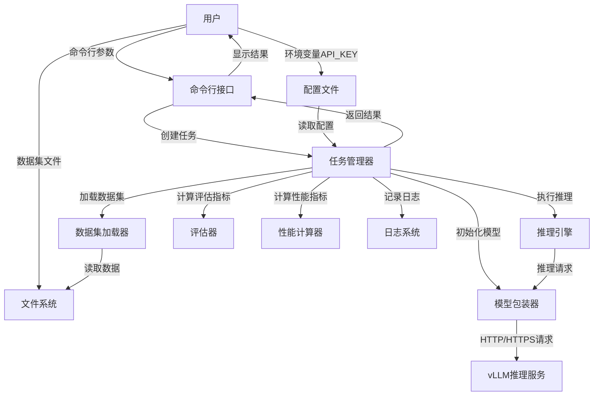
```mermaid
graph TD;
    User[用户] -->|命令行参数| CLI[命令行接口];
    User -->|环境变量API_KEY| Config[配置文件];
    User -->|数据集文件| FileSystem[文件系统];
    CLI -->|创建任务| TaskMgr[任务管理器];
    Config -->|读取配置| TaskMgr;
    TaskMgr -->|加载数据集| DatasetLoader[数据集加载器];
    DatasetLoader -->|读取数据| FileSystem;
    TaskMgr -->|初始化模型| ModelWrapper[模型包装器];
    ModelWrapper -->|HTTP/HTTPS请求| VLLMService[vLLM推理服务];
    TaskMgr -->|执行推理| Inferencer[推理引擎];
    Inferencer -->|推理请求| ModelWrapper;
    TaskMgr -->|计算评估指标| Evaluator[评估器];
    TaskMgr -->|计算性能指标| PerfCalculator[性能计算器];
    TaskMgr -->|记录日志| Logger[日志系统];
    TaskMgr -->|返回结果| CLI;
    CLI -->|显示结果| User;
```

#### 4.1.3 逻辑视图

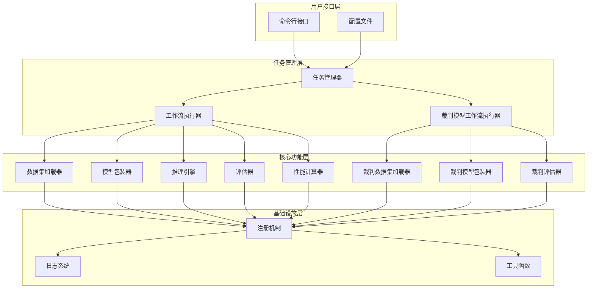
```mermaid
graph TB
    subgraph "用户接口层"
        CLI[命令行接口]
        Config[配置文件]
    end

    subgraph "任务管理层"
        TaskMgr[任务管理器]
        Workflow[工作流执行器]
        JudgeWorkflow[裁判模型工作流执行器]
    end

    subgraph "核心功能层"
        DatasetLoader[数据集加载器]
        JudgeDatasetLoader[裁判数据集加载器]
        ModelWrapper[模型包装器]
        JudgeModelWrapper[裁判模型包装器]
        Inferencer[推理引擎]
        Evaluator[评估器]
        JudgeEvaluator[裁判评估器]
        Calculator[性能计算器]
    end

    subgraph "基础设施层"
        Registry[注册机制]
        Logger[日志系统]
        Utils[工具函数]
    end

    CLI --> TaskMgr
    Config --> TaskMgr
    TaskMgr --> Workflow
    TaskMgr --> JudgeWorkflow
    Workflow --> DatasetLoader
    Workflow --> ModelWrapper
    Workflow --> Inferencer
    Workflow --> Evaluator
    Workflow --> Calculator
    JudgeWorkflow --> JudgeDatasetLoader
    JudgeWorkflow --> JudgeModelWrapper
    JudgeWorkflow --> JudgeEvaluator

    DatasetLoader --> Registry
    JudgeDatasetLoader --> Registry
    ModelWrapper --> Registry
    JudgeModelWrapper --> Registry
    Inferencer --> Registry
    Evaluator --> Registry
    JudgeEvaluator --> Registry
    Calculator --> Registry

    Registry --> Logger
    Registry --> Utils
```

#### 4.1.4 软件实现单元设计

**静态结构框图**

```mermaid
classDiagram
    class BaseDataset {
        +load() Dataset
        +preprocess() void
        +format() void
    }

    class LEvalDataset {
        +load() Dataset
        +parse_openai_task() void
        +parse_closed_task() void
    }

    class MultiModalDataset {
        +load() Dataset
        +load_images() List~Image~
        +load_videos() List~Video~
    }

    class MMStarDataset {
        +load() Dataset
        +load_images() List~Image~
        +calculate_subject_scores() dict
    }

    class VideoMMEDataset {
        +load() Dataset
        +load_videos() List~Video~
        +extract_answer() str
    }

    class OCRBenchDataset {
        +load() Dataset
        +load_images() List~Image~
        +calculate_ocr_accuracy() float
    }

    class MMMUDataset {
        +load() Dataset
        +load_images() List~Image~
        +parse_question() void
    }

    class OmniDocBenchDataset {
        +load() Dataset
        +load_documents() List~Document~
        +adapt_for_ocr_model() void
    }

    class VQADataset {
        +load() Dataset
        +load_images() List~Image~
        +calculate_anls() float
    }

    class DAPOMathDataset {
        +load() Dataset
        +parse_math_problem() void
        +calculate_pass_rate() float
    }

    class GEditDataset {
        +load() Dataset
        +load_edit_images() List~Image~
        +split_dataset() void
    }

    class BaseJDGDataset {
        +load_from_predictions() Dataset
        +_modify_dataset_item() void
    }

    class LLMJudgeDataset {
        +load() Dataset
        +extract_judgment() str
    }

    class LMMImgJDGDataset {
        +load() Dataset
        +convert_images_to_base64() List~str~
    }

    class BaseModel {
        +infer(prompt) str
        +batch_infer(prompts) List~str~
    }

    class BaseAPIModel {
        -api_key: str
        -url: str
        -stream: bool
        +infer(prompt) str
        +_set_headers() dict
        +_retry_request() Response
    }

    class VLLMCustomAPI {
        +infer(prompt) str
        +_build_request_body() dict
    }

    class BaseInferencer {
        +infer() List~Result~
        +batch_infer() List~Result~
    }

    class GenInferencer {
        +infer() List~Result~
        +_process_stream_response() str
    }

    class PPLInferencer {
        +infer() List~Result~
        +get_ppl(text) float
    }

    class MultiTurnGenInferencer {
        +infer() List~Result~
        +_build_conversation_history() List
    }

    class BaseEvaluator {
        +score(predictions, references) dict
    }

    class RougeEvaluator {
        +score(predictions, references) dict
        +_calculate_rouge_n() float
        +_calculate_rouge_l() float
    }

    class AccEvaluator {
        +score(predictions, references) dict
        +_extract_answer() str
    }

    class ANLSEvaluator {
        +score(predictions, references) dict
        +_calculate_anls() float
    }

    class ExactMatchEvaluator {
        +score(predictions, references) dict
        +_exact_match() bool
    }

    class LLMJudgeCorrectEvaluator {
        +score(predictions, references) dict
        +_extract_judgment() str
    }

    class LMMJudgeImageEditEvaluator {
        +score(predictions, references) dict
        +_calculate_sc_score() float
        +_calculate_pq_score() float
        +_calculate_o_score() float
    }

    class PerfMetricCalculator {
        +calculate() dict
        +_calculate_ttft() float
        +_calculate_tpot() float
        +_calculate_itl() float
    }

    class EncodingTimeCalculator {
        +calculate() dict
        +_extract_encoding_time() float
    }

    class TraceReplayCalculator {
        +replay() List~Request~
        +_parse_trace_file() List
        +_schedule_requests() void
    }

    BaseDataset <|-- LEvalDataset
    BaseDataset <|-- MultiModalDataset
    MultiModalDataset <|-- MMStarDataset
    MultiModalDataset <|-- VideoMMEDataset
    MultiModalDataset <|-- OCRBenchDataset
    MultiModalDataset <|-- MMMUDataset
    MultiModalDataset <|-- OmniDocBenchDataset
    MultiModalDataset <|-- VQADataset
    BaseDataset <|-- DAPOMathDataset
    BaseDataset <|-- GEditDataset
    BaseDataset <|-- BaseJDGDataset
    BaseJDGDataset <|-- LLMJudgeDataset
    BaseJDGDataset <|-- LMMImgJDGDataset
    BaseModel <|-- BaseAPIModel
    BaseAPIModel <|-- VLLMCustomAPI
    BaseInferencer <|-- GenInferencer
    BaseInferencer <|-- PPLInferencer
    BaseInferencer <|-- MultiTurnGenInferencer
    BaseEvaluator <|-- RougeEvaluator
    BaseEvaluator <|-- AccEvaluator
    BaseEvaluator <|-- ANLSEvaluator
    BaseEvaluator <|-- ExactMatchEvaluator
    BaseEvaluator <|-- LLMJudgeCorrectEvaluator
    BaseEvaluator <|-- LMMJudgeImageEditEvaluator
```

**接口设计**

| **接口**                 | **类型** | **接口范围** | **备注**            |
| ---------------------- | ------ | -------- | ----------------- |
| BaseDataset.load()     | 数据加载   | 数据集加载器接口 | 加载数据集并返回Dataset对象 |
| LEvalDataset.parse_openai_task() | 数据处理 | L-Eval数据集接口 | 解析开放式任务数据 |
| LEvalDataset.parse_closed_task() | 数据处理 | L-Eval数据集接口 | 解析封闭式任务数据 |
| MultiModalDataset.load_images() | 数据加载 | 多模态数据集接口 | 加载图片数据 |
| MultiModalDataset.load_videos() | 数据加载 | 多模态数据集接口 | 加载视频数据 |
| GEditDataset.load_edit_images() | 数据加载 | GEdit数据集接口 | 加载编辑图片数据 |
| BaseAPIModel.infer()   | 推理请求   | 模型接口     | 执行单次推理请求          |
| BaseAPIModel._set_headers() | 配置设置 | 模型接口 | 设置请求头，包括API Key |
| BaseInferencer.infer() | 推理执行   | 推理引擎接口   | 执行推理任务并返回结果       |
| PPLInferencer.get_ppl() | 推理计算 | PPL推理接口 | 计算文本困惑度 |
| BaseEvaluator.score()  | 评估计算   | 评估器接口    | 计算评估指标            |
| RougeEvaluator._calculate_rouge_n() | 评估计算 | Rouge评估接口 | 计算Rouge-n指标 |
| ANLSEvaluator._calculate_anls() | 评估计算 | ANLS评估接口 | 计算ANLS指标 |
| BaseJDGDataset.load()  | 裁判数据加载 | 裁判数据集接口  | 从预测结果加载裁判数据       |
| LMMJudgeImageEditEvaluator._calculate_sc_score() | 评估计算 | 图片编辑评估接口 | 计算语义一致性得分 |
| LMMJudgeImageEditEvaluator._calculate_pq_score() | 评估计算 | 图片编辑评估接口 | 计算感知质量得分 |
| PerfMetricCalculator._calculate_ttft() | 性能计算 | 性能计算器接口 | 计算首token时间 |
| PerfMetricCalculator._calculate_tpot() | 性能计算 | 性能计算器接口 | 计算首token后时间 |
| PerfMetricCalculator._calculate_itl() | 性能计算 | 性能计算器接口 | 计算推理延迟 |
| EncodingTimeCalculator._extract_encoding_time() | 性能计算 | 编码时间计算接口 | 提取编码阶段耗时 |
| TraceReplayCalculator._parse_trace_file() | 数据处理 | 流量复现接口 | 解析trace文件 |
| TraceReplayCalculator._schedule_requests() | 调度管理 | 流量复现接口 | 调度请求发送 |
| JudgeInfer.do\_work()  | 裁判推理执行 | 裁判工作流接口  | 执行裁判模型推理任务        |

### 4.2 接口定义

#### 4.2.1 总体设计

接口设计遵循统一性、可扩展性、向后兼容性原则。所有数据集、模型、评估器都遵循统一的接口规范，通过注册机制（Registry）统一管理。接口设计支持灵活扩展新的数据集、评估器和推理模式，同时保持向后兼容性，新版本支持老版本的接口。

#### 4.2.2 设计目标

1. **统一性**：所有同类组件遵循统一的接口规范，保证一致性
2. **可扩展性**：接口设计支持灵活扩展，易于添加新功能
3. **向后兼容性**：新版本支持老版本的接口，保证平滑升级
4. **安全性**：接口设计考虑安全性，支持API Key鉴权、HTTPS加密等

#### 4.2.3 设计约束

1. **性能约束**：接口调用开销<5%（相对于实际推理时间）
2. **并发约束**：接口支持并发调用，并发数≤CPU核心数
3. **兼容性约束**：接口支持跨版本兼容，支持不同版本的vLLM服务
4. **安全约束**：接口支持API Key鉴权、HTTPS加密、日志脱敏等安全措施

#### 4.2.4 技术选型

备选1：RESTful API接口
备选2：gRPC接口
决策结论及依据：选择RESTful API接口，因为vLLM推理服务主要提供RESTful API接口，兼容性好，易于调试和测试。

#### 4.2.5 软件单元数据集加载器

**接口描述**

数据集加载器负责数据集的加载、预处理和格式化，提供统一的数据集接口。

**接口信息模型**

数据集加载器返回的Dataset对象包含以下字段：

- data: List\[Dict]，数据集数据列表
- metadata: Dict，数据集元数据
- subsets: List\[str]，子数据集列表（如适用）

**接口清单**

1. **BaseDataset.load()**
   - 功能：加载数据集并返回Dataset对象
   - 类型/协议：Python方法
   - 方向：内部接口
   - 输入参数：
     - path: str，必选参数，数据集文件路径
     - split: str，可选参数，数据集切分（默认为'test'）
     - \*\*kwargs: dict，可选参数，其他参数
   - 输出参数：Dataset对象，包含data、metadata、subsets等字段
   - 返回值：成功返回Dataset对象，失败抛出异常
   - 注意事项：数据集文件需要存在且格式正确，路径需要验证防止路径遍历攻击

2. **BaseDataset.preprocess()**
   - 功能：预处理数据集数据
   - 类型/协议：Python方法
   - 方向：内部接口
   - 输入参数：
     - data: List\[Dict]，必选参数，原始数据
   - 输出参数：List\[Dict]，预处理后的数据
   - 返回值：成功返回预处理后的数据，失败抛出异常
   - 注意事项：预处理逻辑由子类实现，支持数据清洗、格式转换等

3. **BaseDataset.format()**
   - 功能：格式化数据为统一的接口格式
   - 类型/协议：Python方法
   - 方向：内部接口
   - 输入参数：
     - data: List\[Dict]，必选参数，预处理后的数据
   - 输出参数：List\[Dict]，格式化后的数据
   - 返回值：成功返回格式化后的数据，失败抛出异常
   - 注意事项：格式化逻辑由子类实现，确保数据格式统一

4. **LEvalDataset.parse_openai_task()**
   - 功能：解析L-Eval数据集的开放式任务
   - 类型/协议：Python方法
   - 方向：内部接口
   - 输入参数：
     - data: List\[Dict]，必选参数，原始数据
   - 输出参数：List\[Dict]，解析后的开放式任务数据
   - 返回值：成功返回解析后的数据，失败抛出异常
   - 注意事项：支持financial_qa、gov_report_summ等15个子数据集

5. **LEvalDataset.parse_closed_task()**
   - 功能：解析L-Eval数据集的封闭式任务
   - 类型/协议：Python方法
   - 方向：内部接口
   - 输入参数：
     - data: List\[Dict]，必选参数，原始数据
   - 输出参数：List\[Dict]，解析后的封闭式任务数据
   - 返回值：成功返回解析后的数据，失败抛出异常
   - 注意事项：支持coursera、gsm100等5个子数据集

6. **MultiModalDataset.load_images()**
   - 功能：加载多模态数据集的图片数据
   - 类型/协议：Python方法
   - 方向：内部接口
   - 输入参数：
     - image_paths: List\[str]，必选参数，图片路径列表
   - 输出参数：List\[Image]，图片对象列表
   - 返回值：成功返回图片对象列表，失败抛出异常
   - 注意事项：支持JPG、PNG等常见图片格式

7. **MultiModalDataset.load_videos()**
   - 功能：加载多模态数据集的视频数据
   - 类型/协议：Python方法
   - 方向：内部接口
   - 输入参数：
     - video_paths: List\[str]，必选参数，视频路径列表
   - 输出参数：List\[Video]，视频对象列表
   - 返回值：成功返回视频对象列表，失败抛出异常
   - 注意事项：支持MP4、AVI等常见视频格式

8. **GEditDataset.load_edit_images()**
   - 功能：加载GEdit数据集的编辑图片数据
   - 类型/协议：Python方法
   - 方向：内部接口
   - 输入参数：
     - image_paths: List\[str]，必选参数，图片路径列表
   - 输出参数：List\[Image]，图片对象列表
   - 返回值：成功返回图片对象列表，失败抛出异常
   - 注意事项：用于图片编辑能力评估

#### 4.2.6 软件单元模型包装器

**接口描述**

模型包装器负责模型接口的封装和调用，支持API Key鉴权、流式/非流式接口等。

**接口信息模型**

模型包装器包含以下属性：

- api\_key: str，API Key（用于鉴权）
- url: str，服务端URL
- stream: bool，是否使用流式接口
- timeout: int，请求超时时间（默认30s）

**接口清单**

1. **BaseAPIModel.infer()**
   - 功能：执行单次推理请求
   - 类型/协议：Python方法
   - 方向：内部接口
   - 输入参数：
     - prompt: str，必选参数，推理输入
     - \*\*kwargs: dict，可选参数，其他参数（如temperature、max\_tokens等）
   - 输出参数：str，推理结果
   - 返回值：成功返回推理结果，失败抛出异常
   - 注意事项：支持重试机制（默认2次），支持超时控制，API Key通过环境变量传递

2. **BaseAPIModel.batch\_infer()**
   - 功能：执行批量推理请求
   - 类型/协议：Python方法
   - 方向：内部接口
   - 输入参数：
     - prompts: List\[str]，必选参数，推理输入列表
     - \*\*kwargs: dict，可选参数，其他参数
   - 输出参数：List\[str]，推理结果列表
   - 返回值：成功返回推理结果列表，失败抛出异常
   - 注意事项：支持并发控制，并发数≤CPU核心数

3. **BaseAPIModel.\_set\_headers()**
   - 功能：设置HTTP请求头
   - 类型/协议：Python方法
   - 方向：内部接口
   - 输入参数：无
   - 输出参数：dict，HTTP请求头字典
   - 返回值：成功返回HTTP请求头字典
   - 注意事项：如果api\_key不为空，添加Authorization字段

4. **BaseAPIModel.\_retry\_request()**
   - 功能：重试HTTP请求
   - 类型/协议：Python方法
   - 方向：内部接口
   - 输入参数：
     - request_func: callable，必选参数，请求函数
     - \*args: tuple，可选参数，请求函数参数
     - \*\*kwargs: dict，可选参数，请求函数关键字参数
   - 输出参数：Response，HTTP响应对象
   - 返回值：成功返回HTTP响应对象，失败抛出异常
   - 注意事项：默认重试2次，支持指数退避

#### 4.2.7 软件单元推理引擎

**接口描述**

推理引擎负责推理任务的执行和管理，支持批量推理和并发控制。

**接口信息模型**

推理引擎返回的Result对象包含以下字段：

- prediction: str，推理结果
- reference: str，参考答案
- metadata: Dict，元数据（如时间戳、性能指标等）

**接口清单**

1. **BaseInferencer.infer()**
   - 功能：执行推理任务
   - 类型/协议：Python方法
   - 方向：内部接口
   - 输入参数：
     - dataset: Dataset，必选参数，数据集对象
     - model: BaseModel，必选参数，模型对象
   - 输出参数：List\[Result]，推理结果列表
   - 返回值：成功返回推理结果列表，失败抛出异常
   - 注意事项：支持批量推理和并发控制，记录推理结果和时间戳

2. **PPLInferencer.get\_ppl()**
   - 功能：获取文本的困惑度
   - 类型/协议：Python方法
   - 方向：内部接口
   - 输入参数：
     - text: str，必选参数，输入文本
   - 输出参数：float，困惑度值
   - 返回值：成功返回困惑度值，失败抛出异常
   - 注意事项：PPL推理模式不支持流式推理和性能测评模式

3. **GenInferencer.\_process\_stream\_response()**
   - 功能：处理流式响应
   - 类型/协议：Python方法
   - 方向：内部接口
   - 输入参数：
     - response: Response，必选参数，HTTP响应对象
   - 输出参数：str，处理后的推理结果
   - 返回值：成功返回推理结果，失败抛出异常
   - 注意事项：用于流式推理模式

#### 4.2.8 软件单元评估器

**接口描述**

评估器负责评估指标的计算和结果输出，支持多种评估指标。

**接口信息模型**

评估器返回的评估结果包含以下字段：

- score: float，评估分数
- details: Dict，详细评估信息（如Rouge-1、Rouge-2、Rouge-L等）

**接口清单**

1. **BaseEvaluator.score()**
   - 功能：计算评估指标
   - 类型/协议：Python方法
   - 方向：内部接口
   - 输入参数：
     - predictions: List\[str]，必选参数，预测结果列表
     - references: List\[str]，必选参数，参考答案列表
   - 输出参数：dict，评估结果字典
   - 返回值：成功返回评估结果字典，失败抛出异常
   - 注意事项：评估指标计算需要与OpenCompass或官方脚本对齐

2. **RougeEvaluator.score()**
   - 功能：计算Rouge指标
   - 类型/协议：Python方法
   - 方向：内部接口
   - 输入参数：
     - predictions: List\[str]，必选参数，预测结果列表
     - references: List\[str]，必选参数，参考答案列表
   - 输出参数：dict，包含Rouge-1、Rouge-2、Rouge-L等指标
   - 返回值：成功返回Rouge指标字典，失败抛出异常
   - 注意事项：与OpenCompass使用相同的Rouge计算库

3. **AccEvaluator.score()**
   - 功能：计算准确率
   - 类型/协议：Python方法
   - 方向：内部接口
   - 输入参数：
     - predictions: List\[str]，必选参数，预测结果列表
     - references: List\[str]，必选参数，参考答案列表
   - 输出参数：dict，包含accuracy等指标
   - 返回值：成功返回准确率字典，失败抛出异常
   - 注意事项：支持精准匹配和多选题评估

4. **ANLSEvaluator.score()**
   - 功能：计算ANLS指标
   - 类型/协议：Python方法
   - 方向：内部接口
   - 输入参数：
     - predictions: List\[str]，必选参数，预测结果列表
     - references: List\[str]，必选参数，参考答案列表
   - 输出参数：dict，包含ANLS指标
   - 返回值：成功返回ANLS指标字典，失败抛出异常
   - 注意事项：用于VQA等数据集的评估

5. **ExactMatchEvaluator.score()**
   - 功能：计算精准匹配准确率
   - 类型/协议：Python方法
   - 方向：内部接口
   - 输入参数：
     - predictions: List\[str]，必选参数，预测结果列表
     - references: List\[str]，必选参数，参考答案列表
   - 输出参数：dict，包含精准匹配准确率
   - 返回值：成功返回精准匹配准确率字典，失败抛出异常
   - 注意事项：用于MMStar等数据集的评估

6. **LLMJudgeCorrectEvaluator.score()**
   - 功能：LLM裁判模型评估器，从裁判模型输出中提取正确性判断
   - 类型/协议：Python方法
   - 方向：内部接口
   - 输入参数：
     - predictions: List\[str]，必选参数，裁判模型预测结果列表
     - references: List\[str]，必选参数，参考答案列表
   - 输出参数：dict，包含正确性评估结果
   - 返回值：成功返回评估结果字典，失败抛出异常
   - 注意事项：从裁判模型推理结果中提取A/B选择等判断结果

7. **LMMJudgeImageEditEvaluator.score()**
   - 功能：LMM裁判模型评估器，支持SC和PQ两种评估指标
   - 类型/协议：Python方法
   - 方向：内部接口
   - 输入参数：
     - predictions: List\[str]，必选参数，裁判模型预测结果列表
     - references: List\[str]，必选参数，参考答案列表
   - 输出参数：dict，包含SC、PQ、O等指标
   - 返回值：成功返回评估结果字典，失败抛出异常
   - 注意事项：SC（语义一致性）和PQ（感知质量）评估独立进行

#### 4.2.9 软件单元命令行接口

**接口描述**

命令行接口负责解析和处理命令行参数，支持多种测评模式和参数配置。

**接口信息模型**

命令行接口解析后的参数包含以下字段：

- mode: str，测评模式（如'accuracy'、'performance'等）
- dataset: str，数据集名称
- model: str，模型名称
- num_prompts: int，推理数据条数
- merge_ds: bool，是否合并数据集
- max_num_workers: int，最大并行worker数
- pressure_time: int，压测时间
- num_warmups: int，预热次数

**接口清单**

1. **parse_args()**
   - 功能：解析命令行参数
   - 类型/协议：Python函数
   - 方向：外部接口
   - 输入参数：无
   - 输出参数：argparse.Namespace，解析后的参数对象
   - 返回值：成功返回参数对象，失败抛出异常
   - 注意事项：支持--num-prompts、--merge-ds、--max-num-workers、--pressure-time、--num-warmups等参数

#### 4.2.10 软件单元工作流模块

**接口描述**

工作流模块负责协调各个模块的执行，管理测评任务的整个生命周期。

**接口信息模型**

工作流执行器包含以下属性：

- dataset: Dataset，数据集对象
- model: BaseModel，模型对象
- inferencer: BaseInferencer，推理引擎对象
- evaluator: BaseEvaluator，评估器对象
- calculator: PerfMetricCalculator，性能计算器对象

**接口清单**

1. **Workflow.run()**
   - 功能：执行工作流
   - 类型/协议：Python方法
   - 方向：内部接口
   - 输入参数：无
   - 输出参数：dict，执行结果
   - 返回值：成功返回执行结果，失败抛出异常
   - 注意事项：协调数据集加载、模型推理、评估等步骤

2. **JudgeWorkflow.run()**
   - 功能：执行裁判模型工作流
   - 类型/协议：Python方法
   - 方向：内部接口
   - 输入参数：无
   - 输出参数：dict，执行结果
   - 返回值：成功返回执行结果，失败抛出异常
   - 注意事项：协调被测模型推理和裁判模型推理

#### 4.2.11 软件单元配置管理模块

**接口描述**

配置管理模块负责管理系统配置，支持环境变量和配置文件配置。

**接口信息模型**

配置管理模块包含以下配置项：

- LOG_LEVEL: str，日志级别
- PRESSURE_TIME: int，压测时间（兼容老版本）
- CONNECTION_ADD_RATE: int，连接添加速率（兼容老版本）

**接口清单**

1. **get_config()**
   - 功能：获取配置
   - 类型/协议：Python函数
   - 方向：内部接口
   - 输入参数：
     - key: str，必选参数，配置键
     - default: Any，可选参数，默认值
   - 输出参数：Any，配置值
   - 返回值：成功返回配置值，失败返回默认值
   - 注意事项：支持从环境变量和配置文件读取配置

#### 4.2.12 软件单元性能计算模块

**接口描述**

性能计算模块负责计算性能指标，支持EPD分离的encoding阶段耗时统计和基于timestamp的流量负载复现。

**接口信息模型**

性能计算器返回的性能指标包含以下字段：

- ttft: float，首token时间
- tpot: float，首token后时间
- itl: float，推理延迟
- encoding_time: float，编码阶段耗时

**接口清单**

1. **PerfMetricCalculator.calculate()**
   - 功能：计算性能指标
   - 类型/协议：Python方法
   - 方向：内部接口
   - 输入参数：
     - results: List\[Result]，必选参数，推理结果列表
   - 输出参数：dict，性能指标字典
   - 返回值：成功返回性能指标字典，失败抛出异常
   - 注意事项：计算TTFT、TPOT、ITL等指标

2. **EncodingTimeCalculator.calculate()**
   - 功能：计算编码阶段耗时
   - 类型/协议：Python方法
   - 方向：内部接口
   - 输入参数：
     - results: List\[Result]，必选参数，推理结果列表
   - 输出参数：dict，编码时间统计字典
   - 返回值：成功返回编码时间统计字典，失败抛出异常
   - 注意事项：从vLLM响应中提取encoding时间

3. **TraceReplayCalculator.replay()**
   - 功能：复现流量负载
   - 类型/协议：Python方法
   - 方向：内部接口
   - 输入参数：
     - trace_file: str，必选参数，trace文件路径
     - model: BaseModel，必选参数，模型对象
   - 输出参数：List\[Result]，推理结果列表
   - 返回值：成功返回推理结果列表，失败抛出异常
   - 注意事项：按照timestamp精准发送请求

### 4.3 数据模型

#### 4.3.1 设计目标

数据模型的设计目标包括数据的一致性、完整性、可扩展性等。通过统一的数据格式和接口规范，确保数据在不同模块间传递时的一致性和完整性。数据模型设计支持灵活扩展新的数据集和评估指标，特别是支持长序列推理和多模态数据集的特殊需求。

#### 4.3.2 设计约束

数据模型设计遵循以下约束：

1. 数据集格式：支持JSON格式的数据集文件
2. 数据大小：支持大规模数据集（建议≤100GB）
3. 数据一致性：确保评估结果的数据一致性，避免因网络波动等原因导致的数据不一致
4. 数据完整性：确保数据集文件的完整性，支持数据集文件完整性检查
5. 多模态数据：支持图片、视频等多模态数据的处理和存储
6. 长序列数据：支持长文本数据的处理，适应L-Eval等长序列数据集

#### 4.3.3 设计选型

技术选型点：数据集格式
选型：JSON格式
选型理由：JSON格式通用性好，易于解析和扩展，与OpenCompass等工具兼容

技术选型点：数据存储
选型：文件系统存储
选型理由：数据集文件和评估结果文件存储在用户本地，由用户控制访问权限，安全性高

技术选型点：多模态数据处理
选型：Base64编码
选型理由：将图片、视频等二进制数据转换为Base64编码，便于在JSON格式中存储和传输

#### 4.3.4 数据模型设计

**数据集数据模型**

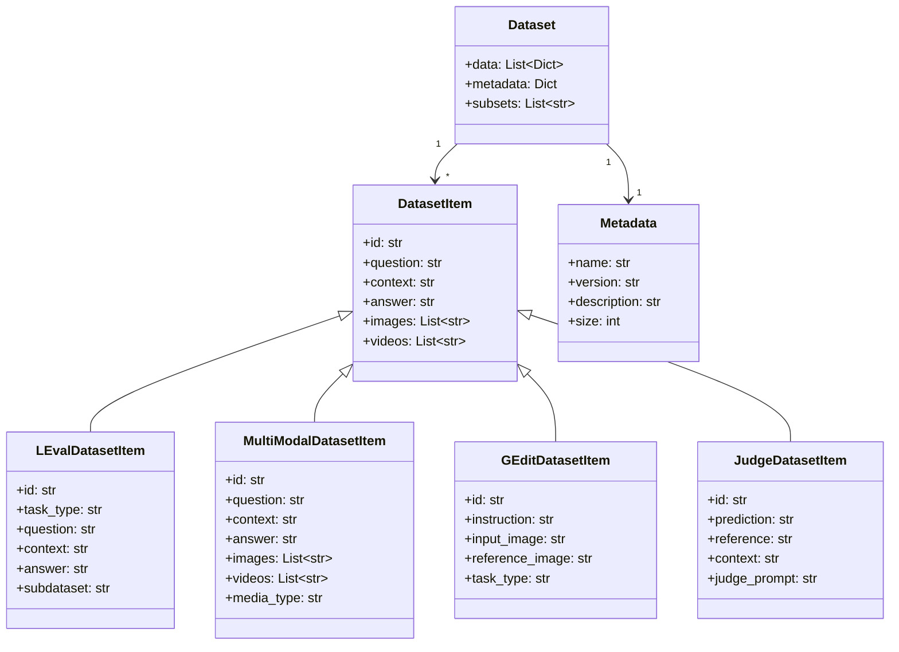
```mermaid
classDiagram
    class Dataset {
        +data: List~Dict~
        +metadata: Dict
        +subsets: List~str~
    }

    class DatasetItem {
        +id: str
        +question: str
        +context: str
        +answer: str
        +images: List~str~
        +videos: List~str~
    }

    class Metadata {
        +name: str
        +version: str
        +description: str
        +size: int
    }

    class LEvalDatasetItem {
        +id: str
        +task_type: str
        +question: str
        +context: str
        +answer: str
        +subdataset: str
    }

    class MultiModalDatasetItem {
        +id: str
        +question: str
        +context: str
        +answer: str
        +images: List~str~
        +videos: List~str~
        +media_type: str
    }

    class GEditDatasetItem {
        +id: str
        +instruction: str
        +input_image: str
        +reference_image: str
        +task_type: str
    }

    class JudgeDatasetItem {
        +id: str
        +prediction: str
        +reference: str
        +context: str
        +judge_prompt: str
    }

    Dataset "1" --> "*" DatasetItem
    Dataset "1" --> "1" Metadata
    DatasetItem <|-- LEvalDatasetItem
    DatasetItem <|-- MultiModalDatasetItem
    DatasetItem <|-- GEditDatasetItem
    DatasetItem <|-- JudgeDatasetItem
```

**评估结果数据模型**

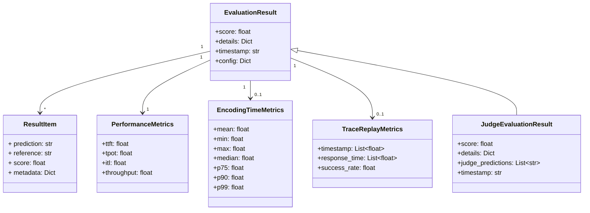
```mermaid
classDiagram
    class EvaluationResult {
        +score: float
        +details: Dict
        +timestamp: str
        +config: Dict
    }

    class ResultItem {
        + prediction: str
        + reference: str
        + score: float
        + metadata: Dict
    }

    class PerformanceMetrics {
        +ttft: float
        +tpot: float
        +itl: float
        +throughput: float
    }

    class EncodingTimeMetrics {
        +mean: float
        +min: float
        +max: float
        +median: float
        +p75: float
        +p90: float
        +p99: float
    }

    class TraceReplayMetrics {
        +timestamp: List~float~
        +response_time: List~float~
        +success_rate: float
    }

    class JudgeEvaluationResult {
        +score: float
        +details: Dict
        +judge_predictions: List~str~
        +timestamp: str
    }

    EvaluationResult "1" --> "*" ResultItem
    EvaluationResult "1" --> "1" PerformanceMetrics
    EvaluationResult "1" --> "0..1" EncodingTimeMetrics
    EvaluationResult "1" --> "0..1" TraceReplayMetrics
    EvaluationResult <|-- JudgeEvaluationResult
```

**数据归属操作表**

| 数据类型  | 归属模块   | 操作权限 | 备注           |
| ----- | ------ | ---- | ------------ |
| 数据集文件 | 数据集加载器 | 只读   | 从文件系统读取数据集文件 |
| 推理结果  | 推理引擎   | 读写   | 生成推理结果并保存到文件 |
| 评估结果  | 评估器    | 读写   | 计算评估指标并保存到文件 |
| 性能指标  | 性能计算器  | 读写   | 计算性能指标并保存到文件 |
| 编码时间指标 | 性能计算器  | 读写   | 计算编码阶段耗时并保存到文件 |
| 流量复现指标 | 性能计算器  | 读写   | 计算流量复现结果并保存到文件 |
| 裁判模型评估结果 | 评估器    | 读写   | 计算裁判模型评估结果并保存到文件 |
| 配置文件  | 配置管理器  | 只读   | 从文件系统读取配置文件  |
| 日志文件  | 日志系统   | 只写   | 写入日志文件       |
| 环境变量  | 配置管理器  | 只读   | 读取API Key等环境变量 |
| Trace文件 | 性能计算器  | 只读   | 从文件系统读取trace文件 |

### 4.4 算法实现

#### 4.4.1 设计目标

算法实现的设计目标包括性能、空间复杂度等。通过优化算法和数据结构，确保评估指标计算的准确性和效率。性能目标包括评估指标计算时间<1s（1000条数据），性能测评开销<5%（相对于实际推理时间）。

#### 4.4.2 设计约束

算法实现设计遵循以下约束：

1. 时间复杂度：评估指标计算的时间复杂度≤O(n)，其中n为数据集大小
2. 空间复杂度：评估指标计算的空间复杂度≤O(n)，其中n为数据集大小
3. 精度要求：评估指标计算精度与OpenCompass或官方脚本差异<1%

#### 4.4.3 技术选型

备选1：使用rouge-score库计算Rouge指标
备选2：使用nltk库计算Rouge指标
决策结论及依据：选择rouge-score库，因为与OpenCompass使用相同的库，确保精度对齐

备选1：使用自定义实现计算ANLS指标
备选2：使用第三方库计算ANLS指标
决策结论及依据：选择自定义实现，因为ANLS指标计算逻辑相对简单，自定义实现可以更好地控制计算过程和精度

#### 4.4.4 算法实现

**Rouge指标计算算法**

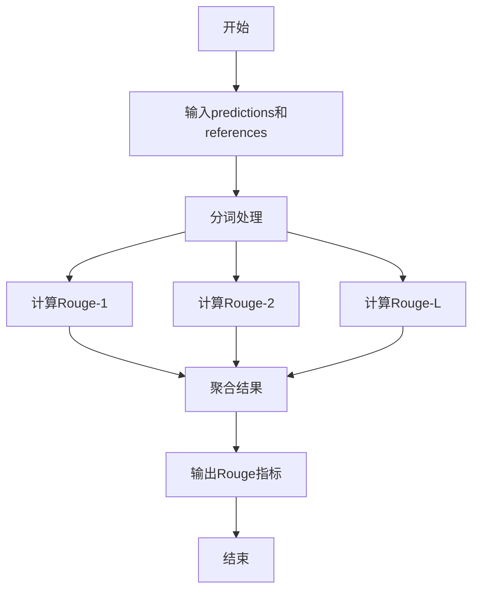
```mermaid
flowchart TD
    Start[开始] --> Input[输入predictions和references]
    Input --> Tokenize[分词处理]
    Tokenize --> CalculateRouge1[计算Rouge-1]
    Tokenize --> CalculateRouge2[计算Rouge-2]
    Tokenize --> CalculateRougeL[计算Rouge-L]
    CalculateRouge1 --> Aggregate[聚合结果]
    CalculateRouge2 --> Aggregate
    CalculateRougeL --> Aggregate
    Aggregate --> Output[输出Rouge指标]
    Output --> End[结束]
```

**准确率计算算法**

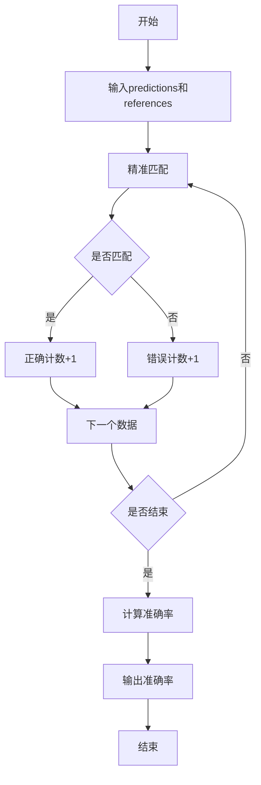
```mermaid
flowchart TD
    Start[开始] --> Input[输入predictions和references]
    Input --> Match[精准匹配]
    Match --> Check{是否匹配}
    Check -->|是| CountCorrect[正确计数+1]
    Check -->|否| CountIncorrect[错误计数+1]
    CountCorrect --> Next[下一个数据]
    CountIncorrect --> Next
    Next --> CheckEnd{是否结束}
    CheckEnd -->|否| Match
    CheckEnd -->|是| Calculate[计算准确率]
    Calculate --> Output[输出准确率]
    Output --> End[结束]
```

**PPL计算算法**

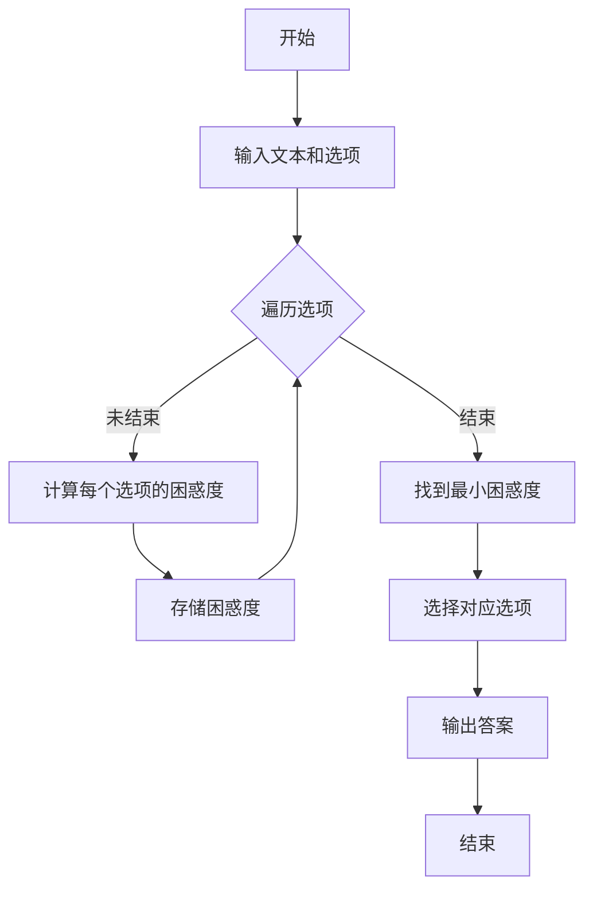
```mermaid
flowchart TD
    Start[开始] --> Input[输入文本和选项]
    Input --> Loop{遍历选项}
    Loop -->|未结束| CalculatePPL[计算每个选项的困惑度]
    CalculatePPL --> Store[存储困惑度]
    Store --> Loop
    Loop -->|结束| FindMin[找到最小困惑度]
    FindMin --> Select[选择对应选项]
    Select --> Output[输出答案]
    Output --> End[结束]
```

**ANLS指标计算算法**

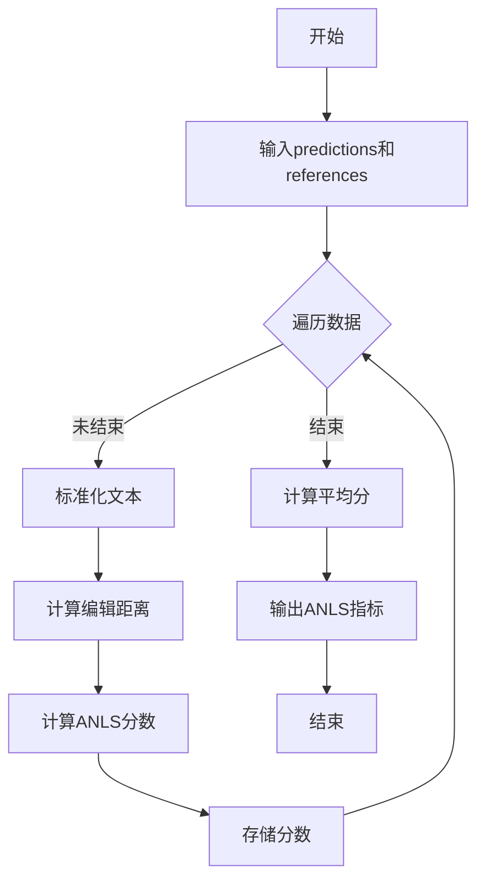
```mermaid
flowchart TD
    Start[开始] --> Input[输入predictions和references]
    Input --> Loop{遍历数据}
    Loop -->|未结束| Normalize[标准化文本]
    Normalize --> CalculateLevenshtein[计算编辑距离]
    CalculateLevenshtein --> CalculateANLS[计算ANLS分数]
    CalculateANLS --> Store[存储分数]
    Store --> Loop
    Loop -->|结束| Average[计算平均分]
    Average --> Output[输出ANLS指标]
    Output --> End[结束]
```

**精准匹配算法**

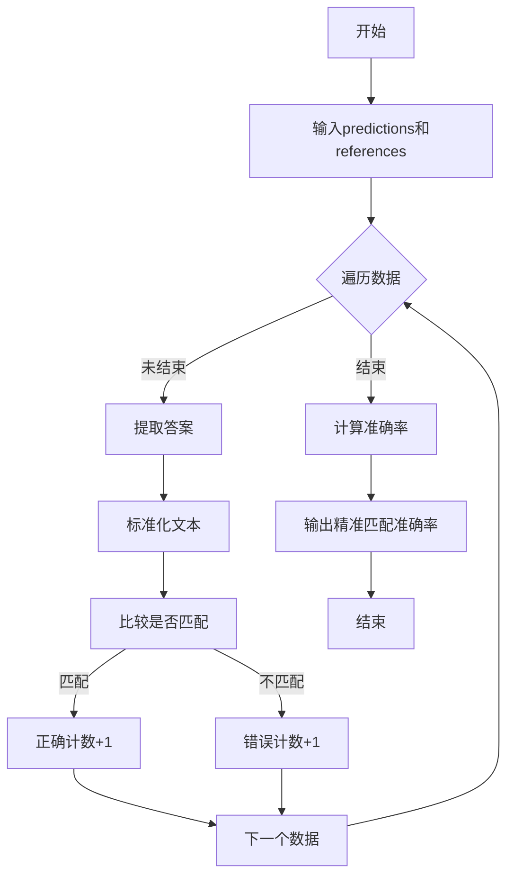
```mermaid
flowchart TD
    Start[开始] --> Input[输入predictions和references]
    Input --> Loop{遍历数据}
    Loop -->|未结束| ExtractAnswer[提取答案]
    ExtractAnswer --> Normalize[标准化文本]
    Normalize --> Compare[比较是否匹配]
    Compare -->|匹配| CountCorrect[正确计数+1]
    Compare -->|不匹配| CountIncorrect[错误计数+1]
    CountCorrect --> Next[下一个数据]
    CountIncorrect --> Next
    Next --> Loop
    Loop -->|结束| Calculate[计算准确率]
    Calculate --> Output[输出精准匹配准确率]
    Output --> End[结束]
```

**编码时间统计算法**

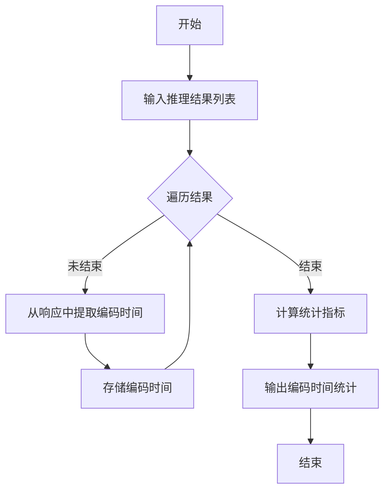
```mermaid
flowchart TD
    Start[开始] --> Input[输入推理结果列表]
    Input --> Loop{遍历结果}
    Loop -->|未结束| ExtractEncodingTime[从响应中提取编码时间]
    ExtractEncodingTime --> Store[存储编码时间]
    Store --> Loop
    Loop -->|结束| CalculateStats[计算统计指标]
    CalculateStats --> Output[输出编码时间统计]
    Output --> End[结束]
```

**流量负载复现算法**

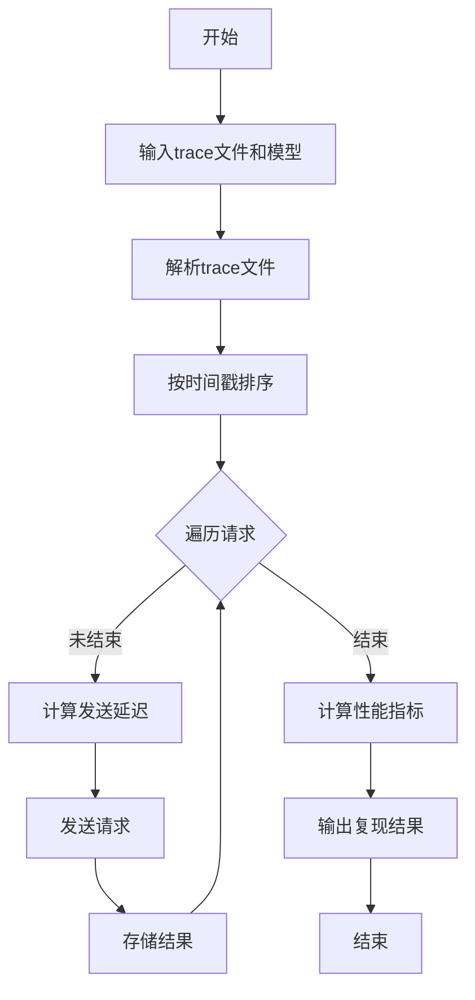
```mermaid
flowchart TD
    Start[开始] --> Input[输入trace文件和模型]
    Input --> ParseTrace[解析trace文件]
    ParseTrace --> SortByTimestamp[按时间戳排序]
    SortByTimestamp --> Loop{遍历请求}
    Loop -->|未结束| CalculateDelay[计算发送延迟]
    CalculateDelay --> SendRequest[发送请求]
    SendRequest --> StoreResult[存储结果]
    StoreResult --> Loop
    Loop -->|结束| CalculateMetrics[计算性能指标]
    CalculateMetrics --> Output[输出复现结果]
    Output --> End[结束]
```

**裁判模型评估算法**

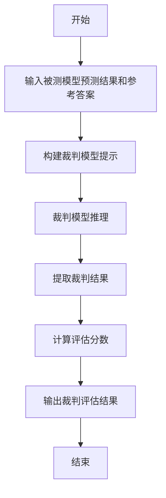
```mermaid
flowchart TD
    Start[开始] --> Input[输入被测模型预测结果和参考答案]
    Input --> BuildJudgePrompt[构建裁判模型提示]
    BuildJudgePrompt --> JudgeInfer[裁判模型推理]
    JudgeInfer --> ExtractJudgment[提取裁判结果]
    ExtractJudgment --> CalculateScore[计算评估分数]
    CalculateScore --> Output[输出裁判评估结果]
    Output --> End[结束]
```

**GEdit Bench评估算法**

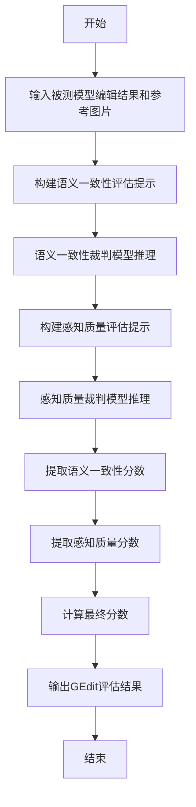
```mermaid
flowchart TD
    Start[开始] --> Input[输入被测模型编辑结果和参考图片]
    Input --> BuildSCPrompt[构建语义一致性评估提示]
    BuildSCPrompt --> SCJudgeInfer[语义一致性裁判模型推理]
    SCJudgeInfer --> BuildPQPrompt[构建感知质量评估提示]
    BuildPQPrompt --> PQJudgeInfer[感知质量裁判模型推理]
    PQJudgeInfer --> ExtractSCScore[提取语义一致性分数]
    ExtractSCScore --> ExtractPQScore[提取感知质量分数]
    ExtractPQScore --> CalculateFinalScore[计算最终分数]
    CalculateFinalScore --> Output[输出GEdit评估结果]
    Output --> End[结束]
```

### 4.5 安全实现设计

#### 4.5.1 安全设计目标

安全实现的设计目标包括数据的机密性、完整性、可用性等。通过API Key鉴权、HTTPS加密、文件路径验证、日志脱敏等措施保障系统安全，满足企业级部署的安全要求。

#### 4.5.2 安全设计上下文

安全实现设计的上下文包括系统架构、威胁模型、安全需求等。主要威胁包括：

1. API Key泄露：通过环境变量传递和日志脱敏防止泄露
2. 数据传输被窃听：通过HTTPS加密防止窃听
3. 路径遍历攻击：通过文件路径验证防止攻击
4. 服务端仿冒：通过SSL证书验证防止仿冒
5. SSRF攻击：通过服务端URL验证防止攻击

#### 4.5.3 高风险模块识别

##### 4.5.3.1 高风险模块识别

| 模块名称          | 模块功能简要说明          | 设计域高风险模块分析                              | 对应代码目录                                   | 语言类型   | 备注                  |
| ------------- | ----------------- | --------------------------------------- | ---------------------------------------- | ------ | ------------------- |
| ModelWrapper  | 模型包装器，负责HTTP请求和响应 | 处理API Key和HTTP请求，存在API Key泄露和数据传输被窃听的风险 | ais\_bench/benchmark/models/api\_models/ | Python | 需要API Key鉴权和HTTPS加密 |
| DatasetLoader | 数据集加载器，负责加载数据集文件  | 读取文件系统，存在路径遍历攻击的风险                      | ais\_bench/benchmark/datasets/           | Python | 需要文件路径验证            |
| ConfigManager | 配置管理器，负责读取配置文件    | 读取配置文件，存在配置文件被篡改的风险                     | ais\_bench/benchmark/                    | Python | 需要配置文件验证            |
| TraceReplay   | 流量负载复现模块，负责读取trace文件 | 读取文件系统，存在路径遍历攻击的风险                      | ais\_bench/benchmark/calculators/        | Python | 需要文件路径验证            |

##### 4.5.3.2 高风险API识别

| 高风险API               | 接口说明   | 高风险接口函数分析                       | 对应代码目录                                   | 语言类型   | 备注                  |
| -------------------- | ------ | ------------------------------- | ---------------------------------------- | ------ | ------------------- |
| BaseAPIModel.infer() | 执行推理请求 | 发送HTTP请求，存在API Key泄露和数据传输被窃听的风险 | ais\_bench/benchmark/models/api\_models/ | Python | 需要API Key鉴权和HTTPS加密 |
| BaseDataset.load()   | 加载数据集  | 读取文件系统，存在路径遍历攻击的风险              | ais\_bench/benchmark/datasets/           | Python | 需要文件路径验证            |
| TraceReplayCalculator.replay() | 复现流量负载 | 读取文件系统，存在路径遍历攻击的风险              | ais\_bench/benchmark/calculators/        | Python | 需要文件路径验证            |

#### 4.5.4 代码实现安全防范处理

**1. API Key安全管理**

- API Key通过环境变量传递，不在命令行参数中暴露
- API Key不在日志中打印，避免泄露
- API Key错误时，提供明确的错误提示，但不泄露API Key信息
- 支持HTTPS协议，保护API Key传输安全

**2. 网络传输安全**

- 支持HTTPS协议，通过TLS加密保护数据传输
- 支持SSL证书验证，防止中间人攻击
- 使用TLS 1.2+协议，采用AES-256-GCM加密算法和ECDHE密钥交换
- 支持超时控制，防止长时间连接

**3. 文件访问安全**

- 验证文件路径，防止路径遍历攻击
- 限制文件访问范围，仅访问用户指定的文件
- 验证文件格式，防止恶意文件
- 验证数据集文件完整性，确保数据一致性

**4. 服务端安全**

- 验证服务端URL，防止SSRF攻击
- 支持服务端证书验证，防止服务端仿冒
- 限制服务端访问范围，仅访问指定的服务端

**5. 输入验证**

- 所有命令行参数和配置参数都进行验证
- 验证参数类型和范围，防止类型错误和溢出
- 验证文件路径，防止路径遍历攻击
- 验证服务端URL，防止SSRF攻击
- 验证数据集文件格式，防止恶意文件

**6. 错误和异常处理**

- 网络请求失败：自动重试（默认2次），重试失败后记录错误
- 数据集加载失败：提示用户检查数据集文件，不继续执行
- 评估计算失败：记录失败的数据，继续处理其他数据
- API Key错误：不重试，直接返回错误，提示用户检查API Key
- 所有异常情况都提供明确的错误提示和处理建议
- 支持错误堆栈跟踪，便于定位问题
- 支持debug模式，输出详细调试信息

**7. 日志审计**

- 支持多级别日志（DEBUG、INFO、WARNING、ERROR、CRITICAL）
- 支持日志级别配置，控制日志详细程度
- 日志中不打印API Key等敏感信息
- 记录详细的操作日志，包括用户输入、操作时间、操作结果等
- 支持日志文件轮转，防止日志文件过大

**8. 模块依赖和第三方库**

- aiohttp：用于HTTP请求，支持HTTPS协议和SSL证书验证
- datasets：用于加载HuggingFace数据集，验证数据集格式
- requests：用于HTTP请求，支持HTTPS协议和SSL证书验证
- 定期更新依赖库，修复安全漏洞

**9. 数据保护**

- 评估结果文件包含时间戳和配置信息，便于验证
- 支持结果文件的备份和恢复
- 结果文件存储在用户本地，由用户控制访问权限
- 不收集和存储用户的个人数据

**10. 安全风险分析**

| 安全风险 | 风险级别 | 影响 | 消减措施 |
| ---- | ---- | ---- | ---- |
| API Key泄露 | 中 | 未授权访问 | 使用环境变量、HTTPS协议、日志脱敏 |
| 网络传输被窃听 | 中 | 数据泄露 | 使用HTTPS协议、SSL证书验证 |
| 路径遍历攻击 | 低 | 文件系统访问 | 验证文件路径、限制访问范围 |
| SSRF攻击 | 低 | 服务器资源访问 | 验证服务端URL、限制访问范围 |
| 服务端仿冒 | 低 | 数据篡改 | SSL证书验证 |

### 4.6 开发者测试模型

#### 4.6.1 设计目标

开发者测试模型是软件可测试性设计的抽象表达，包括测试分层策略设计。针对不同的分层进行开发者测试环境设计、测试工程设计、基础通用框架和领域专用框架设计、DFX专项测试。确保所有新增功能都有相应的测试用例，测试覆盖率≥80%。

#### 4.6.2 设计约束

架构设计的原则和约束限制：

1. 测试覆盖率：功能测试覆盖率≥80%
2. 测试执行时间：单元测试执行时间≤5min，集成测试执行时间≤30min
3. 测试环境：支持Linux、Windows、macOS等操作系统
4. 精度对齐：与OpenCompass结果对比，确保精度差异<1%

#### 4.6.3 可测试性设计

**1. 测试分层策略设计**

描述测试分层策略，包括单元测试、集成测试、端到端测试等。每个测试层的测试目标、测试用例设计、测试执行等：

- 单元测试：测试数据集加载、评估器计算等核心功能，测试目标覆盖率≥80%
- 集成测试：测试完整的测评流程，包括数据集加载、模型推理、评估计算等
- 端到端测试：测试完整的用户使用流程，包括命令行参数解析、配置加载、结果输出等
- 性能测试：测试性能测评的准确性和开销
- 精度对齐测试：与OpenCompass结果对比，确保精度差异<1%

#### 4.6.4 分层测试

**1. 单元测试**

描述如何进行单元测试，包括测试用例设计、测试执行等：

- 测试数据集加载：测试数据集文件的解析和格式化，包括L-Eval、多模态数据集等
- 测试评估器计算：测试Rouge指标、准确率、ANLS、精准匹配等评估指标的计算
- 测试性能计算：测试TTFT、TPOT、ITL、编码时间统计等性能指标的计算
- 测试PPL计算：测试困惑度计算的准确性
- 测试裁判模型评估：测试裁判模型推理和评估结果提取
- 使用pytest框架，支持参数化测试和fixture

**2. 集成测试**

描述如何进行集成测试，包括测试用例设计、测试执行等：

- 测试完整的精度测评流程：数据集加载 -> 模型推理 -> 评估计算
- 测试完整的性能测评流程：数据集加载 -> 模型推理 -> 性能计算
- 测试裁判模型评估流程：被测模型推理 -> 裁判模型推理 -> 评估计算
- 测试流量负载复现流程：解析trace文件 -> 发送请求 -> 计算性能指标
- 使用mock对象模拟外部服务，支持独立测试

**3. 端到端测试**

描述如何进行端到端测试，包括测试用例设计、测试执行等：

- 测试完整的用户使用流程：命令行参数解析 -> 配置加载 -> 测评执行 -> 结果输出
- 测试异常场景：数据集文件不存在、模型服务连接失败、API Key错误等
- 测试边界值场景：空数据集、单条数据、大规模数据集（10000+条）、超长序列（32K+ tokens）
- 使用真实的vLLM服务和数据集文件进行测试

**4. 精度对齐测试**

描述如何进行精度对齐测试，包括测试用例设计、测试执行等：

- 与OpenCompass结果对比，确保精度差异<1%
- 测试不同模型和数据集的精度评估结果
- 验证评估指标计算的准确性

#### 4.6.5 关键测试技术方案

映射分层测试策略在不同分层中的技术选型，主要包括环境、测试框架和工具、仿真等。在描述技术方案时，可以列举备选方案，进行对比分析，识别优缺点。根据方案设计意图，确定最终方案，记录决策依据：

**单元测试技术方案**
备选1：pytest框架
备选2：unittest框架
决策结论及依据：选择pytest框架，因为pytest支持参数化测试和fixture，测试代码更简洁

**集成测试技术方案**
备选1：使用mock对象模拟外部服务
备选2：使用真实的vLLM服务和数据集文件
决策结论及依据：选择使用mock对象模拟外部服务，因为集成测试需要独立执行，不依赖外部服务

**端到端测试技术方案**
备选1：使用真实的vLLM服务和数据集文件
备选2：使用容器化的vLLM服务和数据集文件
决策结论及依据：选择使用真实的vLLM服务和数据集文件，因为端到端测试需要验证真实的用户使用流程

**性能测试技术方案**
备选1：使用真实的模型服务
备选2：使用模拟的性能数据
决策结论及依据：选择使用真实的模型服务，因为性能测试需要验证真实的性能指标

**精度对齐测试技术方案**
备选1：与OpenCompass结果对比
备选2：与官方脚本结果对比
决策结论及依据：选择与OpenCompass结果对比，因为OpenCompass是行业标准的评估工具

## 5. 运行视图

### 5.1 交互模型

#### 5.1.1 设计目标

描述交互模型的设计目标，包括系统的响应时间、吞吐量、可扩展性等。交互模型的设计目标包括：

1. 响应时间：单条数据推理时间<10s（取决于模型和序列长度）
2. 吞吐量：支持高并发性能测评（建议并发数≤CPU核心数）
3. 可扩展性：支持大规模数据集的测评（建议数据集大小≤100GB）
4. 流量复现：支持基于timestamp的流量负载复现，精准模拟真实场景

#### 5.1.2 设计约束

确定交互模型设计遵循的系统或本模块约束或者限制，包括交互协议、消息格式等：

1. 交互协议：支持HTTP/HTTPS协议
2. 消息格式：支持JSON格式的请求和响应
3. 并发约束：并发数≤CPU核心数
4. 超时约束：请求超时时间默认30s
5. 流量复现：需要trace文件包含timestamp、input_length、output_length等字段

#### 5.1.3 交互模型设计

**常规测评交互模型**

1. 备选方案：同步交互模型、异步交互模型
2. 技术决策：选择异步交互模型，因为异步模型支持高并发，性能更好
3. 常规测评交互模型设计

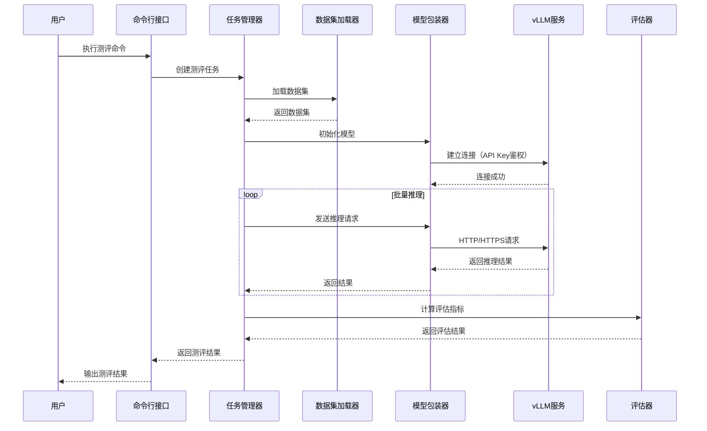
```mermaid
sequenceDiagram
    participant User as 用户
    participant CLI as 命令行接口
    participant TaskMgr as 任务管理器
    participant DatasetLoader as 数据集加载器
    participant ModelWrapper as 模型包装器
    participant VLLMService as vLLM服务
    participant Evaluator as 评估器

    User->>CLI: 执行测评命令
    CLI->>TaskMgr: 创建测评任务
    TaskMgr->>DatasetLoader: 加载数据集
    DatasetLoader-->>TaskMgr: 返回数据集
    TaskMgr->>ModelWrapper: 初始化模型
    ModelWrapper->>VLLMService: 建立连接（API Key鉴权）
    VLLMService-->>ModelWrapper: 连接成功
    loop 批量推理
        TaskMgr->>ModelWrapper: 发送推理请求
        ModelWrapper->>VLLMService: HTTP/HTTPS请求
        VLLMService-->>ModelWrapper: 返回推理结果
        ModelWrapper-->>TaskMgr: 返回结果
    end
    TaskMgr->>Evaluator: 计算评估指标
    Evaluator-->>TaskMgr: 返回评估结果
    TaskMgr-->>CLI: 返回测评结果
    CLI-->>User: 输出测评结果
```

**裁判模型评估交互模型**

1. 备选方案：同步交互模型、异步交互模型
2. 技术决策：选择异步交互模型，因为异步模型支持高并发，性能更好
3. 裁判模型评估交互模型设计

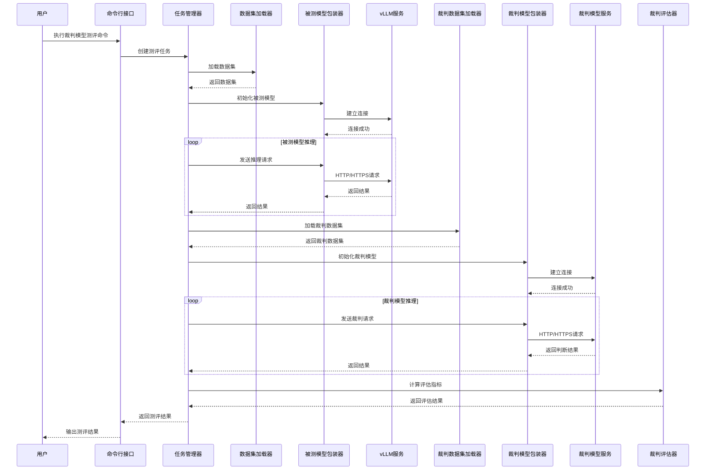
```mermaid
sequenceDiagram
    participant User as 用户
    participant CLI as 命令行接口
    participant TaskMgr as 任务管理器
    participant DatasetLoader as 数据集加载器
    participant ModelWrapper as 被测模型包装器
    participant VLLMService as vLLM服务
    participant JudgeDatasetLoader as 裁判数据集加载器
    participant JudgeModelWrapper as 裁判模型包装器
    participant JudgeService as 裁判模型服务
    participant JudgeEvaluator as 裁判评估器

    User->>CLI: 执行裁判模型测评命令
    CLI->>TaskMgr: 创建测评任务
    TaskMgr->>DatasetLoader: 加载数据集
    DatasetLoader-->>TaskMgr: 返回数据集
    TaskMgr->>ModelWrapper: 初始化被测模型
    ModelWrapper->>VLLMService: 建立连接
    VLLMService-->>ModelWrapper: 连接成功
    loop 被测模型推理
        TaskMgr->>ModelWrapper: 发送推理请求
        ModelWrapper->>VLLMService: HTTP/HTTPS请求
        VLLMService-->>ModelWrapper: 返回结果
        ModelWrapper-->>TaskMgr: 返回结果
    end
    TaskMgr->>JudgeDatasetLoader: 加载裁判数据集
    JudgeDatasetLoader-->>TaskMgr: 返回裁判数据集
    TaskMgr->>JudgeModelWrapper: 初始化裁判模型
    JudgeModelWrapper->>JudgeService: 建立连接
    JudgeService-->>JudgeModelWrapper: 连接成功
    loop 裁判模型推理
        TaskMgr->>JudgeModelWrapper: 发送裁判请求
        JudgeModelWrapper->>JudgeService: HTTP/HTTPS请求
        JudgeService-->>JudgeModelWrapper: 返回判断结果
        JudgeModelWrapper-->>TaskMgr: 返回结果
    end
    TaskMgr->>JudgeEvaluator: 计算评估指标
    JudgeEvaluator-->>TaskMgr: 返回评估结果
    TaskMgr-->>CLI: 返回测评结果
    CLI-->>User: 输出测评结果
```

**流量负载复现交互模型**

1. 备选方案：同步交互模型、异步交互模型
2. 技术决策：选择异步交互模型，因为异步模型支持高并发，性能更好
3. 流量负载复现交互模型设计

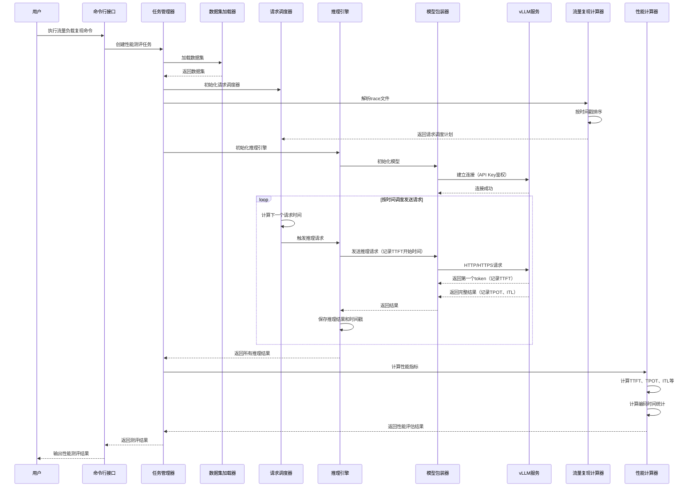
```mermaid
sequenceDiagram
    participant User as 用户
    participant CLI as 命令行接口
    participant TaskMgr as 任务管理器
    participant DatasetLoader as 数据集加载器
    participant RequestScheduler as 请求调度器
    participant Inferencer as 推理引擎
    participant ModelWrapper as 模型包装器
    participant VLLMService as vLLM服务
    participant TraceReplayCalculator as 流量复现计算器
    participant PerfCalculator as 性能计算器

    User->>CLI: 执行流量负载复现命令
    CLI->>TaskMgr: 创建性能测评任务
    TaskMgr->>DatasetLoader: 加载数据集
    DatasetLoader-->>TaskMgr: 返回数据集
    TaskMgr->>RequestScheduler: 初始化请求调度器
    TaskMgr->>TraceReplayCalculator: 解析trace文件
    TraceReplayCalculator->>TraceReplayCalculator: 按时间戳排序
    TraceReplayCalculator-->>RequestScheduler: 返回请求调度计划
    TaskMgr->>Inferencer: 初始化推理引擎
    Inferencer->>ModelWrapper: 初始化模型
    ModelWrapper->>VLLMService: 建立连接（API Key鉴权）
    VLLMService-->>ModelWrapper: 连接成功
    loop 按时间调度发送请求
        RequestScheduler->>RequestScheduler: 计算下一个请求时间
        RequestScheduler->>Inferencer: 触发推理请求
        Inferencer->>ModelWrapper: 发送推理请求（记录TTFT开始时间）
        ModelWrapper->>VLLMService: HTTP/HTTPS请求
        VLLMService-->>ModelWrapper: 返回第一个token（记录TTFT）
        VLLMService-->>ModelWrapper: 返回完整结果（记录TPOT、ITL）
        ModelWrapper-->>Inferencer: 返回结果
        Inferencer->>Inferencer: 保存推理结果和时间戳
    end
    Inferencer-->>TaskMgr: 返回所有推理结果
    TaskMgr->>PerfCalculator: 计算性能指标
    PerfCalculator->>PerfCalculator: 计算TTFT、TPOT、ITL等
    PerfCalculator->>PerfCalculator: 计算编码时间统计
    PerfCalculator-->>TaskMgr: 返回性能评估结果
    TaskMgr-->>CLI: 返回测评结果
    CLI-->>User: 输出性能测评结果
```

### 5.2 并发模型

#### 5.2.1 设计目标

描述并发模型的设计目标，包括系统的并发处理能力、资源利用率等。并发模型的设计目标包括：

1. 并发处理能力：支持高并发性能测评（建议并发数≤CPU核心数）
2. 资源利用率：充分利用CPU和内存资源，避免资源浪费
3. 资源控制：避免资源耗尽，支持资源监控和预警
4. 自动调节：根据系统资源情况自动调节并发数
5. 分布式支持：支持多进程/多线程并行处理，支持分布式测评

#### 5.2.2 设计约束

确定并发模型设计遵循的系统或本模块约束或者限制，包括并发线程数、资源分配等：

1. 并发线程数：≤CPU核心数的80%
2. 内存分配：每个任务≥4GB内存
3. 网络带宽：建议≥100Mbps
4. 并发增长速率：压测模式下通过request_rate控制并发增长速率
5. 资源监控：实时监控系统资源使用情况

#### 5.2.3 并发模型设计

**批量推理并发模型**

1. 备选方案：多线程模型、多进程模型、异步IO模型
2. 技术决策：选择多线程模型，因为Python的GIL限制，多线程适合IO密集型任务
3. 批量推理并发模型设计

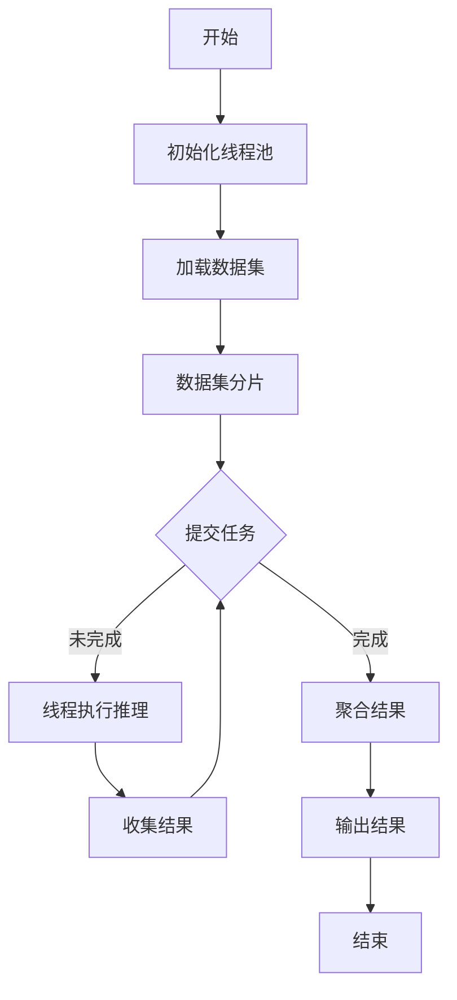
```mermaid
flowchart TD
    Start[开始] --> Init[初始化线程池]
    Init --> Load[加载数据集]
    Load --> Split[数据集分片]
    Split --> Submit{提交任务}
    Submit -->|未完成| Thread[线程执行推理]
    Thread --> Result[收集结果]
    Result --> Submit
    Submit -->|完成| Aggregate[聚合结果]
    Aggregate --> Output[输出结果]
    Output --> End[结束]
```

**请求调度并发模型**

1. 备选方案：泊松到达模型、固定RR模型、基于timestamp的模型
2. 技术决策：支持多种模型，根据用户选择动态切换
3. 请求调度并发模型设计

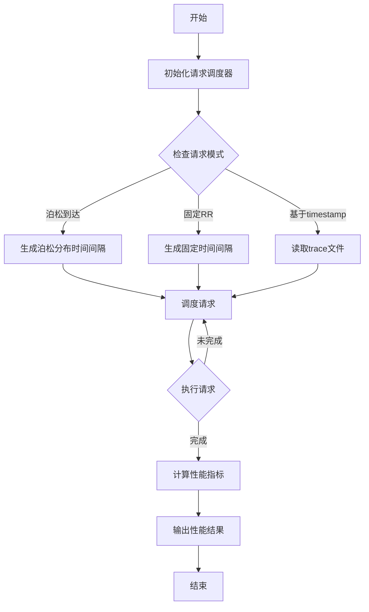
```mermaid
flowchart TD
    Start[开始] --> Init[初始化请求调度器]
    Init --> CheckMode{检查请求模式}
    CheckMode -->|泊松到达| Poisson[生成泊松分布时间间隔]
    CheckMode -->|固定RR| Fixed[生成固定时间间隔]
    CheckMode -->|基于timestamp| Trace[读取trace文件]
    Poisson --> Schedule[调度请求]
    Fixed --> Schedule
    Trace --> Schedule
    Schedule --> Execute{执行请求}
    Execute -->|未完成| Schedule
    Execute -->|完成| Calculate[计算性能指标]
    Calculate --> Output[输出性能结果]
    Output --> End[结束]
```

**裁判模型并发模型**

1. 备选方案：同步模型、异步模型
2. 技术决策：选择异步模型，因为裁判模型推理与被测模型推理解耦，可以并行执行
3. 裁判模型并发模型设计

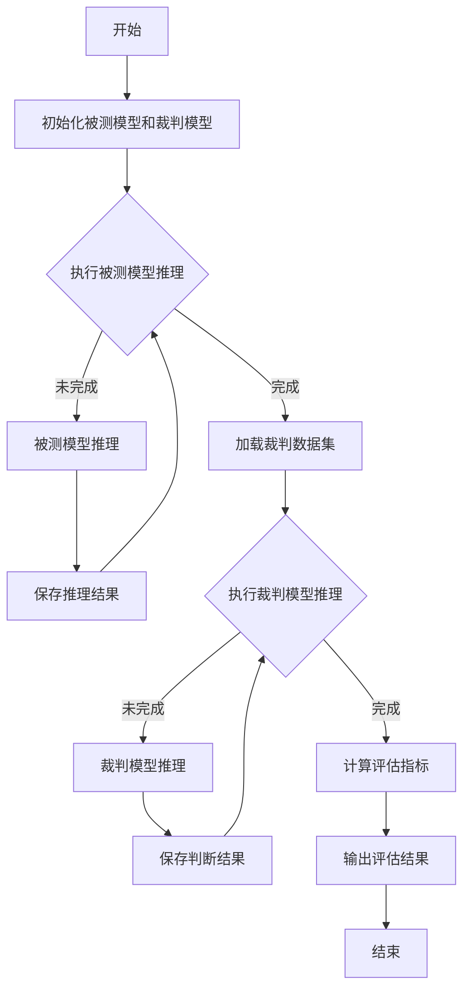
```mermaid
flowchart TD
    Start[开始] --> Init[初始化被测模型和裁判模型]
    Init --> ExecuteModel{执行被测模型推理}
    ExecuteModel -->|未完成| ModelInfer[被测模型推理]
    ModelInfer --> SaveResult[保存推理结果]
    SaveResult --> ExecuteModel
    ExecuteModel -->|完成| LoadJudgeData[加载裁判数据集]
    LoadJudgeData --> ExecuteJudge{执行裁判模型推理}
    ExecuteJudge -->|未完成| JudgeInfer[裁判模型推理]
    JudgeInfer --> SaveJudgeResult[保存判断结果]
    SaveJudgeResult --> ExecuteJudge
    ExecuteJudge -->|完成| Calculate[计算评估指标]
    Calculate --> Output[输出评估结果]
    Output --> End[结束]
```

**资源管理并发模型**

1. 备选方案：静态资源分配、动态资源分配
2. 技术决策：选择动态资源分配，根据系统资源情况自动调节
3. 资源管理并发模型设计

```mermaid
flowchart TD
    Start[开始] --> Init[初始化资源监控]
    Init --> CheckResources{检查系统资源}
    CheckResources -->|资源充足| StartTask[开始任务]
    CheckResources -->|资源不足| Adjust[调整并发数]
    Adjust --> StartTask
    StartTask --> Monitor{监控资源}
    Monitor -->|资源正常| Continue[继续执行]
    Monitor -->|资源过载| Reduce[减少并发数]
    Monitor -->|内存不足| Warn[提示用户]
    Reduce --> Continue
    Warn --> Continue
    Continue --> CheckComplete{任务完成}
    CheckComplete -->|未完成| Monitor
    CheckComplete -->|完成| Output[输出结果]
    Output --> End[结束]
```

**分布式并发模型**

1. 备选方案：多进程模型、多线程模型、分布式计算
2. 技术决策：支持多进程模型，因为多进程可以充分利用多核CPU
3. 分布式并发模型设计

```mermaid
flowchart TD
    Start[开始] --> Init[初始化多进程池]
    Init --> Load[加载数据集]
    Load --> Split[数据集分片]
    Split --> Map[映射任务到进程]
    Map --> Process{进程执行}
    Process -->|未完成| Execute[执行推理]
    Execute --> Process
    Process -->|完成| Reduce[汇总结果]
    Reduce --> Calculate[计算评估指标]
    Calculate --> Output[输出结果]
    Output --> End[结束]
```

