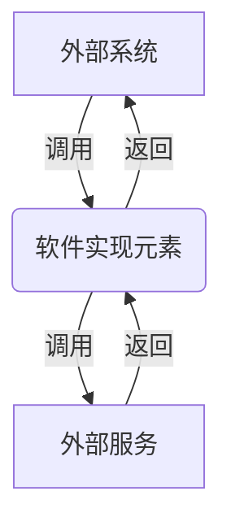

# XXX服务/组件实现设计说明书（模板）
## 1. 概述
讲清楚本服务或组件在整个系统中的位置及定位，对外提供的关键服务或功能。

## 2. 服务/组件功能清单
基于组件、服务与的功能与DFX非功能属性，明确后续关键要素设计内容与目标。

功能清单应包含业务功能和DFX功能：
1. 业务功能： 描述服务或组件的主要功能，包括但不限于数据处理、业务逻辑执行等。
2. DFX功能： 描述服务或组件的非功能性需求，包括但不限于性能、可扩展性、可维护性等。

**功能清单以表格形式输出**
| 类型 | 功能清单 | 功能描述 | 支持的系统功能 |
| -------- | -------- | ----- | ----- |
| 业务功能 | xxxxx | xxxxxx | xxxxx |
| DFX功能 | xxxxxx | xxxxxx | xxxxxx |

## 3. 软件实现设计目标分析与关键要素设计
### 3.1 整体设计目标分析
基于业务功能与DFX非业务功能，分析软件实现设计关键内容与设计目标，通过软件实现设计解决代码可拓展性、复用性、性能等关键挑战。
如：
1. 代码易用性： 设计软件实现时，注重代码的可读性、可维护性和可扩展性，以提高开发效率和代码质量。
2. 数据一致性： 确保在多线程或分布式环境下，数据的一致性和完整性。
3. 低延时高并发： 设计软件实现时，考虑到高并发场景下的性能问题，采用合适的并发模型和技术，以实现低延时和高并发处理。

### 3.2 关键要素设计
结合设计目标分析，明确具体开展哪些关键要素的设计，将设计目标拆解到不同的关键要素上，明确整篇文档的详细开展逻辑。
|关键要素|设计目标|
|--------|--------|
|实现模型|xxxxxxx|
|交互模型|xxxxxxx|
|并发模型|xxxxxxx|

## 4.开发视图
### 4.1 实现模型
#### 4.1.1 概述
此处描述本软件实现元素内部的详细架构，分解为哪些软件单元，每个软件单元处理哪些业务，实现什么功能，对子系统内各软件单元进行简单的功能描述。包括这些软件单元之间的接口及相关描述。
#### 4.1.2 上下文视图
描述软件实现元素的上下文视图，将软件实现元素当作黑盒，描述其与外部的环境、系统关系。
通过mermaid画图展示软件实现元素的上下文视图，如下所示：

#### 4.1.3 逻辑视图
此处描述软件实现元素分解关系，包括外部接口到内部元素的实现/使用关系，内部元素分解关系，内部元素之间的关系等。

本章节根据产品的逻辑元素层次划分可以逐层往下分解，例如产品的分解关系是IM->SWC->SWM，那么逻辑视图应该用组件图逐层分解，一直分解到SWM，SWM内部的划分即下一章节软件实现单元设计，采用类图表达。
这些图都使用mermaid表示。

#### 4.1.4 软件实现单元设计
**静态结构框图**
此图可根据业务情况进行裁剪，如果描述软件实现元素足够小可进行裁剪，直接画静态结构图（可选）
注：采用类图描述。描述每个类承载的功能、接口含义及每个类之间的关系
接口设计：描述实现单元内部和外部的接口
接口功能：
|**接口**| **类型**| **接口范围**| **备注**|
|--------|--------|--------|--------|
|xxxxxxx|消息交互|xxxx管理接口|xxxxxxx|
这些图都使用mermaid表示。

**静态结构图**
需包含静态结构图、结构图中每个元素的说明（含属性和操作）、接口描述（可选）
注：采用类图描述，描述每个类的详细设计，包括类的关键属性和操作，可以指导核心实现
这些图都使用mermaid表示。

### 4.2 接口定义
#### 4.2.1 总体设计
描述接口的设计思路、上下文等。

#### 4.2.2 设计目标
描述接口设计遵循的基本原则、目标等

#### 4.2.3 设计约束
确定接口设计遵循的系统或本模块约束或者限制，包括接口的性能、安全性等

### 4.2.4 技术选型
备选1：
备选2：
决策结论及依据

#### 4.2.5 软件单元XXX
描述软件单元对其他软件单元提供的接口（内部接口）。
1. 接口描述
描述软件单元的核心功能以及接口，可以之间在代码中描述，然后加以引用。

2. 接口信息模型
描述接口数据结构等

3. 接口清单
示例
```
接口名:xxx
接口功能：描述接口的功能
接口类型/协议：rest接口等
接口方向：
输入参数名：参数类型，是否必选参数，接口参数取值范围，参数描述
输出参数名：参数类型，接口参数取值范围，参数描述
返回值：成功以及不同的失败返回值
注意事项： 接口的使用约束和限制、质量属性，上下文等
```

### 4.3 数据模型
#### 4.3.1 设计目标
描述数据模型的设计目标，包括数据的一致性、完整性、可扩展性等。

#### 4.3.2 设计约束
确定数据模型设计遵循的系统或本模块约束或者限制，包括数据的存储方式、索引策略等。

#### 4.3.3 设计选型
技术选型点：数据库选型、数据建模标准等等。
示例：
XXXXX
选型：XXXX
选型理由：XXXX

#### 4.3.4 数据模型设计
1. UML类图/ER图 + 文字，描述数据结构、关系
2. 数据归属操作表 + 文字，描述数据的归属、操作

### 4.4 算法实现
#### 4.4.1 设计目标
描述算法实现的设计目标，包括性能、空间复杂度等。

#### 4.4.2 设计约束
确定算法实现设计遵循的系统或本模块约束或者限制，包括算法的时间复杂度、空间复杂度等。

#### 4.4.3 技术选型
备选1：
备选2：
决策结论及依据

#### 4.4.4 算法实现
UML、伪代码、编程语言、硬件实现、文字说明等


### 4.5 安全实现设计
#### 4.5.1 安全设计目标
描述安全实现的设计目标，包括数据的机密性、完整性、可用性等。

#### 4.5.2 安全设计上下文
描述安全实现设计的上下文，包括系统架构、威胁模型、安全需求等。
本章通常是讨论系统设计阶段输出的威胁建模信息，从软件设计角度进行安全分析

#### 4.5.3 高风险模块识别
##### 4.5.3.1 高风险模块识别
列出被认为高风险的模块，并描述为什么它们被认为是高风险的。
|模块名称|模块功能简要说明|设计域高风险模块分析|对应代码目录|语言类型|备注|
|--------|--------|--------|--------|--------|--------|
|xxxxxxx|xxxxxxx|xxxxxxx|xxxxxxx|xxxxxxx|xxxxxxx|

##### 4.5.3.2 高风险API识别
列出被认为高风险的API，并描述为什么它们被认为是高风险的。
|高风险API|接口说明|高风险接口函数分析|对应代码目录|语言类型|备注|
|--------|--------|--------|--------|--------|--------|
|xxxxxxx|xxxxxxx|xxxxxxx|xxxxxxx|xxxxxxx|xxxxxxx|

#### 4.5.4 代码实现安全防范处理
针对每个已识别的高风险模块和API，描述在代码实现中需要采取的安全防范措施，包括输入验证、输出编码、异常处理等。

高风险模块安全加固
**1. 数据保护**
描述如何在代码中保护数据的机密性、完整性和可用性，包括加密存储、访问控制、审计日志等。

**2. 模块依赖和第三方库**
描述在代码中使用的模块依赖和第三方库，包括它们的安全风险和 mitigations。

**3. 错误处理**
描述在代码中处理错误的机制，包括异常处理、错误码返回等。

**4. 日志审计**
描述如何在代码中记录和审计系统操作，包括用户操作、系统事件等。

高风险API安全加固
**1. 输入验证**
描述如何在代码中验证用户输入，包括参数检查、数据类型验证、边界值检查等。

**2. 错误和异常处理**
描述在代码中处理异常的机制，包括异常捕获、日志记录、错误码返回等。

**3. 身份验证和授权**
描述如何在代码中实现用户身份验证和授权，包括用户名密码验证、角色based访问控制等。

**4. 接口数据加密**
描述如何在代码中对接口数据进行加密，包括请求数据和响应数据的加密传输。

### 4.6 开发者测试模型
#### 4.6.1 设计目标
开发者测试模型是软件可测试性设计的抽象表达，包括测试分层策略设计。针对不同的分层进行开发者测试环境设计、测试工程设计、基础通用框架和领域专用框架设计、DFX专项测试

#### 4.6.2 设计约束
架构设计的原则和约束限制

#### 4.6.3 可测试性设计
    **1. 测试分层策略设计**
    描述测试分层策略，包括单元测试、集成测试、端到端测试等。
    每个测试层的测试目标、测试用例设计、测试执行等。
#### 4.6.4 分层测试
开发者测试分层测试策略
**1. 单元测试**
描述如何进行单元测试，包括测试用例设计、测试执行等。

**2. 集成测试**
描述如何进行集成测试，包括测试用例设计、测试执行等。

**3. 端到端测试**
描述如何进行端到端测试，包括测试用例设计、测试执行等。

#### 4.6.5 关键测试技术方案
映射分层测试策略在不同分层中的技术选型，主要包括环境、测试框架和工具、仿真等。在描述技术方案时，可以列举备选方案，进行对比分析，识别优缺点。根据方案设计意图，确定最终方案，记录决策依据。

## 5. 运行视图
### 5.1 交互模型
#### 5.1.1 设计目标
描述交互模型的设计目标，包括系统的响应时间、吞吐量、可扩展性等。

#### 5.1.2 设计约束
确定交互模型设计遵循的系统或本模块约束或者限制，包括交互协议、消息格式等。

#### 5.1.3 交互模型设计
**xxx交互模型**
1. 备选方案
2. 技术决策
3. XX交互模型设计
用顺序图、活动图、状态图等动态图描述软件核心交互模型设计，对业务进行抽象，不能对业务进行罗列设计。
这些图都用mermaid表示

### 5.2 并发模型
#### 5.2.1 设计目标
描述并发模型的设计目标，包括系统的并发处理能力、资源利用率等。

#### 5.2.2 设计约束
确定并发模型设计遵循的系统或本模块约束或者限制，包括并发线程数、资源分配等。

#### 5.2.3 并发模型设计
**xxx并发模型**
1. 备选方案
2. 技术决策
3. XX并发模型设计
输出以UML图与文字描述为主
这些图都用mermaid表示
