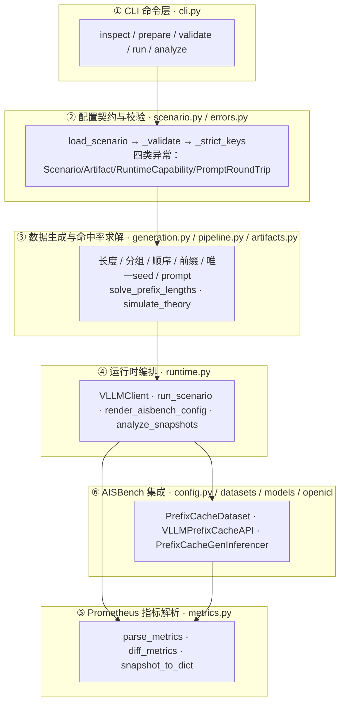
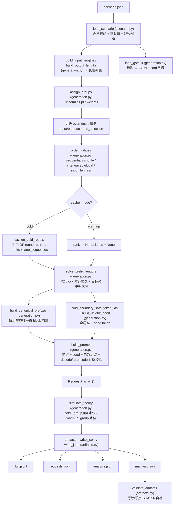
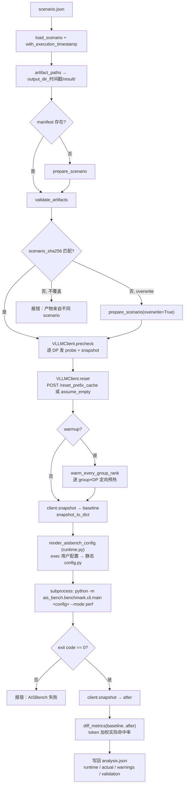
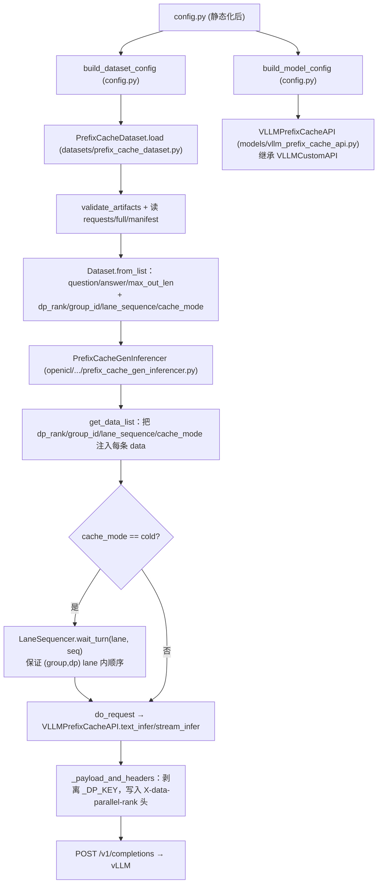
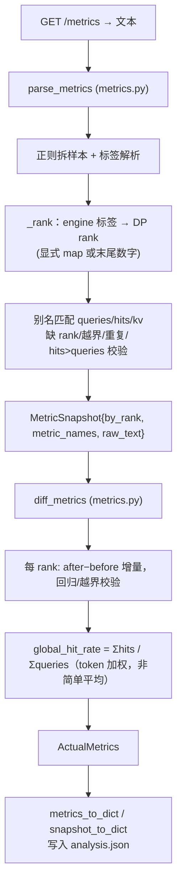
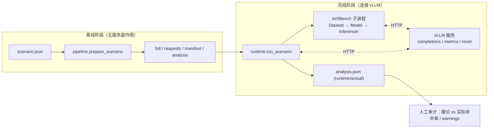

# AISBench Prefix Cache 插件 — 代码架构图（数据流视角）

> 本文档配合 `README.md`、`config_examples/scenario.example.md` 和根目录 `prefix_cache_architecture.html` 阅读，聚焦 **代码级数据流架构**：每个阶段由哪个模块的哪个函数驱动，数据对象如何在不同模块之间流转。
>
> 插件仅新增 `plugins/prefix_cache` 下的代码，通过 `setup.py` 的 entry point 注册到 AISBench，不修改 AISBench 核心。

## 0. 约定

- 图例统一：圆角矩形 = 模块/函数，圆柱 = 落盘产物，菱形 = 分支判断，箭头 = 数据流转方向。
- Mermaid 图可在 GitHub / VS Code / Typora 中直接渲染；若你的阅读器不支持，可参考每张图下方的文字版数据流。
- 图中函数所属文件用括号标注，例如 `prepare_scenario (pipeline.py)`。

---

## 1. 模块分层总览

插件按职责分为 6 层。数据自上而下流动，最终产物反向回流：

| 层 | 文件 | 职责 | 是否产生外部副作用 |
|---|---|---|---|
| ① CLI | `cli.py` | 解析子命令，分发到 pipeline/runtime | 打印 JSON 或 warning |
| ② 配置 | `scenario.py`、`errors.py` | 严格白名单校验 + 默认值注入 + 路径解析 | 无 |
| ③ 生成/求解 | `generation.py`、`pipeline.py`、`artifacts.py` | 确定性构造数据集、求解前缀长度、模拟理论命中率、读写四类产物 | 写产物文件 |
| ④ 运行时 | `runtime.py` | 探测/预热/reset vLLM、编排 AISBench、采集指标 | 发 HTTP 请求、启动子进程 |
| ⑤ 指标 | `metrics.py` | 解析 Prometheus 文本、算增量与 token 加权命中率 | 无 |
| ⑥ 集成 | `config.py`、`datasets/`、`models/`、`openicl/` | 把产物与路由注入 AISBench 的 Dataset/Model/Inferencer | 随 AISBench 进程执行 |

---

## 2. 核心数据对象（跨模块流转的“血液”）

这些 dataclass 是模块之间传递的核心数据结构，理解它们就能理解数据流。

| 对象 | 定义处 | 字段要点 | 流向 |
|---|---|---|---|
| `Scenario` | `scenario.py` | `source_path` + 校验后的 `data`；属性 `run_id/random_seed/output_dir/block_size/cache_mode/dp_size` | 所有入口的输入 |
| `GSMRecord` | `generation.py` | `line_index / question / question_sha256` | 语料 → 选择 → 前缀/后缀 |
| `CanonicalPrefix` | `generation.py` | `group_id / text / token_ids / sha256 / gsm_indices / gsm_hashes` | 每个组的公共前缀 |
| `RequestPlan` | `generation.py` | `request_id / sequence_index / group_id / dp_rank / lane_sequence / target_input_tokens / shared_prefix_tokens / seed_tokens / question / watermark_before / theoretical_hit_tokens / watermark_after …` | 生成 → 理论模拟 → full.jsonl |
| `SolveResult` | `generation.py` | `shared_prefix_tokens / requested/effective hit / min/max reachable / target_reachable / group_reachability / reason` | 求解器 → 生成/analysis/manifest |
| `TheorySummary` | `generation.py` | `rows / total_input_tokens / total_hit_tokens / global_hit_rate / group_stats / dp_stats` | 理论模拟 → analysis/manifest |
| `ArtifactPaths` | `artifacts.py` | `full / requests / manifest / analysis` 四个 Path | prepare 的返回值 |
| `MetricSnapshot` | `metrics.py` | `by_rank: {rank → RankMetrics} / metric_names / raw_text` | 采集 → 差值计算 |
| `ActualMetrics` | `metrics.py` | `by_rank / global_queries / global_hits / global_hit_rate` | 差值计算 → analysis |

---

## 3. 数据流一：`prepare` —— 数据生成与命中率求解

`prepare` 是纯离线、确定性的过程，不访问 vLLM。入口 `pipeline.prepare_scenario`。

### 文字版数据流（与上图一一对应）

1. `load_scenario` 读取并校验 `scenario.json`，注入默认值、把相对路径解析为绝对路径，产出 `Scenario`。
2. `build_input_lengths` / `build_output_lengths` 按 `mode`（fixed/explicit/range/truncated_normal/csv）生成长度列表，均以 `random_seed` 派生种子保证确定性。
3. `load_gsm8k` 逐行解析 JSONL，规范化 `question`，计算 `question_sha256`，产出 `GSMRecord` 列表。
4. `assign_groups` 把 `requests.count` 条请求按 uniform/zipf/weights 分配到 `group-0..group-(n-1)`。
5. 组级 `overrides` 覆盖该组的输入/输出长度与语料选择；`select_gsm8k` 为每组生成 `group_pools`。
6. `order_indices` 按 `order.strategy` 重排（`input_len_asc` 需要传入 `input_lengths` 参与组内排序）。
7. cold 模式下 `assign_cold_routes` 组内轮转分配 `dp_rank`，并为每个 `(group, rank)` lane 编号 `lane_sequence`；warmup 下两者均为 `None`（交给 vLLM 内部负载均衡）。
8. `solve_prefix_lengths` 对每条请求求解 `shared_prefix_tokens`：先计算全局/分组可达边界，再把最终目标钳制到最近的 Block 对齐命中量；在最终 hit token 精确的硬约束下，warmup 按累计输入比例均衡分配，cold 用各 `(Prefix Group, DP rank)` lane 水位状态搜索累计率低超调/少回落的轨迹。搜索受限时回退 `lane_hit = Σprefix - max(prefix)` exact 构造，输出 `SolveResult`（含 effective/min/max/reachable）。
9. `build_canonical_prefixes` 为每组构造唯一首 block 的 canonical 前缀（首 block 碰撞时轮换语料、仍碰撞则加确定性组标记）。
10. `find_boundary_safe_token_ids` 选边界安全 token，`build_unique_seed` 按请求派生全局唯一 seed（长度 = `seed_blocks × block_size`）。
11. `build_prompt` 拼接 `前缀 + seed + 自然后缀`，做 decode/re-encode 往返校验，产出每条请求的最终 prompt 与 token。
12. `simulate_theory` 按最终顺序模拟缓存水位，计算每条请求的 `watermark_before/hit/after` 与全局/分组/分 DP 理论命中率。
13. `write_jsonl`/`write_json` 原子写入四类产物；`validate_artifacts` 自检行数、顺序与 SHA256。

---

## 4. 数据流二：`run` —— 运行时编排

`run` 是有副作用的主流程，入口 `runtime.run_scenario`。它把前面的离线产物“送进”真实 vLLM 服务并采集指标。

### 文字版数据流

1. `load_scenario` → 追加或复用执行时间戳 → 在 `output_dir_时间戳/result/` 检查/生成产物 → `validate_artifacts` → 校验 `scenario_sha256`（防止复用旧配置产物）。
2. `VLLMClient.precheck`：对每个 DP rank 发一条 `max_tokens=1` 的 probe completion（多 DP 加 `X-data-parallel-rank` 头），再 `snapshot` 验证指标与全部 rank 可见。
3. `VLLMClient.reset`：POST `/reset_prefix_cache`；未配置 reset 且 `assume_empty_cache=true` 时记录 `ASSUME_EMPTY_CACHE` 告警并继续。
4. warmup 模式下 `warm_every_group_rank` 按 `(group, rank)` 定向预热，覆盖全集后进入下一步。
5. 采集 `baseline` 快照（warmup 不计入正式统计，故预热后才采集）。
6. `render_aisbench_config` 注入本次 `AISBENCH_PREFIX_CACHE_MANIFEST` 精确路径、`exec` 用户 AISBench 配置、把类引用渲染为 import 别名，产出静态 `config.py`。
7. 以子进程执行 AISBench（`--mode perf`），插件数据集/模型/推理器在子进程内被 AISBench 的 entry point 机制加载（见第 5 节）。
8. 采集 `after` 快照，`diff_metrics` 算 token 加权实际命中率。
9. 计算理论/实际偏差，追加 `ACTUAL_DEVIATION` 等 warning，写回 `analysis.json`（`status: complete`）。

---

## 5. 数据流三：AISBench 正式推理集成（子进程内）

这是 `run` 第 7 步展开后的内部数据流：插件如何把离线产物与 DP 路由注入 AISBench 的加载链。

### 关键机制

- **`PrefixCacheDataset.load`**：把 `requests.jsonl`（最小字段）与 `full.jsonl`（审计字段）逐行合并，输出 `question/answer/max_out_len` 外加 `dp_rank/group_id/lane_sequence/cache_mode` 五列元数据。
- **`VLLMPrefixCacheAPI.__init__`**：解析 `inference_url` 提取 base URL（供父类），同时保存完整 URL 供自己 POST；`get_request_body` 把 `dp_rank` 塞进 body 的 `_DP_KEY`；`_payload_and_headers` 再把它剥离并转为 `X-data-parallel-rank` 头，避免污染请求 payload。
- **`PrefixCacheGenInferencer`**：cold 模式下用 `LaneSequencer`（`asyncio.Condition` 实现的逐 lane 屏障）保证同一 `(group_id, dp_rank)` lane 内的请求按 `lane_sequence` 顺序发出，即使 AISBench 并发发送也不破坏理论水位。
- warmup 模式跳过 lane 序列化，交给 vLLM 内部负载均衡。

---

## 6. 数据流四：Prometheus 指标解析与命中率计算

- 兼容新旧指标别名：`vllm:prefix_cache_queries[_total]` / `vllm:gpu_prefix_cache_queries[_total]` 等（见 `_ALIASES`）。
- `kv_cache_usage` 为可选指标，缺失不影响命中率计算。
- `diff_metrics` 要求 before/after 的 rank 集合完全一致；counter 回退（负增量）或 `hits > queries` 直接判为运行能力错误。

---

## 7. 数据流五：离线命令 `inspect` / `validate` / `analyze`

这三个命令都不发请求。`pipeline.inspect_scenario()` 用临时目录且不改正式数据产物；CLI `inspect` 另行写本次日志和 `status="inspected"` 的轻量 Manifest。

```mermaid
flowchart TB
    subgraph INSPECT["inspect (pipeline.inspect_scenario)"]
        I1["load_scenario"] --> I2["改写 run_id/output_dir 到临时目录"]
        I2 --> I3["prepare_scenario(临时目录)"]
        I3 --> I4["汇总组分布 / DP 路由 / 长度分位数 / 可达范围"]
    end
    subgraph VALIDATE["validate (artifacts.validate_artifacts)"]
        V1["读 manifest"] --> V2["行数 / sequence_index / 字段白名单 / 逐行对应 / SHA256"]
    end
    subgraph ANALYZE["analyze (runtime.analyze_snapshots)"]
        A1["validate_artifacts(manifest)"] --> A2["parse_metrics(baseline 文件)"]
        A2 --> A3["parse_metrics(after 文件)"]
        A3 --> A4["diff_metrics → 写回 analysis.json (status: analyzed)"]
    end
```

- `inspect`：不访问 vLLM、不发送请求；临时构造目录用完即销毁。CLI 在时间戳目录保留 inspect 日志和轻量 Manifest，但不保留 full/requests/analysis。
- `validate`：只校验已有产物完整性，用于发现手工编辑/截断/换序/错误版本。
- `analyze`：用离线保存的 baseline/after Prometheus 文本重算命中率，不连接 vLLM、不重跑 AISBench。

---

## 8. 端到端全链路数据流总图

- 左侧离线产物（`prepare`）是右侧在线阶段（`run`）的输入，二者通过 `manifest.json` 的 `scenario_sha256` 与 `validate_artifacts` 保证一致性与可复现性。
- 理论命中率（`simulate_theory`，离线）与实际命中率（`diff_metrics`，在线）在 `analysis.json` 中并排呈现，偏差只告警不改变退出码。

---

## 9. 复现性设计要点（数据流上的“确定性”约束）

数据流全程刻意保持确定性，任何一环破坏都会让理论/实际对比失真：

| 环节 | 种子来源 | 说明 |
|---|---|---|
| 输入/输出长度 | `seed` / `seed+1` | `build_input_lengths` / `build_output_lengths` |
| 组分配 | `seed+2` | `assign_groups` |
| 组内语料池 | `seed+300+group_index` | `select_gsm8k` |
| 请求顺序 | `seed+4` | `order_indices` |
| 每请求唯一 seed | `seed+5` → `_request_random_seed` | `build_unique_seed` |
| warmup seed | `seed+6` | `build_unique_seed_tokens` |
| 唯一 seed 内容 | `sha256(random_seed:request_id:nonce)` | 逐请求确定性生成，全局去重 |

`manifest.json` 同时记录 `scenario_sha256`、`effective_config_sha256`、`corpus_sha256`、tokenizer 指纹与四类产物 SHA256，构成完整的复现锚点。
