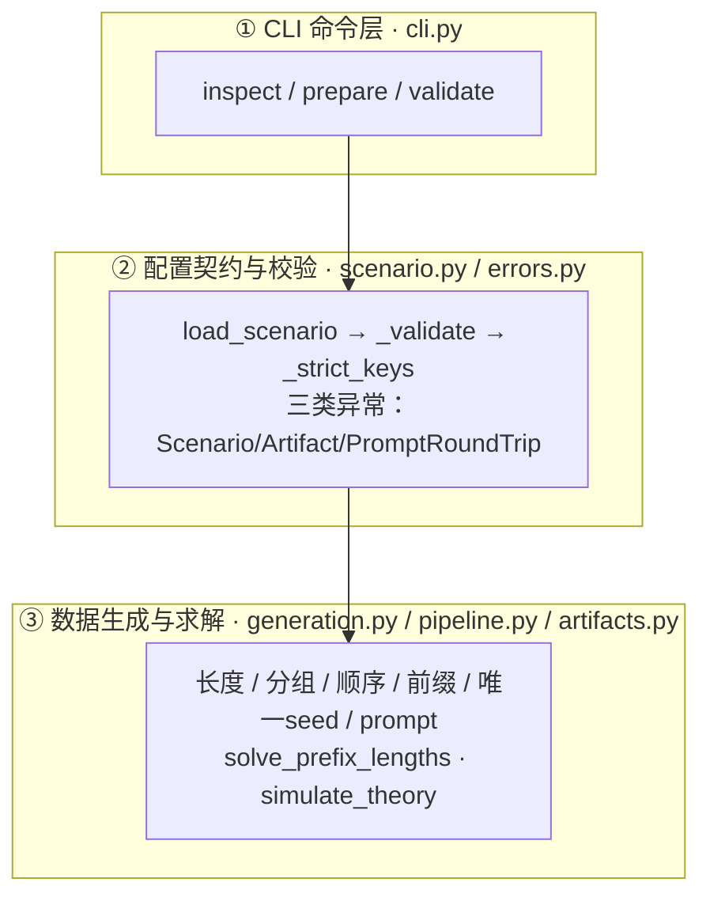
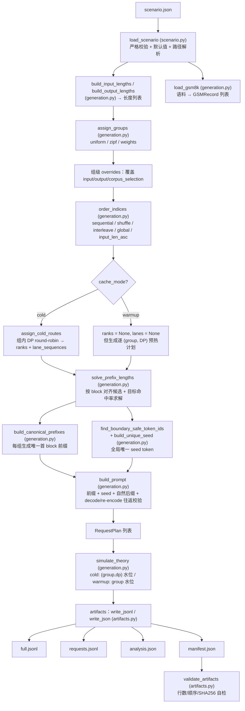
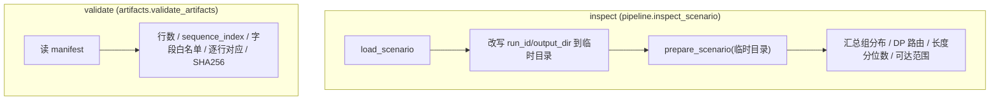
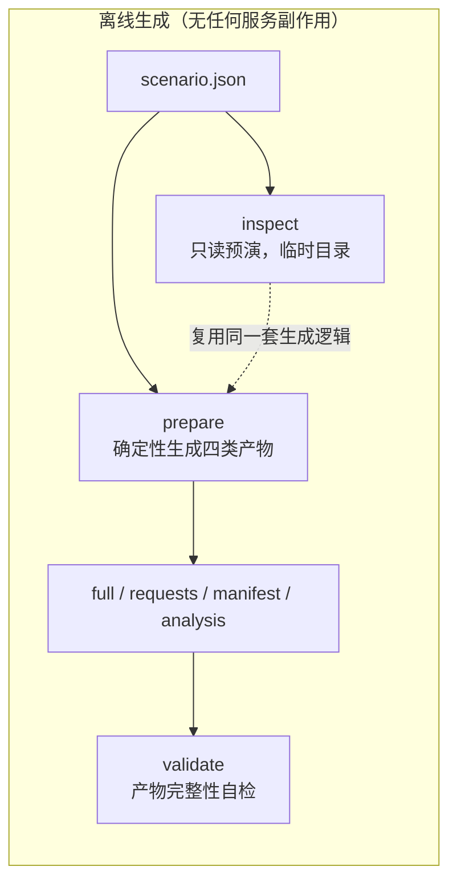

# AISBench Prefix Cache 插件 — 代码架构图（数据流视角）

> 本文档配合 `README.md`、`config_examples/scenario.example.md` 阅读，聚焦 **代码级数据流架构**：每个阶段由哪个模块的哪个函数驱动，数据对象如何在不同模块之间流转。
>
> 本分支只保留离线数据生成与校验能力（`inspect` / `prepare` / `validate`），不包含任何在线压测、AISBench 子进程集成或 Prometheus 指标解析。

## 0. 约定

- 图例统一：圆角矩形 = 模块/函数，圆柱 = 落盘产物，菱形 = 分支判断，箭头 = 数据流转方向。
- Mermaid 图可在 GitHub / VS Code / Typora 中直接渲染；若你的阅读器不支持，可参考每张图下方的文字版数据流。
- 图中函数所属文件用括号标注，例如 `prepare_scenario (pipeline.py)`。

---

## 1. 模块分层总览

插件按职责分为 3 层。数据自上而下流动，产物作为最终交付物落盘：

| 层 | 文件 | 职责 | 是否产生外部副作用 |
|---|---|---|---|
| ① CLI | `cli.py` | 解析子命令，分发到 pipeline | 打印 JSON 或 warning |
| ② 配置 | `scenario.py`、`errors.py` | 严格白名单校验 + 默认值注入 + 路径解析 | 无 |
| ③ 生成/求解 | `generation.py`、`pipeline.py`、`artifacts.py` | 确定性构造数据集、求解前缀长度、模拟理论命中率、读写四类产物 | 写产物文件 |

本分支没有运行时层：不发 HTTP 请求、不启动子进程、不采集指标。

---

## 2. 核心数据对象（跨模块流转的“血液”）

这些 dataclass 是模块之间传递的核心数据结构，理解它们就能理解数据流。

| 对象 | 定义处 | 字段要点 | 流向 |
|---|---|---|---|
| `Scenario` | `scenario.py` | `source_path` + 校验后的 `data`；属性 `run_id/random_seed/output_dir/block_size/cache_mode/dp_size` | 所有入口的输入 |
| `GSMRecord` | `generation.py` | `line_index / question / question_sha256` | 语料 → 选择 → 前缀/后缀 |
| `CanonicalPrefix` | `generation.py` | `group_id / text / token_ids / sha256 / gsm_indices / gsm_hashes` | 每个组的公共前缀 |
| `RequestPlan` | `generation.py` | `request_id / sequence_index / group_id / dp_rank / lane_sequence / target_input_tokens / shared_prefix_tokens / seed_tokens / question / watermark_before / theoretical_hit_tokens / watermark_after …` | 生成 → 理论模拟 → full.jsonl |
| `SolveResult` | `generation.py` | `shared_prefix_tokens / requested/effective hit / min/max reachable / target_reachable / group_reachability / reason` | 求解器 → 生成/analysis/manifest |
| `TheorySummary` | `generation.py` | `rows / total_input_tokens / total_hit_tokens / global_hit_rate / group_stats / dp_stats` | 理论模拟 → analysis/manifest |
| `ArtifactPaths` | `artifacts.py` | `full / requests / manifest / analysis` 四个 Path | prepare 的返回值 |

---

## 3. 数据流一：`prepare` —— 数据生成与命中率求解

`prepare` 是纯离线、确定性的过程，不访问 vLLM。入口 `pipeline.prepare_scenario`。

### 文字版数据流（与上图一一对应）

1. `load_scenario` 读取并校验 `scenario.json`，注入默认值、把相对路径解析为绝对路径，产出 `Scenario`。
2. `build_input_lengths` / `build_output_lengths` 按 `mode`（fixed/explicit/range/truncated_normal/csv）生成长度列表，均以 `random_seed` 派生种子保证确定性。
3. `load_gsm8k` 逐行解析 JSONL，规范化 `question`，计算 `question_sha256`，产出 `GSMRecord` 列表。
4. `assign_groups` 把 `requests.count` 条请求按 uniform/zipf/weights 分配到 `group-0..group-(n-1)`。
5. 组级 `overrides` 覆盖该组的输入/输出长度与语料选择；`select_gsm8k` 为每组生成 `group_pools`。
6. `order_indices` 按 `order.strategy` 重排（`input_len_asc` 需要传入 `input_lengths` 参与组内排序）。
7. cold 模式下 `assign_cold_routes` 组内轮转分配 `dp_rank`，并为每个 `(group, rank)` lane 编号 `lane_sequence`；warmup 下请求本身不固定 DP（交给 vLLM 内部负载均衡），但会为每个 `(Prefix Group, DP rank)` 生成预热计划写入 Manifest。
8. `solve_prefix_lengths` 对每条请求求解 `shared_prefix_tokens`：先计算全局/分组可达边界，再把目标钳制到最近的 Block 对齐命中量；warmup 直接按请求容量分配，cold 按 `(Prefix Group, DP rank)` lane 利用 `lane_hit = Σprefix - max(prefix)` 线性构造精确解，输出 `SolveResult`（含 effective/min/max/reachable）。
9. `build_canonical_prefixes` 为每组构造唯一首 block 的 canonical 前缀（首 block 碰撞时轮换语料、仍碰撞则加确定性组标记）。
10. `find_boundary_safe_token_ids` 选边界安全 token，`build_unique_seed` 按请求派生全局唯一 seed（长度 = `seed_blocks × block_size`）。
11. `build_prompt` 拼接 `前缀 + seed + 自然后缀`，做 decode/re-encode 往返校验，产出每条请求的最终 prompt 与 token。
12. `simulate_theory` 按最终顺序模拟缓存水位，计算每条请求的 `watermark_before/hit/after` 与全局/分组/分 DP 理论命中率。
13. `write_jsonl`/`write_json` 原子写入四类产物；`validate_artifacts` 自检行数、顺序与 SHA256。

---

## 4. 数据流二：离线命令 `inspect` / `validate`

这两个命令都不发请求、不改正式产物（`inspect` 用临时目录）。

- `inspect`：不访问 vLLM、不发送请求、不在 `output_dir` 留产物；临时目录用完即销毁。
- `validate`：只校验已有产物完整性，用于发现手工编辑/截断/换序/错误版本。

---

## 5. 离线端到端数据流总图

- 四类产物是最终交付物，可直接供 vLLM 场景或 AISBench 在线流程复用（本分支不负责在线阶段）。
- 理论命中率（`simulate_theory`，离线）记录在 `analysis.json`，偏差只告警不改变退出码。

---

## 6. 复现性设计要点（数据流上的“确定性”约束）

数据流全程刻意保持确定性，任何一环破坏都会让理论命中率失真：

| 环节 | 种子来源 | 说明 |
|---|---|---|
| 输入/输出长度 | `seed` / `seed+1` | `build_input_lengths` / `build_output_lengths` |
| 组分配 | `seed+2` | `assign_groups` |
| 组内语料池 | `seed+300+group_index` | `select_gsm8k` |
| 请求顺序 | `seed+4` | `order_indices` |
| 每请求唯一 seed | `seed+5` → `_request_random_seed` | `build_unique_seed` |
| warmup seed | `seed+6` | `build_unique_seed_tokens` |
| 唯一 seed 内容 | `sha256(random_seed:request_id:nonce)` | 逐请求确定性生成，全局去重 |

`manifest.json` 同时记录 `scenario_sha256`、`effective_config_sha256`、`corpus_sha256`、tokenizer 指纹与四类产物 SHA256，构成完整的复现锚点。
