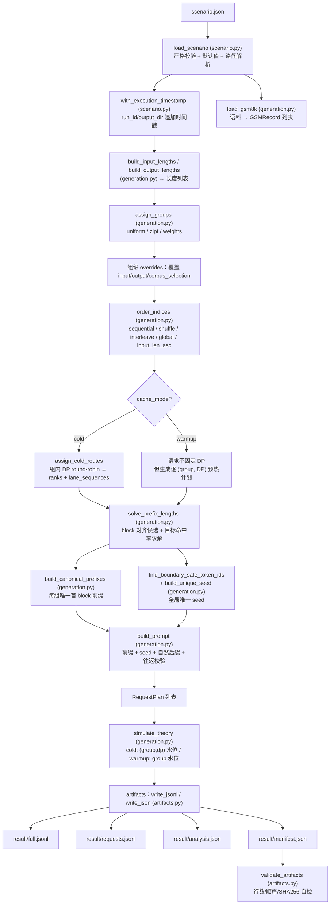

# AISBench Prefix Cache 数据集生成插件 — 需求设计文档

> 分支：`0827_prefix_cache`
> 配套代码：`plugins/prefix_cache/`（`ais_bench_prefix_cache` 包）
> 配套文档：`ARCHITECTURE.md`（数据流视角）、`MODULES.md`（模块/函数级）、`README.md`（使用手册）、`config_examples/scenario.example.md`（配置字段）、`tests/`（测试代码）
> 文档基线：2026-08-26 当前源码；范围为单实例入口下的离线数据生成、理论分析与多 DP 规划，不包含多实例运行时实现

---

## 1. 背景

### 1.1 需求来源

AISBench 当前主要面向通用模型性能评测，**缺少针对 Prefix Cache 优化能力的专项评测**。该需求旨在补齐以下能力：

- 系统评估不同推理框架、缓存策略和部署形态下 Prefix Cache 的实际收益；
- 覆盖从测试数据构造到性能分析的完整流程；
- 解决现有方案在**数据生成、理论分析**方面的不足。

需求拆解为：

1. **Prefix Cache 测试数据生成能力**
   - 支持固定长度、变长长度、用户自定义区间分布等请求数据生成方式；
   - 支持根据目标 Prefix Cache 命中率（如 50%、60%、90%）自动规划公共 Prefix 长度；
   - 支持随机 Token、GSM8K 等真实文本数据作为 Prefix/Suffix 来源；
   - 支持单 Prefix、多 Prefix Group 数据构造。

### 1.2 本分支的定位与边界

完整的 Prefix Cache 专项评测链路是「数据构造 → 理论分析 → 实际测评 → 结果对比」。其中：

- **数据构造**：确定性地生成带可控公共前缀的请求数据集；
- **理论分析**：模拟 Prefix Cache 缓存水位，计算理论命中率与可达区间；

**离线数据生成与理论分析**能力，对应三个子命令 `inspect` / `prepare` / `validate`。`prepare` 生成四个正式数据产物，三个命令均生成运行日志；`inspect` 将摘要写入时间戳结果目录中的轻量 Manifest，供下一次 `prepare` 复用并原位升级。正式数据产物可直接供 vLLM 场景或 AISBench 在线流程复用。

### 1.3 核心目标

- 生成带**可控公共前缀**、**可控全局唯一差异**、**可复现**的 Prefix Cache 请求数据集；
- 数据构造全程**确定性**：相同有效数据参数 + 相同语料时，`full.jsonl` 与 `requests.jsonl` 的请求内容一致；Manifest/analysis 会记录当次时间戳化的 `run_id`、目录和文件名，因此不同执行间元数据不承诺字节级一致；
- 在**不发任何网络请求**的前提下，提供理论命中率、可达区间等分析，支持数据审计与压测前预演。
- 通过 stderr 进度条、分层日志、哈希与原子写提升长任务的可观测性和可恢复审计能力。

---

## 2. 方案设计

### 2.1 总体架构

插件按职责分为 3 层，数据自上而下流动，正式产物与运行日志分层落盘：

```
① CLI 执行层 · cli.py
   inspect / prepare / validate
   时间戳 · inspect Manifest · 日志 · stderr 进度 · stdout JSON
        │
        ▼
② 配置契约与校验 · scenario.py / errors.py
   load_scenario → _validate → _strict_keys
        │
        ▼
③ 数据生成与求解 · generation.py / pipeline.py / artifacts.py
   长度 / 分组 / 顺序 / 前缀 / 唯一seed / prompt
   solve_prefix_lengths · simulate_theory
```

| 层 | 文件 | 职责 | 外部副作用 |
|---|---|---|---|
| ① CLI | `cli.py` | 解析子命令、时间戳化运行、发现/复用 inspect Manifest、安装日志 handler、输出进度和结果 | 写 `log/`、inspect 轻量 Manifest；stderr 进度/错误；stdout JSON |
| ② 配置 | `scenario.py`、`errors.py` | 严格白名单校验 + 默认值注入 + 路径解析 | 无 |
| ③ 生成/求解 | `generation.py`、`pipeline.py`、`artifacts.py` | 确定性构造数据集、求解前缀长度、模拟理论命中率、读写四类产物 | 原子写 `result/` 四类产物 |

设计要点：**没有在线运行时层**。不发 HTTP 请求、不启动压测子进程、不采集在线指标，从而保证数据生成与分析完全离线、可复现。`service.dp_size` 仍用于离线 cold lane 分配和 warmup 计划；多实例 `service.instances` 明确不支持并会被严格校验拒绝。

### 2.2 模块划分

| 模块 | 职责 | 关键函数 |
|---|---|---|
| `errors.py` | 异常体系 | `PrefixCacheError` → `ScenarioValidationError` / `ArtifactValidationError` / `PromptRoundTripError` |
| `scenario.py` | 配置契约、默认值、校验与执行时间戳 | `load_scenario`、`_validate`、`_strict_keys`、`_minimum_input_tokens`、`new_execution_timestamp`、`with_execution_timestamp` |
| `generation.py` | 核心算法层（纯函数） | 见 2.3 |
| `pipeline.py` | 编排：`prepare` / `inspect`，上报逐 prompt 进度 | `prepare_scenario`、`inspect_scenario` |
| `artifacts.py` | 产物读写、Manifest 发现与校验 | `write_jsonl` / `write_json` / `sha256_file` / `find_latest_execution_manifest` / `validate_artifacts` |
| `cli.py` | 命令行入口、日志、进度条、inspect Manifest 和 stdout/stderr 契约 | `build_parser`、`PromptProgress`、`_resolve_log_file`、`_reusable_execution_timestamp`、`_persist_inspect_manifest`、`main` |

依赖链（无环）：

```
cli.py → pipeline.py → scenario.py → errors.py
                       → artifacts.py → errors.py
                       → generation.py → errors.py
```

### 2.3 核心数据对象

| 对象 | 定义处 | 字段要点 | 流向 |
|---|---|---|---|
| `Scenario` | `scenario.py` | `source_path` + 校验后 `data`；`run_id/random_seed/output_dir/block_size/cache_mode/dp_size` | 所有入口输入 |
| `GSMRecord` | `generation.py` | `line_index / question / question_sha256` | 语料 → 选择 → 前缀/后缀 |
| `CanonicalPrefix` | `generation.py` | `group_id / text / token_ids / sha256 / gsm_indices / gsm_hashes` | 每组公共前缀 |
| `RequestPlan` | `generation.py` | `request_id / sequence_index / group_id / dp_rank / lane_sequence / target_input_tokens / shared_prefix_tokens / seed_tokens / watermark_before/hit/after …` | 生成 → 模拟 → full.jsonl |
| `SolveResult` | `generation.py` | `shared_prefix_tokens / requested/effective hit / min/max reachable / target_reachable / group_reachability / reason` | 求解器 → analysis/manifest |
| `TheorySummary` | `generation.py` | `rows / total_input_tokens / total_hit_tokens / global_hit_rate / group_stats / dp_stats` | 理论模拟 → analysis/manifest |
| `ArtifactPaths` | `artifacts.py` | `full / requests / manifest / analysis`，全部位于 `result/` | prepare 返回值 |

### 2.4 CLI 执行外壳

CLI 在调用 pipeline 前统一建立本次执行上下文：

1. `inspect` 生成格式为 `_YYYYMMDD_HHMMSS` 的新时间戳，并把它同时追加到 `run_id` 和 `output_dir` 最后一段；
2. `prepare` 扫描 `<base_output_dir>_时间戳/result/<run_id_时间戳>.manifest.json`。Manifest 版本、`status="inspected"`、Scenario SHA-256、时间戳化 `run_id` 与 `output_dir` 均有效时复用 inspect 时间戳；否则生成新时间戳；
3. `validate` 不重新加时间戳，而是从 Manifest 的 `run_id` 与 `effective_config.run.output_dir` 定位原运行目录；
4. 安装插件独立 logger，并把日志写入该运行目录的 `log/`；只有日志路径无法解析或创建时才回退到控制台；
5. `prepare` 把逐 prompt 进度写到 stderr，最终机器可读 JSON 独占 stdout，避免管道解析被进度文本污染。

inspect 轻量 Manifest 是检查结果和跨命令复用状态的统一载体，顶层 `status="inspected"`，摘要位于 `inspect.summary`。匹配逻辑比较 Scenario SHA-256；Scenario 修改后旧 Manifest 自动失配。prepare 只会原位升级同场景 inspect-only Manifest，不会把已有正式 `status="prepared"` Manifest 当作可覆盖占位文件。

### 2.5 数据生成流程（`prepare`）

数据走向（Mermaid 图，可在 GitHub / VS Code / Typora 渲染；括号标注函数所属文件）：



**数据走向**：`load_scenario` 校验后注入本次执行时间戳，再产出长度列表与语料记录，汇入分组 → 组覆盖 → 排序；随后按 `cache_mode` 分岔——cold 经 `assign_cold_routes` 为每条请求分配 `(rank, lane_sequence)`（供求解器与水位模拟做 lane 级精确构造），warmup 请求不固定 DP 但生成逐 `(group, DP)` 预热计划。`solve_prefix_lengths` 求出每条请求的公共前缀长度后，与 canonical 前缀、全局唯一 seed 一起经 `build_prompt` 拼装成 `RequestPlan`；每成功生成一条 prompt 即调用一次进度回调。`simulate_theory` 按最终顺序模拟缓存水位（cold 按 `(group,dp)`、warmup 按 group），最后一次编排把四类产物原子写入 `result/`，并以 `validate_artifacts` 自检。全程无网络请求、无循环反馈。

确定性主流程（入口 `pipeline.prepare_scenario`）：

1. `load_scenario` 读取并校验 `scenario.json`，注入默认值、解析相对路径；`with_execution_timestamp` 为 `run_id`/`output_dir` 追加同一执行时间戳；
2. `build_input_lengths` / `build_output_lengths` 按 mode 生成长度列表（fixed / explicit / range / truncated_normal / csv）；
3. `load_gsm8k` 逐行解析语料，规范化 `question`，计算 `question_sha256`；
4. `assign_groups` 把请求按 uniform / zipf / weights 分配到 `group-0..group-(n-1)`；
5. 组级 `overrides` 覆盖该组输入/输出长度与语料选择；
6. `order_indices` 按 `order.strategy` 重排（sequential / within_group_shuffle / interleave / global_shuffle / input_len_asc）；
7. cold 模式 `assign_cold_routes` 组内 DP round-robin，产出 `(rank, lane_sequence)`；warmup 模式请求不固定 DP，但生成逐 `(group, DP)` 预热计划；
8. `solve_prefix_lengths` 求解每条请求的 `shared_prefix_tokens`（见 2.5）；
9. `build_canonical_prefixes` 为每组构造唯一首 block 的前缀（碰撞轮换，仍碰撞加确定性组标记兜底）；
10. `find_boundary_safe_token_ids` + `build_unique_seed` 生成全局唯一 seed（长度 = `seed_blocks × block_size`）；
11. `build_prompt` 拼接 `前缀 + seed + 自然后缀`，decode/re-encode 往返校验（失败重试换 seed）；pipeline 每生成一条 prompt 将进度更新为 `n / requests.count`；
12. `simulate_theory` 按最终顺序模拟缓存水位，计算理论命中率；
13. 在 `<timestamped_output_dir>/result/` 原子写四类产物 → warmup 计划 → warnings → 写 analysis/manifest → `validate_artifacts` 自检。

### 2.6 理论命中率求解（`solve_prefix_lengths`）

- **候选空间**：每条请求的公共前缀长度按 Block 对齐，候选为 `[0, block, 2b, …, floor((len−min_non_shared)/b)×b]`；
- **可达区间**：先以全 0 与全最大前缀计算全局/组级 `min/max reachable rate`；
- **目标钳制**：把目标命中 token 钳到可达区间内最近的 Block 整数倍；目标越界时直接取对应边界解，并记录 `target_reachable=false`；
- **硬目标**：最终 hit token 必须等于钳制后的最近可达 Block 总量，轨迹优化不得改变 effective/theoretical 终值；
- **warmup 轨迹**：`_balanced_warmup_prefixes` 按累计输入比例跟踪最终有效目标，并利用剩余容量下界保证尾部仍可精确收敛，不再顺序填满前几条；
- **cold 轨迹**：`_target_convergent_cold_prefixes` 以每个 `(Prefix Group, DP rank)` 水位和累计 hit 为状态，在精确终值路径中依次最小化累计率最大超调、总超调、回落和目标距离；
- **受限回退**：极端多 lane/大状态空间未保留精确 beam 路径时，回退 `lane_hit = Σprefix − max(prefix)` 的最大容量 anchor 构造，确保最终 target-driven 正确；
- **可行性边界**：后置 lane 首次 cold miss、零/低容量请求或 Block 离散性可能使严格单调不可行，此时选择超调/回落最小的精确终值解；
- **验证**：用穷举 oracle 对照最终命中误差，另以代表性 20 请求轨迹断言累计率不超调/不回落，并验证 warmup 均衡分配。

### 2.7 确定性/复现性设计

| 环节 | 种子来源 | 说明 |
|---|---|---|
| 输入/输出长度 | `seed` / `seed+1` | `build_input_lengths` / `build_output_lengths` |
| 组分配 | `seed+2` | `assign_groups` |
| 组内语料池 | `seed+300+group_index` | `select_gsm8k` |
| 请求顺序 | `seed+4` | `order_indices` |
| 每请求唯一 seed | `seed+5` → `_request_random_seed` | `build_unique_seed` |
| warmup seed | `seed+6` | `build_unique_seed_tokens` |
| 唯一 seed 内容 | `sha256(random_seed:request_id:nonce)` | 逐请求确定性生成，全局去重 |

`manifest.json` 记录 `scenario_sha256`、`effective_config_sha256`、`corpus_sha256`、tokenizer 指纹与正式产物 SHA256，构成完整复现锚点。执行时间戳是运行身份的一部分：若需比较两次生成的数据内容，应重点比较 full/requests 的行内容与哈希，并识别 Manifest/analysis 中允许变化的时间戳化路径和名称。

### 2.8 落盘、日志与产物设计

目录示例：

```text
outputs/
└── gsm8k-token2048-prefix-cache-70_20260826_153000/
    ├── log/
    │   ├── gsm8k-token2048-prefix-cache-70_20260826_153000.inspect.log
    │   ├── gsm8k-token2048-prefix-cache-70_20260826_153000.prepare.log
    │   └── gsm8k-token2048-prefix-cache-70_20260826_153000.validate.log
    └── result/
        ├── gsm8k-token2048-prefix-cache-70_20260826_153000.full.jsonl
        ├── gsm8k-token2048-prefix-cache-70_20260826_153000.requests.jsonl
        ├── gsm8k-token2048-prefix-cache-70_20260826_153000.manifest.json
        └── gsm8k-token2048-prefix-cache-70_20260826_153000.analysis.json
```

日志采用 `[时间] [logger 名] [级别] 消息` 格式，插件 logger 名空间为 `ais_bench_prefix_cache`。文件 handler 以 `mode="w"` 打开同名日志；正常 CLI 自动生成/复用的时间戳可避免跨执行同名覆盖。日志覆盖 Scenario 加载、长度/语料/分组/求解、prompt 生成、理论模拟、原子写、哈希与校验等关键节点。日志用于问题定位，不是正式数据契约；`api_key` 不应作为正式产物写入，运行日志和命令行参数仍应按敏感信息规范管理。

正式产物如下：

| 产物 | 内容 | 用途 |
|---|---|---|
| `<run_id>.full.jsonl` | 完整审计数据：最终 prompt、长度、组、公共前缀、唯一 seed、确定性随机种子、GSM8K 来源、DP 路由、理论命中 token、水位变化、差异块碰撞状态 | 审计 / 复现 |
| `<run_id>.requests.jsonl` | 最小输入，每行只含 `question / answer / max_tokens`（保持此公开字段顺序） | 直接可压测的最简请求 |
| `<run_id>.manifest.json` | inspect 阶段为 `status="inspected"` 的轻量摘要；prepare 后原位升级为 `status="prepared"`，包含有效配置、输入哈希、tokenizer 指纹、长度分位数/分桶、全局及组级可达范围、差异块唯一性、组、DP、warmup 计划、产物路径/大小/哈希 | 检查结果、跨命令复用、复现与校验入口 |
| `<run_id>.analysis.json` | requested/effective/theoretical hit rate、目标可达性、带符号/绝对偏差、验证状态（`PASS`/`PASS_WITH_WARNING`）、分组/分 DP 理论结果、warnings | 理论分析交付物 |

安全设计：`service.api_key` 明文**不写入 Manifest**，只记录 `api_key_configured` 布尔。

原子写规则：先写同目录临时文件再 `os.replace`。目标文件已存在且没有 `--overwrite` 时拒绝覆盖；`--overwrite` 只允许重写本次确定路径下的四个正式产物，不删除整个输出目录，也不清理日志或其他用户文件。

CLI 输出契约：

| 命令 | stdout | stderr | 额外落盘 |
|---|---|---|---|
| `inspect` | 缩进 JSON 摘要，含理论可达性、`log` 与 `manifest` 路径 | 业务错误 | inspect 日志；成功时写 `status="inspected"` 的轻量 Manifest |
| `prepare` | 单行 JSON，含 `full/requests/manifest/analysis/log` 路径 | `Generate prompts` 进度条及业务错误 | prepare 日志；`result/` 四类正式产物 |
| `validate` | 单行 JSON：`ok/rows/run_id` | 业务错误 | 与 Manifest 同一运行目录下的 validate 日志 |

### 2.9 需求覆盖映射

| 规划文档需求 | 本分支实现 | 对应命令/模块 |
|---|---|---|
| 固定/变长/自定义区间长度 | `input_length` 五种 mode：`fixed` / `explicit` / `range` / `truncated_normal` / `csv` | `build_input_lengths`（generation） |
| 按目标命中率自动规划公共 Prefix | `target_hit_rate` + 可达区间钳制 + Block 对齐求解 | `solve_prefix_lengths`（generation） |
| GSM8K 真实文本作 Prefix/Suffix | GSM8K `question` 作为 canonical 前缀与自然后缀来源 | `load_gsm8k` / `build_canonical_prefixes` / `_repeat_tokens` |
| 随机 Token 作差异来源 | 边界安全 token 确定性生成全局唯一 seed | `find_boundary_safe_token_ids` / `build_unique_seed` |
| 单 Prefix / 多 Prefix Group | `groups.count` + `assignment`（uniform/zipf/weights）+ 组级 overrides | `assign_groups` / `build_canonical_prefixes` |
| 理论分析 | 理论命中率、可达区间、长度分位数、组/DP 统计 | `simulate_theory` / `inspect_scenario` / analysis.json |
| 数据审计与可复现 | SHA256 指纹、确定性哈希、validate 校验 | `artifacts.validate_artifacts` / manifest |
| 可观测执行 | 每条 prompt 推进一次进度、三命令分层日志、stdout/stderr 分离 | `PromptProgress` / CLI logger / pipeline progress callback |
| 自动运行隔离 | `run_id`/`output_dir` 时间戳化，inspect Manifest 可让后续 prepare 共用目录并安全升级 | `new_execution_timestamp` / `with_execution_timestamp` / `find_latest_execution_manifest` |

---

## 3. 使用说明

### 3.1 安装

```bash
# 在 AISBench 仓库根目录（包含 setup.py / ais_bench / plugins/ 的目录）
python -m pip install -e .                          # 安装 AISBench 核心，供后续压测流程使用
python -m pip install -e ./plugins/prefix_cache     # 安装插件与 CLI 入口
ais-bench-prefix-cache --help                       # 验证安装，应列出 inspect/prepare/validate
```

依赖：Python ≥ 3.10、`ais-bench-benchmark`、`transformers`、GSM8K JSONL（每行含 `question` 字段）。插件日志使用 Python 标准库 `logging`，不依赖 AISBench `AISLogger`；`setup.py` 仍声明 `ais-bench-benchmark`，用于与 AISBench 环境集成。

### 3.2 配置（`scenario.json`）

复制示例并修改关键字段：

```bash
cp ./plugins/prefix_cache/config_examples/scenario.example.json ./scenario.json
```

首次使用通常只需确保 `tokenizer.path` 指向与目标服务一致的本地 tokenizer、`corpus.path` 指向本地 GSM8K JSONL。若采用 cold 多 DP 路由或 warmup 计划，`service.dp_size` 还应与目标 DP 数一致。其余省略字段由代码按 `scenario.example.json` 的当前示例值进行嵌套默认填充。

**核心数据构造参数：**

- **输入长度** `requests.input_length`：`fixed`（固定值）/ `explicit`（显式列表）/ `range`（多闭区间采样）/ `truncated_normal`（截断正态）/ `csv`（长度文件）；
- **非共享区与唯一 seed** `prefix_cache`：`seed_blocks`（seed 长度 = `seed_blocks × block_size`）、`minimum_non_shared_length`（每条请求至少的非共享 token，默认等于 seed 长度，不能小于 seed 长度）；
- **请求顺序** `prefix_cache.order.strategy`：`sequential` / `within_group_shuffle` / `interleave` / `global_shuffle` / `input_len_asc`；
- **Prefix Group** `prefix_cache.groups`：`count` + `assignment`（uniform / zipf / weights）+ 可选 `overrides`（按组覆盖长度与语料）；
- **目标命中率** `prefix_cache.target_hit_rate`：求解器主目标，范围 `[0,1]`。

`service.inference_url`、`service.metrics_url`、`service.model` 有默认值，并要求最终有效值为非空字符串，但本分支的三个离线命令均不访问这些地址，也不会把 `model` 注入 `requests.jsonl`；`service.dp_size` 用于 cold DP 路由与 warmup 计划。`validation` 段控制偏差告警阈值。字段全集、默认值、类型和模式约束以 `config_examples/scenario.example.md` 为准。

### 3.3 命令

```bash
# inspect：加载 tokenizer + GSM8K，在临时工作区构造数据并计算可达范围
#         不留下 full/requests/analysis；会建立时间戳目录、inspect 日志及轻量 Manifest
ais-bench-prefix-cache inspect --scenario ./scenario.json

# prepare：确定性生成并校验 result/ 下四类产物；stderr 显示逐 prompt 进度
#          若存在同场景有效 inspect Manifest 则复用并原位升级，否则新建时间戳目录
ais-bench-prefix-cache prepare --scenario ./scenario.json
ais-bench-prefix-cache prepare --scenario ./scenario.json --overwrite   # 允许重写同一路径的四类正式产物

# validate：不生成数据，校验 Manifest 行数/顺序/字段白名单/逐行对应/SHA256，并写 validate 日志
ais-bench-prefix-cache validate --manifest <manifest路径>
```

### 3.4 推荐工作流

```bash
ais-bench-prefix-cache inspect --scenario ./scenario.json    # 压测前预演
ais-bench-prefix-cache prepare --scenario ./scenario.json    # 生成正式产物
ais-bench-prefix-cache validate --manifest <manifest路径>    # 产物完整性自检
```

推荐连续执行 inspect 与 prepare，使二者通过 Manifest 复用同一时间戳目录。prepare stdout 返回的 `manifest` 路径应直接作为 validate 输入；不要根据基础 `run_id` 手工猜测时间戳目录。

### 3.5 退出码与告警

- 理论值与目标偏差超过 `target_warning_pp` → `TARGET_DEVIATION`；
- 目标超出可达区间 → `TARGET_UNREACHABLE`；
- 以上均**只告警**（`warning_only=true`、`affects_exit_code=false`），不改变成功退出码；
- 配置错误、产物损坏等 `PrefixCacheError` 在 stderr 输出 `ERROR:` 并返回退出码 `2`；成功返回 `0`。

---

## 4. 测试设计

测试位于 `plugins/prefix_cache/tests/`，当前标准库 unittest discovery 共执行 **135 项**，覆盖纯逻辑/配置、离线 pipeline、CLI/日志/进度、产物、指标与 mock 在线运行时。测试使用 FakeTokenizer 或 mock，**不加载真实 transformers、不访问网络、不连接 vLLM**。

```bash
PYTHONPATH=./plugins/prefix_cache python -m unittest discover -s plugins/prefix_cache/tests -v
```

测试使用标准库 `unittest`，不强制要求安装 pytest。测试发现数量和通过状态是两个不同概念；交付前必须记录实际命令输出，不能只凭用例清单宣称全部通过。

### 4.1 测试基础设施

| 设施 | 说明 |
|---|---|
| `_FakeTokenizer` | 模拟 tokenizer 协议（`encode`/`decode`/`__len__`/`all_special_ids`），可触发 BPE 式合并（如 "ab" 重编码为 id 52），用于验证边界安全逻辑 |
| `scenario_dict(root, mode, dp_size)` | 构造最小合法 Scenario 的 fixture（8 条请求、固定长度 32、2 组、block_size=4） |
| `tempfile.TemporaryDirectory` | 每个用例独立临时目录，隔离产物与语料 |
| `unittest.mock.patch` | 隔离 tokenizer、pipeline、时间戳和 CLI 输出，验证 stdout/stderr 与日志路径契约 |

### 4.2 `test_core.py` — 单元测试（17 个）

| 类别 | 用例 | 验证点 |
|---|---|---|
| 默认值 | `test_omitted_values_use_current_example_defaults` | 空 Scenario 使用与当前 `scenario.example.json` 对齐的代码默认值 |
| 默认值 | `test_partially_empty_sections_receive_nested_defaults` | 部分空对象仍能递归补齐嵌套默认值 |
| 配置校验 | `test_scenario_rejects_unknown_multi_instance_field` | 未知字段（`service.instances`）被 `ScenarioValidationError` 拒绝 |
| 配置校验 | `test_seed_capacity_is_rejected_during_scenario_validation` | 输入长度不足以容纳 seed 时加载即报错 |
| 长度生成 | `test_lengths_are_deterministic` | range / truncated_normal 相同种子结果一致 |
| 长度生成 | `test_explicit_and_truncated_normal_input_lengths` | explicit 原样返回；truncated_normal 落在 `[min,max]` 且确定 |
| 长度生成 | `test_csv_lengths_and_specified_gsm_selection` | CSV 列解析；indices / question_sha256 语料选择 |
| 语料选择 | `test_mixed_selection_allows_hashes_without_indices` | mixed 模式空 indices 仅按哈希选择并循环复用 |
| 前缀 | `test_canonical_collision_uses_group_fallback` | 首 block 碰撞时轮换语料，仍碰撞加确定性组标记，组前缀互不相同 |
| 唯一 seed | `test_seed_generation_round_trips` | seed token 中不含边界不安全 id（52）；decode/re-encode 可还原 |
| 分组/排序 | `test_groups_and_orders` | weights 分组精确落额（5/3/2）；5 种顺序策略均保持全集；`input_len_asc` 组内升序 |
| DP 路由/水位 | `test_routes_and_dp_watermarks` | cold 组内 round-robin 路由；按 lane 从零水位模拟命中 |
| 求解器 | `test_unique_seed_and_solver` | 唯一 seed 全局去重；求解结果 block 对齐、命中率 ≤ 最大可达率 |
| 求解器 | `test_solver_reserves_minimum_non_shared_length` | 目标 1.0 时前缀不越过非共享区边界；`target_reachable=false` |
| 求解器 | `test_unreachable_large_cold_target_uses_exact_upper_boundary` | 大目标越界时取精确上界解（`effective_hit_tokens` 精确断言） |
| 求解器 | `test_solver_matches_exhaustive_small_oracle` | 单 lane 下求解结果误差 == 穷举全部候选组合的最优误差（cold + warmup × 3 目标） |
| 求解器 | `test_exact_cold_solver_matches_multi_lane_exhaustive_oracle` | 多 lane 下对 6 个目标值均等于穷举最优误差 |
| 求解器轨迹 | `test_cold_solver_converges_without_cumulative_target_overshoot` | 20 请求 cold 70% 目标下累计率单调上升、全程不超过 effective target、最终精确收敛 |
| 求解器轨迹 | `test_warmup_solver_balances_prefixes_instead_of_front_loading` | warmup 目标按请求均衡分配，不再前置填满、尾部归零 |

### 4.3 `test_pipeline.py` — 集成测试（10 个）

| 用例 | 验证点 |
|---|---|
| `test_four_artifacts_and_minimal_requests` | prepare 在 `result/` 产出四类文件；requests 每行严格只含 `question/answer/max_tokens` 且字段顺序固定；`validate_artifacts` 通过 |
| `test_prepare_reports_each_generated_prompt` | 进度回调先收到 `(0,total)`，随后每成功生成一个 prompt 增加 1，直到 `(total,total)` |
| `test_prepare_appends_one_timestamp_to_run_id_and_output_dir` | 显式执行时间戳只追加一次，`run_id` 与输出目录后缀一致 |
| `test_inspect_reports_reachability_without_persisting_run_artifacts` | pipeline 函数级 inspect 返回可达范围与组分布；`sends_requests=false`；不在基础 `output_dir` 留四类正式产物 |
| `test_deterministic_content_hashes` | 相同 Scenario 两次 prepare 的 full/requests SHA256 一致 |
| `test_manifest_does_not_persist_api_key` | manifest 不含 api_key 明文；记录 `api_key_configured=true` |
| `test_manifest_contains_detailed_audit_fields` | manifest 含 p99、长度分桶、`target_reachable`、各组 `reachable_max`、碰撞状态 `pass`、request_random_seed 全局唯一、divergence_unique |
| `test_length_summary_bins_report_actual_value_min_max` | 每个长度 bin 的 min/max 是该 bin 实际观测值，而非理论边界 |
| `test_warmup_manifest_has_every_group_rank` | warmup plan 覆盖每个 `(group, rank)` 且均 `included_in_formal_statistics=false` |
| `test_group_override_and_multi_sample_suffix` | 组覆盖的固定输入长度生效；语料 indices 覆盖使 suffix 含 ≥2 个不同 GSM8K 样本 |

这里的 inspect 无正式产物断言针对 `pipeline.inspect_scenario`；CLI 级 inspect 另有 `log/` 与轻量 Manifest 副作用，由 CLI flow 测试覆盖，二者不矛盾。

### 4.4 `test_cli.py` — CLI、日志与进度测试（4 个）

| 用例 | 验证点 |
|---|---|
| `test_log_file_is_nested_under_log_directory` | prepare/inspect 日志位于时间戳目录的 `log/`，validate 日志由 Manifest 定位 |
| `test_prompt_progress_renders_zero_updates_and_completion` | 进度条能显示 0%、中间进度和 100%，完成时换行 |
| `test_prepare_cli_keeps_progress_on_stderr_and_result_on_stdout` | prepare 进度只写 stderr，stdout 只保留可解析 JSON，并返回 `log` 路径 |
| `test_inspect_cli_returns_timestamped_log_path` | inspect 返回时间戳化日志路径并写入相应日志 |

### 4.5 测试覆盖矩阵（需求 → 用例）

| 需求/能力 | 覆盖用例 |
|---|---|
| 配置严格校验与嵌套默认值 | `test_omitted_values_...`、`test_partially_empty_...`、`test_scenario_rejects_...`、`test_seed_capacity_...` |
| 长度生成（fixed/explicit/range/truncated_normal/csv） | `test_lengths_are_deterministic`、`test_explicit_and_truncated_normal_input_lengths`、`test_csv_lengths_...` |
| 语料选择（random/indices/hash/mixed） | `test_csv_lengths_...`、`test_mixed_selection_...` |
| 多 Prefix Group 与组覆盖 | `test_groups_and_orders`、`test_group_override_...` |
| 目标命中率求解正确性 | `test_unreachable_...`、`test_solver_matches_exhaustive_...`、`test_exact_cold_solver_...`、`test_solver_reserves_...` |
| 唯一 seed 与边界安全 | `test_seed_generation_round_trips`、`test_unique_seed_and_solver` |
| DP 路由与理论水位 | `test_routes_and_dp_watermarks` |
| 确定性/可复现 | `test_lengths_are_deterministic`、`test_deterministic_content_hashes` |
| 产物最小字段与安全 | `test_four_artifacts_and_minimal_requests`、`test_manifest_does_not_persist_api_key` |
| 审计与校验 | `test_manifest_contains_detailed_audit_fields`、`test_warmup_manifest_has_every_group_rank`、`test_inspect_...` |
| 分层落盘与时间戳 | `test_four_artifacts_...`、`test_prepare_appends_one_timestamp_...`、`test_log_file_is_nested_...` |
| 逐 prompt 进度与 stdout/stderr 分离 | `test_prepare_reports_each_generated_prompt`、`test_prompt_progress_...`、`test_prepare_cli_keeps_progress_...` |
| inspect 离线正式产物边界及 CLI 副作用 | `test_inspect_reports_reachability_without_persisting_run_artifacts`、`test_inspect_cli_returns_timestamped_log_path` |

### 4.6 当前验证状态、边界与交付门禁

- 求解器正确性通过**穷举 oracle** 对照验证，是本分支质量的核心保证（覆盖 cold/warmup、单/多 lane、6 档目标值）；
- 当前本地标准库 unittest discovery 执行 135 项并全部通过，其中包含累计命中率轨迹、时间戳 Manifest、在线 runtime 和既有生成算法回归；
- `test_pipeline.py` 使用 2 组 × 2 DP 的小规模场景，未覆盖大语料、真实 tokenizer、真实 vLLM 和 AISBench 在线端到端；
- 交付门禁至少包括：标准库 unittest 全量通过、`python -m compileall plugins/prefix_cache/ais_bench_prefix_cache` 通过、`git diff --check` 通过，以及在真实 tokenizer + GSM8K 环境下各执行一次 `inspect`/`prepare`/`validate` 冒烟；
- 多实例场景不属于当前实现与 UT 范围；单入口多 DP 的离线路由和 warmup 计划由 core/pipeline 测试覆盖。
