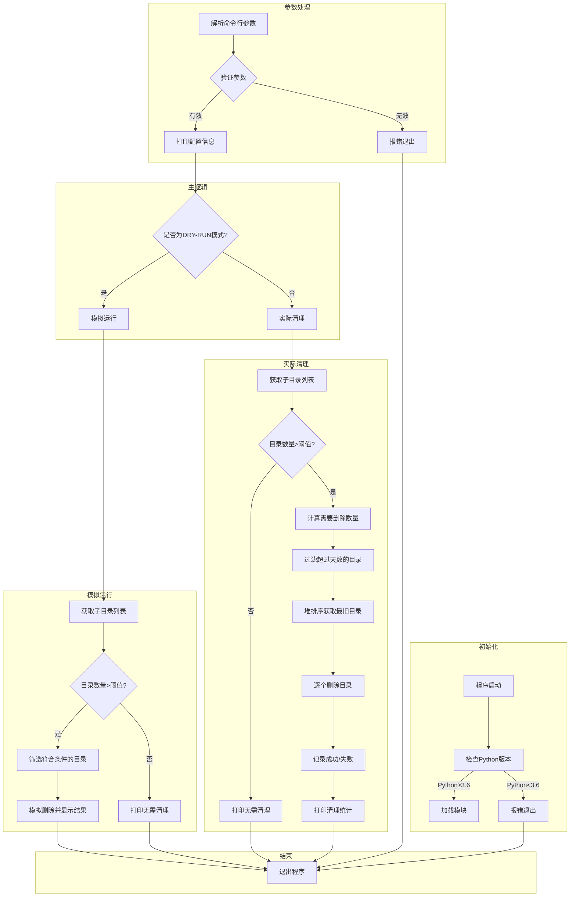
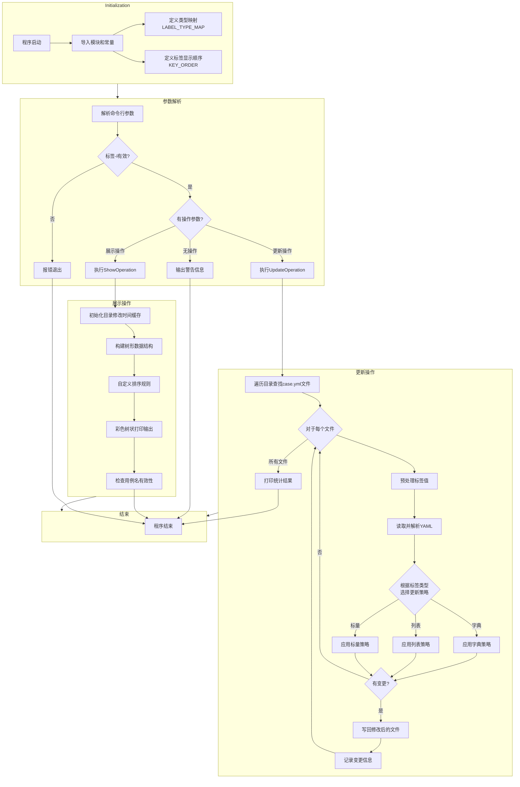

# 🎉 AISBench Smoke 🎉

---

## 🌐 简介
AISBench Smoke 是一个用于 AISBench 基准测试的自动化测试框架，主要包含两个核心目录：framework/ 和 scripts/
本 README 将详细介绍这两个目录的结构、功能以及使用方式，帮助开发者和测试人员快速上手。

---

## 🛠️ TODOs

- [ ] Q3需求用例补充
- [ ] 解决工作进程等待任务时（即在 ProcessPoolExecutor 的内部队列等待时）被中断（`Ctrl + C`）导致打印大量堆栈跟踪
- [x] 冒烟流程 `Ctrl + C` 打断后正确释放资源并打屏当前执行结果
- [x] 增加执行动画和信息, 减少打屏繁杂内容输出 (仅记录在邮件附件日志中)
- [x] 修正 Ctrl_C 场景下的多个用例, 定时任务脚本去掉外层的nohup行为
- [x] run_steps.sh流程中检查到无凭证时，可直接创建邮箱的凭证，无需单独调用脚本

---

##  💡逻辑流程图 - 复杂但常用脚本（最下方有滑块可*横向*拖动参看完整图）

### directory_cleaner.py

### manage_labels.py

---

#### Thanks♪(･ω･)ﾉ✨ 感谢使用 AISBench_Smoke 测试框架！🚀
##### 📝 *如有问题，欢迎随时反馈！* 📮
**如何评价本文？**
👍 有用 | 👍👍 很有用 | 👍👍👍 非常有用

---